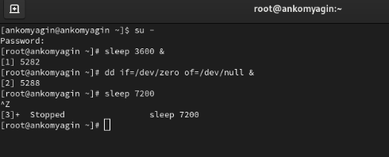
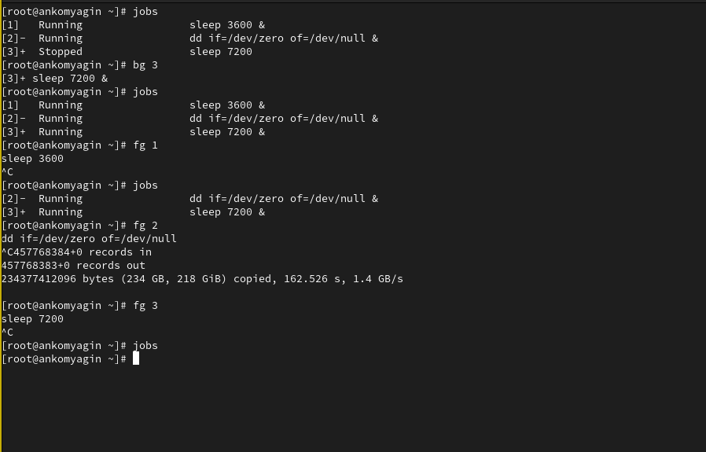
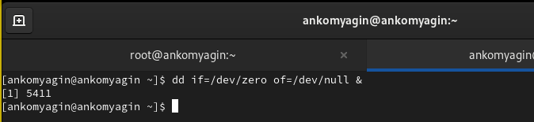
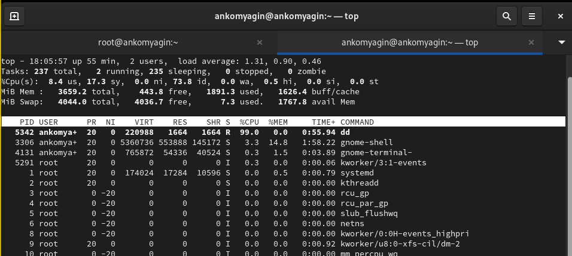
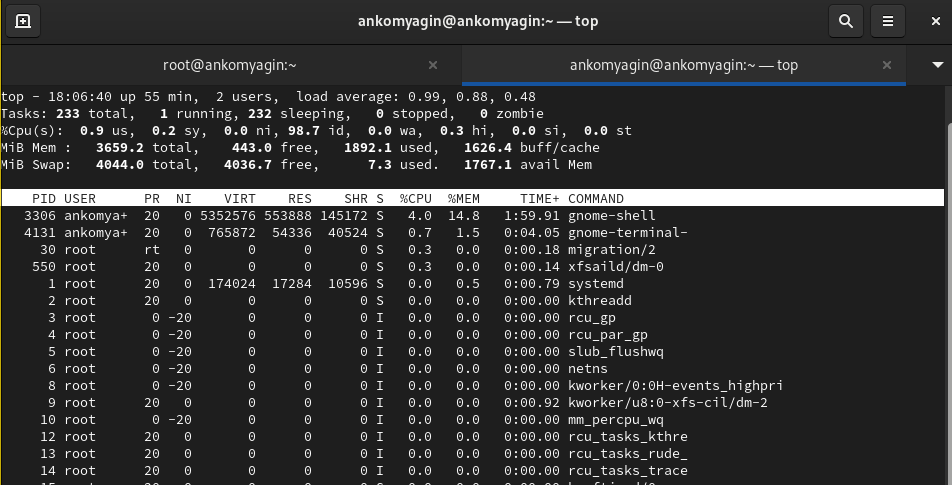
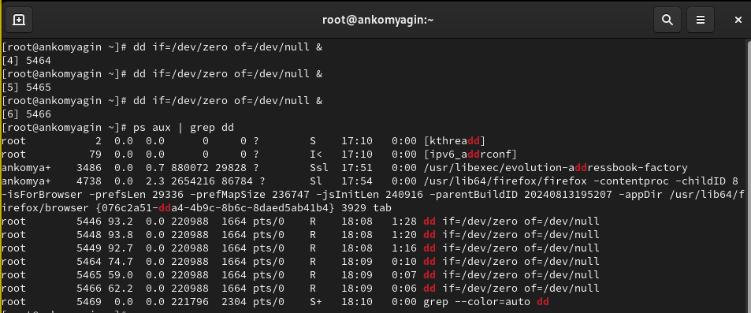
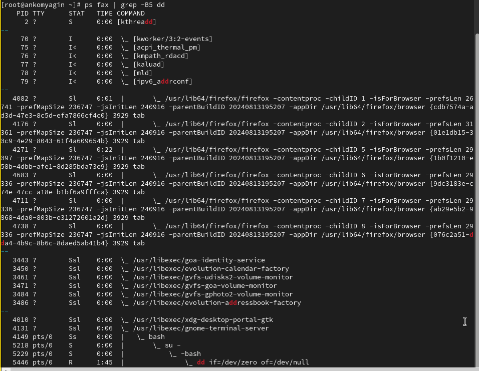
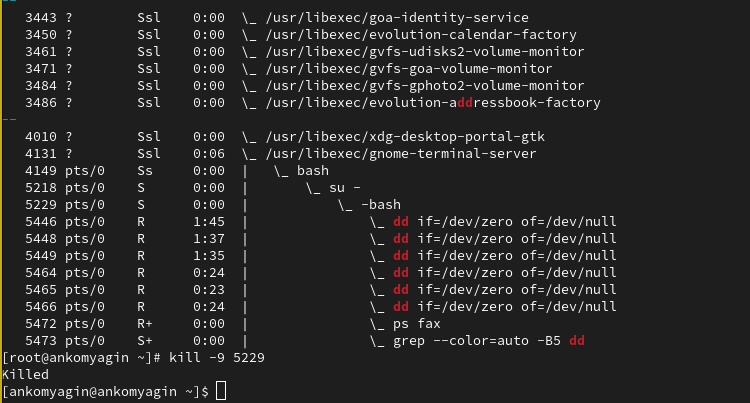
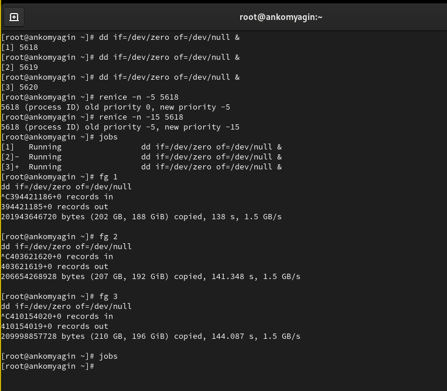
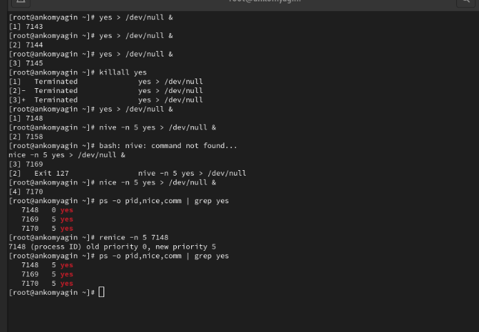

---
## Front matter
lang: ru-RU
title: Лабораторная работа №6
subtitle: Управление процессами
author:
  - Комягин А. Н.
institute:
  - Российский университет дружбы народов, Москва, Россия
date: 08 октября 2024

## i18n babel
babel-lang: russian
babel-otherlangs: english

## Formatting pdf
toc: false
toc-title: Содержание
slide_level: 2
aspectratio: 169
section-titles: true
theme: metropolis
header-includes:
 - \metroset{progressbar=frametitle,sectionpage=progressbar,numbering=fraction}
 - '\makeatletter'
 - '\beamer@ignorenonframefalse'
 - '\makeatother'

##Fonts
mainfont: PT Serif
romanfont: PT Serif
sansfont: PT Sans
monofont: PT Mono
mainfontoptions: Ligatures=TeX
romanfontoptions: Ligatures=TeX
sansfontoptions: Ligatures=TeX,Scale=MatchLowercase
monofontoptions: Scale=MatchLowercase,Scale=0.9
---

## Цель

Получить навыки управления процессами операционной системы.

# Выполнение лабораторной работы

# Управление заданиями

## ввод команд

{width=100%}

## jobs, bg, fg

{width=100%}

## фоновая команда

{width=100%}

## просмотр через top

{width=100%}

## удаление через top

{width=100%}

# Управление процессами

## Список команд с dd

{width=100%}

## поиск оболочки

{width=80%}

## отключение оболочки

{width=80%}

# Самостоятельная работа

## Задание 1

{#fig:009 width=70%}

## Задание 2

{#fig:011 width=70%}

# Контрольные вопросы

## 1. Команда для обзора всех текущих заданий оболочки: 

**jobs**
   
## 2. Как остановить текущее задание оболочки, чтобы продолжить его выполнение в фоновом режиме: 

Нажмите Ctrl + Z, чтобы приостановить задание, а затем используйте команду bg для его запуска в фоновом режиме.

## 3. Комбинация клавиш для отмены текущего задания оболочки: 

**Ctrl + C**

## 4. Как отменить одно из начатых заданий, если доступ к оболочке невозможен: 

Можно использовать команду kill с идентификатором процесса (PID) задания, например, kill <PID>, или pkill <имя_команды>.

## 5. Команда для отображения отношений между родительскими и дочерними процессами: 

**pstree или ps -ef --forest**

## 6. Команда для изменения приоритета процесса с идентификатором 1234 на более высокий: 

**renice -n -5 -p 1234 (где -5 — более высокий приоритет).**

## 7. Как проще всего остановить все запущенные процессы dd сразу: 

**Используйте команду pkill dd.**

## 8. Команда для остановки команды с именем mycommand: 

**pkill mycommand.**

## 9. Команда в top, чтобы убить процесс: 

**Нажмите k, затем введите PID процесса и подтвердите.**

## 10. Как запустить команду с достаточно высоким приоритетом, не рискуя нехваткой ресурсов для других процессов: \

**Используйте nice с положительным значением, например, nice -n 10 <команда>.**

# Вывод

## Вывод

В ходе выполнения лабораторной работы я получил навыки управления процессами операционной системы.

