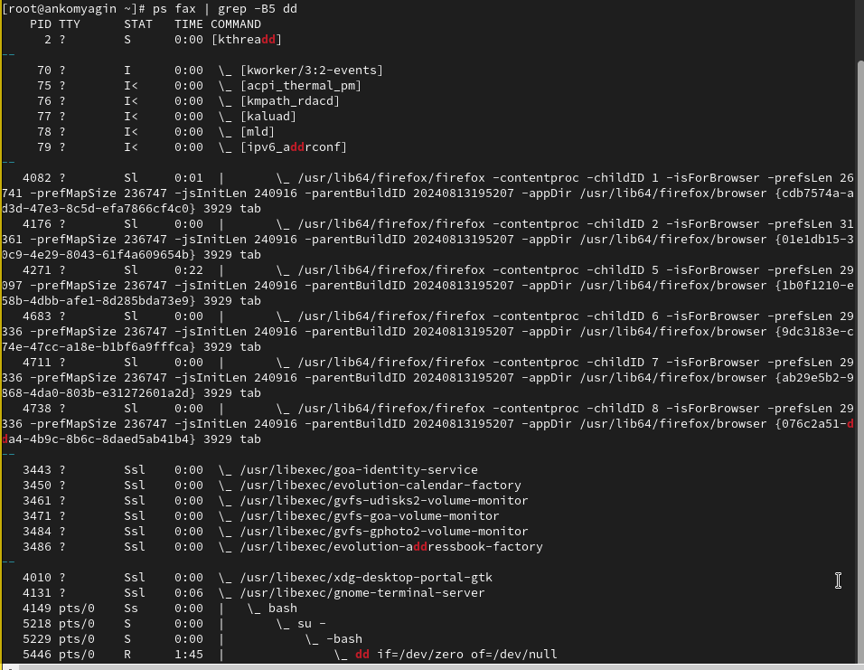

---
## Front matter
title: "Лабораторная работа №6"
subtitle: "Управление процессами"
author: "Комягин Андрей Николаевич"

## Generic otions
lang: ru-RU
toc-title: "Содержание"

## Bibliography
bibliography: bib/cite.bib
csl: pandoc/csl/gost-r-7-0-5-2008-numeric.csl

## Pdf output format
toc: true # Table of contents
toc-depth: 2
lof: true # List of figures
lot: true # List of tables
fontsize: 12pt
linestretch: 1.5
papersize: a4
documentclass: scrreprt
## I18n polyglossia
polyglossia-lang:
  name: russian
  options:
	- spelling=modern
	- babelshorthands=true
polyglossia-otherlangs:
  name: english
## I18n babel
babel-lang: russian
babel-otherlangs: english
## Fonts
mainfont: PT Serif
romanfont: PT Serif
sansfont: PT Sans
monofont: PT Mono
mainfontoptions: Ligatures=TeX
romanfontoptions: Ligatures=TeX
sansfontoptions: Ligatures=TeX,Scale=MatchLowercase
monofontoptions: Scale=MatchLowercase,Scale=0.9
## Biblatex
biblatex: true
biblio-style: "gost-numeric"
biblatexoptions:
  - parentracker=true
  - backend=biber
  - hyperref=auto
  - language=auto
  - autolang=other*
  - citestyle=gost-numeric
## Pandoc-crossref LaTeX customization
figureTitle: "Рис."
tableTitle: "Таблица"
listingTitle: "Листинг"
lofTitle: "Список иллюстраций"
lotTitle: "Список таблиц"
lolTitle: "Листинги"
## Misc options
indent: true
header-includes:
  - \usepackage{indentfirst}
  - \usepackage{float} # keep figures where there are in the text
  - \floatplacement{figure}{H} # keep figures where there are in the text
---

# Цель работы

Получить навыки управления процессами операционной системы.

# Выполнение лабораторной работы

## Управление заданиями

Введём команды (рис. [-@fig:001]).

{#fig:001 width=70%}

Поработаем с поцессами и командой jobs. Поработаем со включением и выключением процессов (рис. [-@fig:002]).

{#fig:002 width=70%}

Добавим  фоновую команду (рис. [-@fig:003]).

{#fig:003 width=70%}

Через top посмотрим задания(рис. [-@fig:004]).

{#fig:004 width=70%}

Через top удалим процесс (рис. [-@fig:005]).

{#fig:005 width=70%}

## Управление процессами

Введем команды, посмотрим строки, где есть символы dd(рис. [-@fig:006]) 

{#fig:006 width=70%}

Введём **ps fax | grep -B5 dd**, найдем айди процесса корневой оболочки и отключим ее (рис. [-@fig:007]), (рис. [-@fig:008]).

{#fig:007 width=70%}

{#fig:008 width=70%}

# Самостоятельная работа

## Задание 1

{#fig:009 width=70%}

## Задание 2

{#fig:011 width=70%}

# Контрольные вопросы

1. Команда для обзора всех текущих заданий оболочки: 

**jobs**
   
2. Как остановить текущее задание оболочки, чтобы продолжить его выполнение в фоновом режиме: 

Нажмите Ctrl + Z, чтобы приостановить задание, а затем используйте команду bg для его запуска в фоновом режиме.

3. Комбинация клавиш для отмены текущего задания оболочки: 

**Ctrl + C**

4. Как отменить одно из начатых заданий, если доступ к оболочке невозможен: 

Можно использовать команду kill с идентификатором процесса (PID) задания, например, kill <PID>, или pkill <имя_команды>.

5. Команда для отображения отношений между родительскими и дочерними процессами: 

**pstree или ps -ef --forest**

6. Команда для изменения приоритета процесса с идентификатором 1234 на более высокий: 

**renice -n -5 -p 1234 (где -5 — более высокий приоритет).**

7. Как проще всего остановить все запущенные процессы dd сразу: 

**Используйте команду pkill dd.**

8. Команда для остановки команды с именем mycommand: 

**pkill mycommand.**

9. Команда в top, чтобы убить процесс: 

**Нажмите k, затем введите PID процесса и подтвердите.**

10. Как запустить команду с достаточно высоким приоритетом, не рискуя нехваткой ресурсов для других процессов: \

**Используйте nice с положительным значением, например, nice -n 10 <команда>.**

# Вывод

В ходе выполнения лабораторной работы я получил навыки управления процессами операционной системы.

# Список литературы{.unnumbered}

[Туис, курс Администрирование операционных систем](https://esystem.rudn.ru/course/view.php?id=5946)
