---
## Front matter
lang: ru-RU
title: Лабораторная работа №7
subtitle: Управление журналами событий в системе
author:
  - Комягин А. Н.
institute:
  - Российский университет дружбы народов, Москва, Россия
date: 09 октября 2024

## i18n babel
babel-lang: russian
babel-otherlangs: english

## Formatting pdf
toc: false
toc-title: Содержание
slide_level: 2
aspectratio: 169
section-titles: true
theme: metropolis
header-includes:
 - \metroset{progressbar=frametitle,sectionpage=progressbar,numbering=fraction}
 - '\makeatletter'
 - '\beamer@ignorenonframefalse'
 - '\makeatother'

##Fonts
mainfont: PT Serif
romanfont: PT Serif
sansfont: PT Sans
monofont: PT Mono
mainfontoptions: Ligatures=TeX
romanfontoptions: Ligatures=TeX
sansfontoptions: Ligatures=TeX,Scale=MatchLowercase
monofontoptions: Scale=MatchLowercase,Scale=0.9
---

## Цель

Получить навыки работы с журналами мониторинга различных событий в системе.

# Выполнение лабораторной работы

# Мониторинг журнала системных событий в реальном времени

## Запустим мониторинг событий

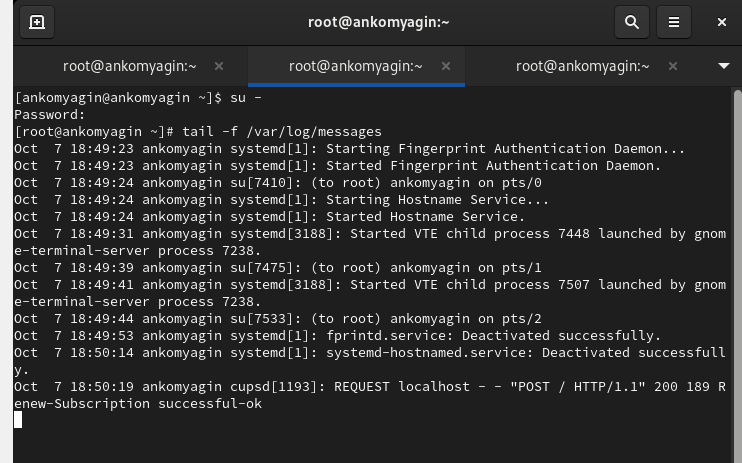{width=100%}

## отображение ошибки в мониторинге

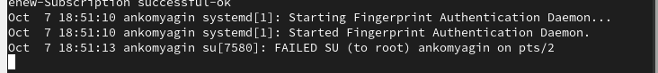{width=100%}

## logger hello

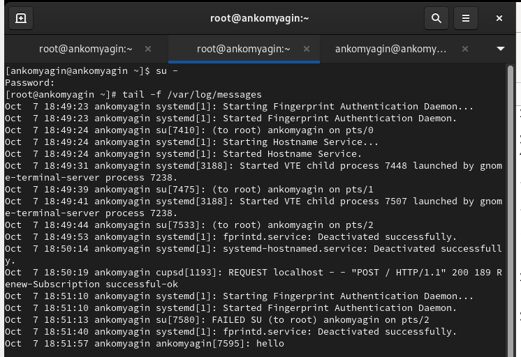{width=100%}

## мониторинг сообщений безопасности

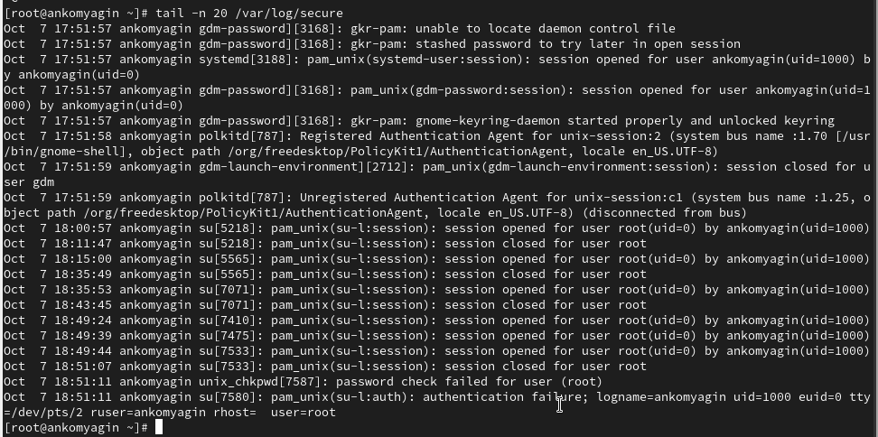{width=100%}

## Установка Apache и запуск веб-службы

{width=100%}

## журнал ошибок веб-службы

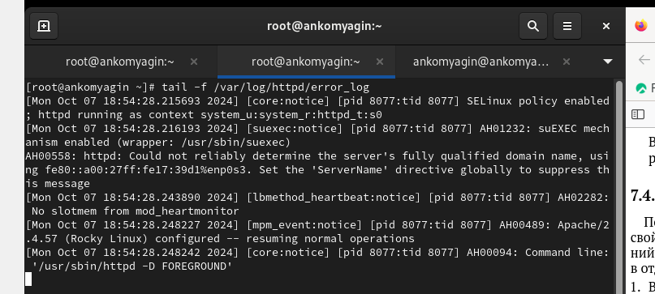{width=100%}

## /etc/httpd/conf/httpd.conf

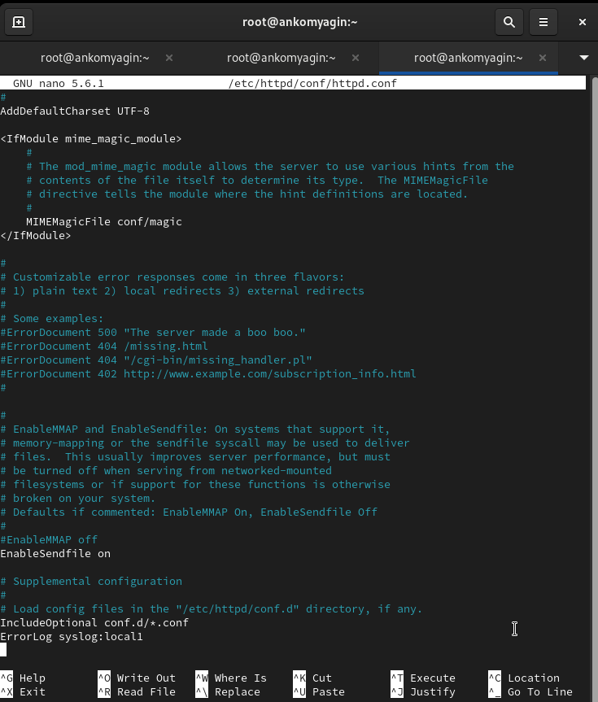{width=80%}

## файл мониторинга

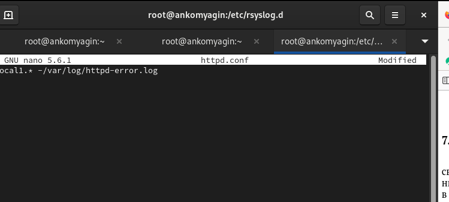{width=80%}

##  перезагрузка конфигураций

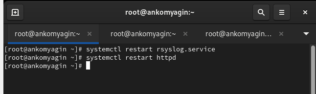{width=80%}

## Мониторинг отладки

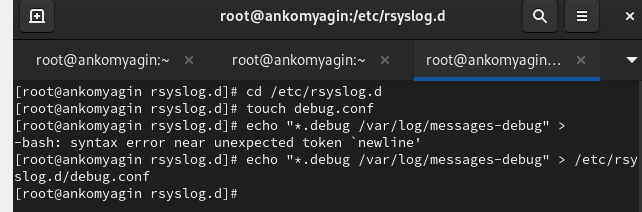{width=80%}

## мониторинг

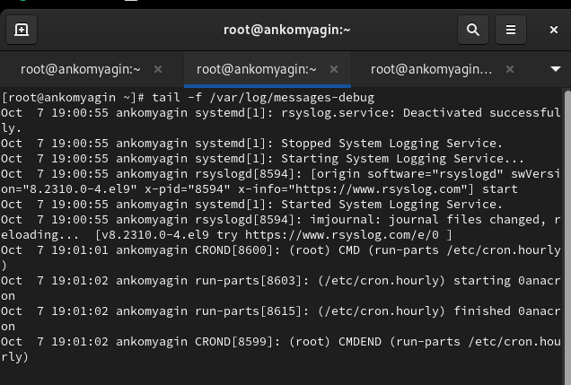{width=80%}

# Использование journalctl

## содержимое журнала событий

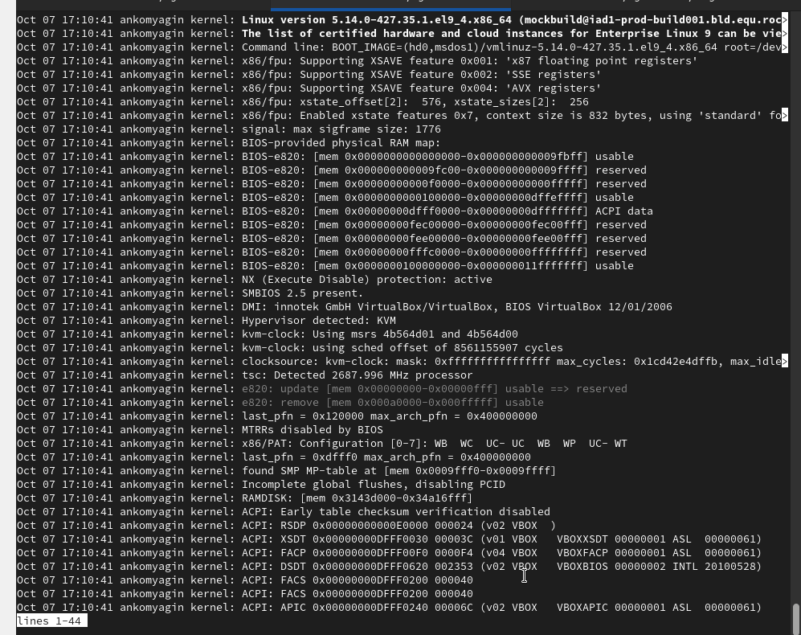{width=80%}

## реальное время

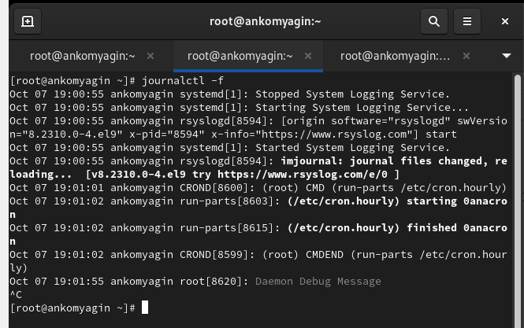{width=80%}

## последние строки журнала

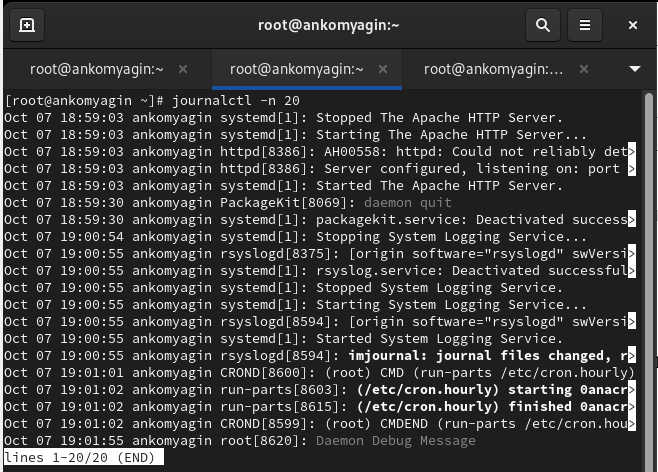{width=80%}

## сообщения об ошибках

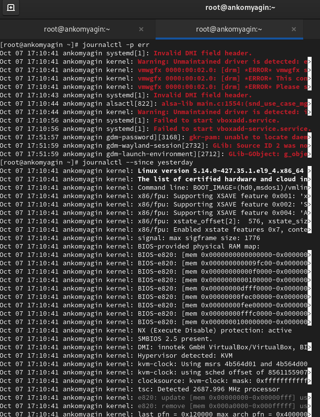{width=70%}

## сообщения со вчерашнего дня

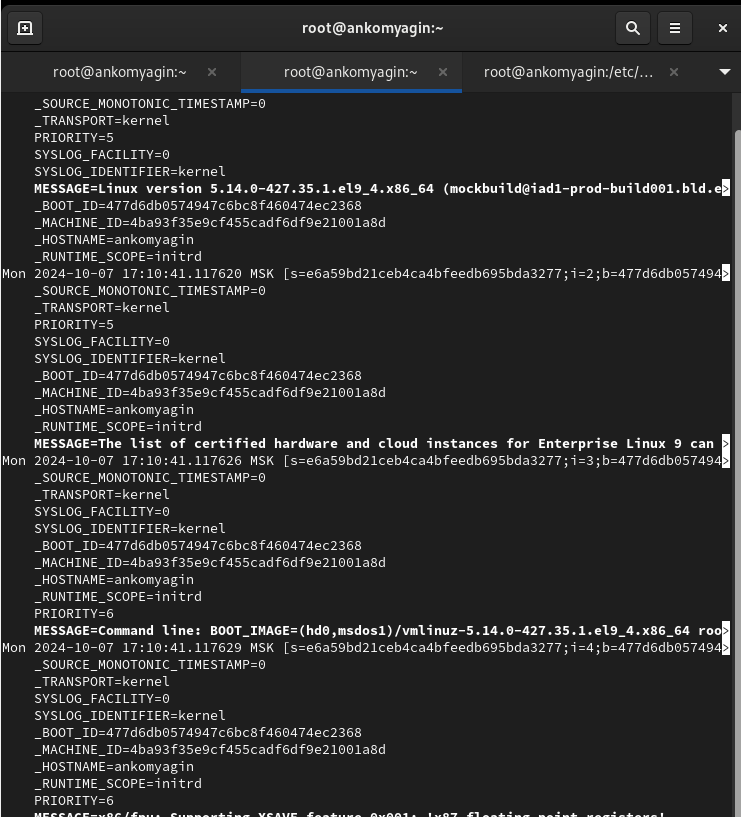{width=70%}

## доп информация о sshd

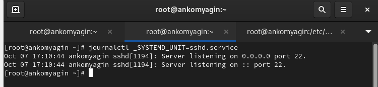{width=70%}

# Постоянный журнал journald

## доп информация о sshd

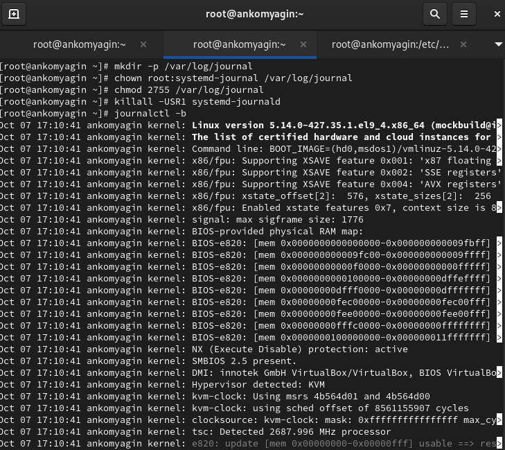{width=70%}

# Контрольные вопросы

## 1. Какой файл используется для настройки rsyslogd?

   - Основной файл конфигурации для rsyslogd — это /etc/rsyslog.conf.

## 2. В каком файле журнала rsyslogd содержатся сообщения, связанные с аутентификацией?

   - Сообщения, связанные с аутентификацией, обычно записываются в файл /var/log/auth.log (или /var/log/secure в некоторых дистрибутивах).

## 3. Если вы ничего не настроите, то сколько времени потребуется для ротации файлов журналов?

   - По умолчанию ротация файлов журналов происходит раз в неделю (это может варьироваться в зависимости от конфигурации системы и используемого инструмента ротации, например, logrotate).

## 4. Какую строку следует добавить в конфигурацию для записи всех сообщений с приоритетом info в файл /var/log/messages.info?

   - Добавим строку: *.info /var/log/messages.info.

## 5. Какая команда позволяет вам видеть сообщения журнала в режиме реального времени?

   - Команда tail -f /var/log/syslog (или другой соответствующий файл журнала).

## 6. Какая команда позволяет вам видеть все сообщения журнала, которые были написаны для PID 1 между 9:00 и 15:00?

   - Используем команду: journalctl _PID=1 --since "YYYY-MM-DD 09:00" --until "YYYY-MM-DD 15:00" (замените YYYY-MM-DD на нужную дату).

## 7. Какая команда позволяет вам видеть сообщения journald после последней перезагрузки системы?

   - Команда: journalctl -b.

## 8. Какая процедура позволяет сделать журнал journald постоянным?

   - Чтобы сделать журнал journald постоянным, нужно отредактировать файл конфигурации /etc/systemd/journald.conf и установить параметр Storage=persistent. Затем перезапустите службу journald с помощью команды systemctl restart systemd-journald.

# Вывод

## Вывод

В ходе выполнения лабораторной работы я получил навыки работы с журналами мониторинга различных событий в системе.

