---
## Front matter
title: "Лабораторная работа №7"
subtitle: "Управление журналами событий в системе"
author: "Комягин Андрей Николаевич"

## Generic otions
lang: ru-RU
toc-title: "Содержание"

## Bibliography
bibliography: bib/cite.bib
csl: pandoc/csl/gost-r-7-0-5-2008-numeric.csl

## Pdf output format
toc: true # Table of contents
toc-depth: 2
lof: true # List of figures
lot: true # List of tables
fontsize: 12pt
linestretch: 1.5
papersize: a4
documentclass: scrreprt
## I18n polyglossia
polyglossia-lang:
  name: russian
  options:
	- spelling=modern
	- babelshorthands=true
polyglossia-otherlangs:
  name: english
## I18n babel
babel-lang: russian
babel-otherlangs: english
## Fonts
mainfont: PT Serif
romanfont: PT Serif
sansfont: PT Sans
monofont: PT Mono
mainfontoptions: Ligatures=TeX
romanfontoptions: Ligatures=TeX
sansfontoptions: Ligatures=TeX,Scale=MatchLowercase
monofontoptions: Scale=MatchLowercase,Scale=0.9
## Biblatex
biblatex: true
biblio-style: "gost-numeric"
biblatexoptions:
  - parentracker=true
  - backend=biber
  - hyperref=auto
  - language=auto
  - autolang=other*
  - citestyle=gost-numeric
## Pandoc-crossref LaTeX customization
figureTitle: "Рис."
tableTitle: "Таблица"
listingTitle: "Листинг"
lofTitle: "Список иллюстраций"
lotTitle: "Список таблиц"
lolTitle: "Листинги"
## Misc options
indent: true
header-includes:
  - \usepackage{indentfirst}
  - \usepackage{float} # keep figures where there are in the text
  - \floatplacement{figure}{H} # keep figures where there are in the text
---

# Цель работы

Получить навыки работы с журналами мониторинга различных событий в системе.

# Выполнение лабораторной работы

## Мониторинг журнала системных событий в реальном времени 

Запустим мониторинг системных событий в реальном времени:(рис. [-@fig:001]).

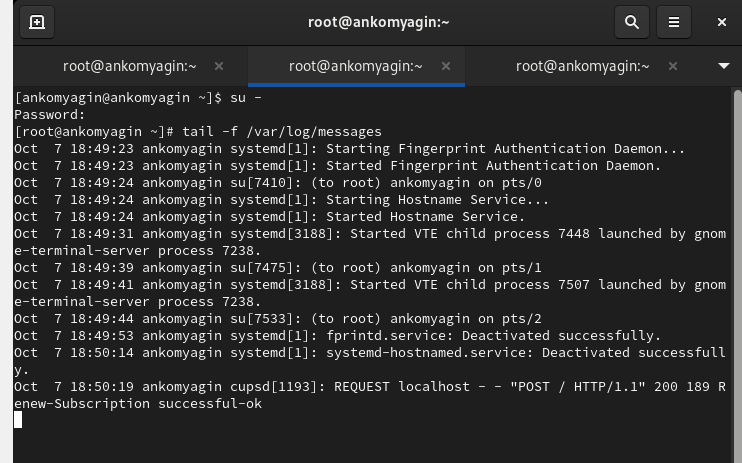{#fig:001 width=70%}

Попробуем получить полномочия администратора, но введём неправильный пароль. Обратим внимание, что во второй вкладке терминала с мониторингом событий появится сообщение **«FAILED SU (to root)**  (рис. [-@fig:002]).

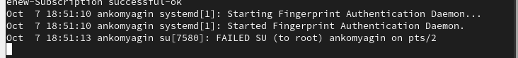{#fig:002 width=70%}

В третьей вкладке терминала из оболочки пользователя введём **logger hello**
Во второй вкладке терминала с мониторингом событий мы увидим сообщение(рис. [-@fig:003]).

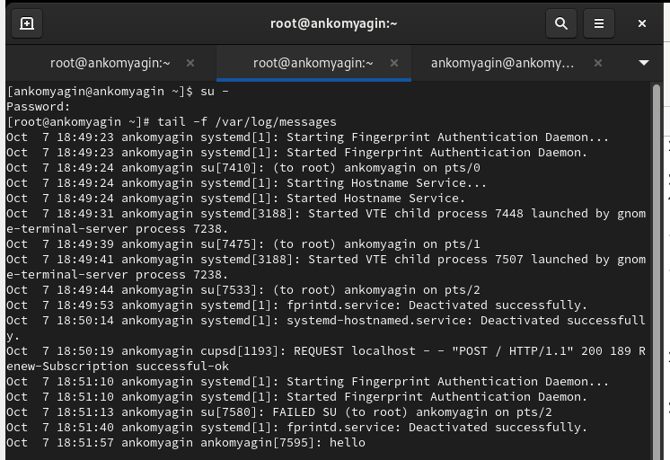{#fig:003 width=70%}

Затем запустим мониторинг сообщений безопасности (последние 20 строк соответствующего файла логов(рис. [-@fig:004]).

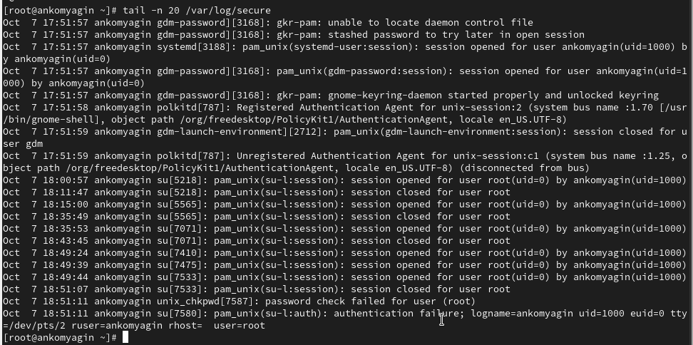{#fig:004 width=70%}

## Изменение правил rsyslog.conf

Установим Apache, запустим веб-службу (рис. [-@fig:005]).

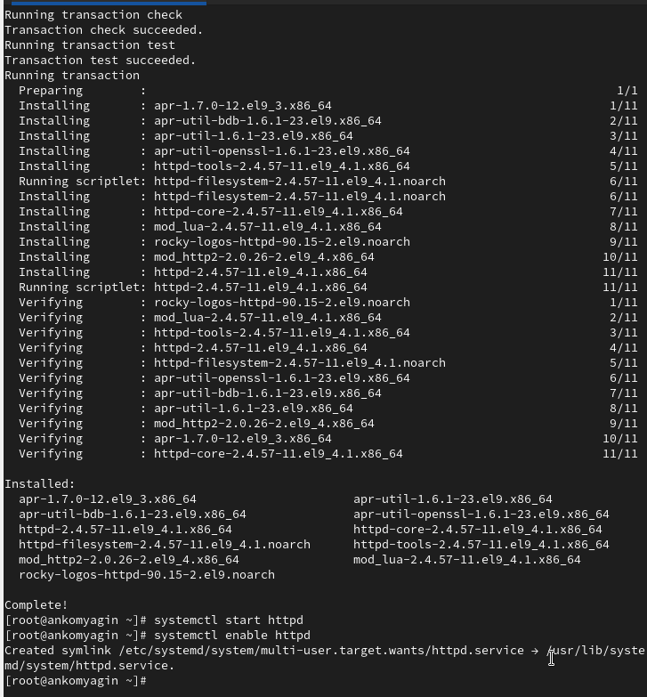{#fig:005 width=70%}

Посмотрим журнал сообщений об ошибках веб-службы(рис. [-@fig:006]) 

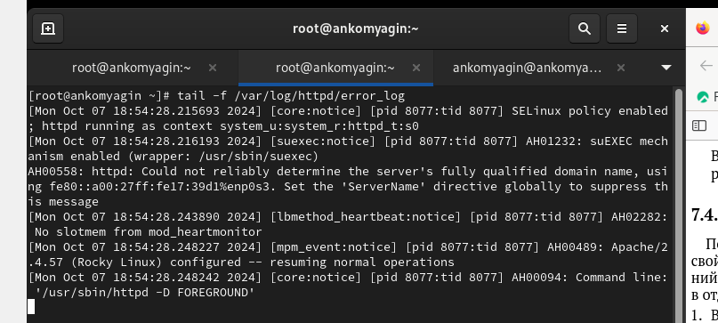{#fig:006 width=70%}

В файле конфигурации /etc/httpd/conf/httpd.conf в конце добавим строку(рис. [-@fig:007])

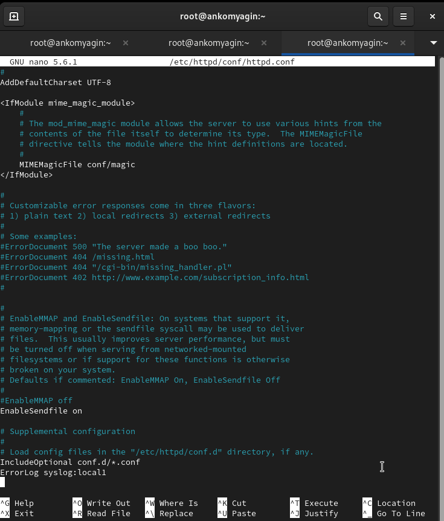{#fig:007 width=70%}

В каталоге /etc/rsyslog.d создадим файл мониторинга событий веб-службы, открыв его на редактирование, пропишем в нём  local1.* -/var/log/httpd-error.log (рис. [-@fig:008]).

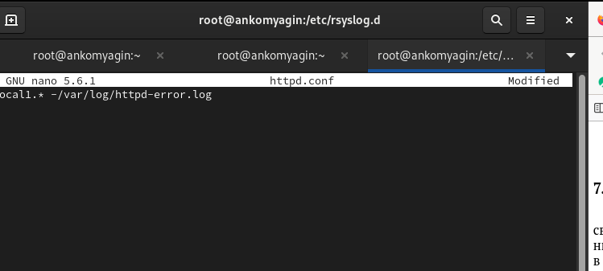{#fig:008 width=70%}

перезагрузим конфигурацию rsyslogd и веб-службу (рис. [-@fig:009])

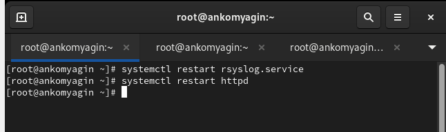{#fig:009 width=70%}

Создадим отдельный файл конфигурации для мониторинга отладочной информации(рис. [-@fig:010])

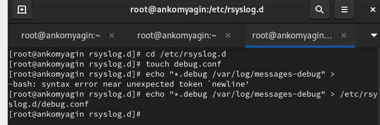{#fig:010 width=70%}

 Запустим мониторинг отладочной информации(рис. [-@fig:011])

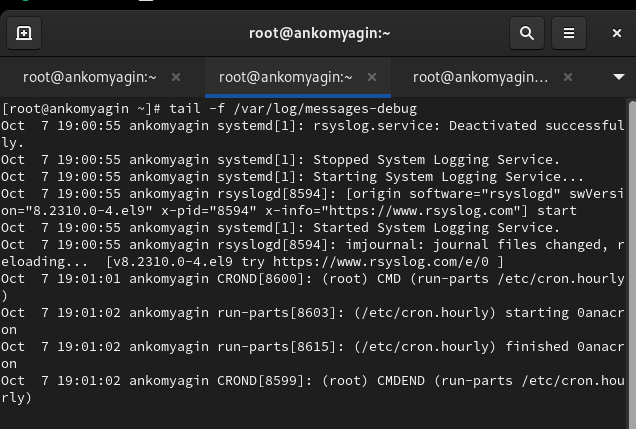{#fig:011 width=70%}

## Использование journalctl

Посмотрим содержимое журнала с событиями с момента последнего запуска системы (рис. [-@fig:012])

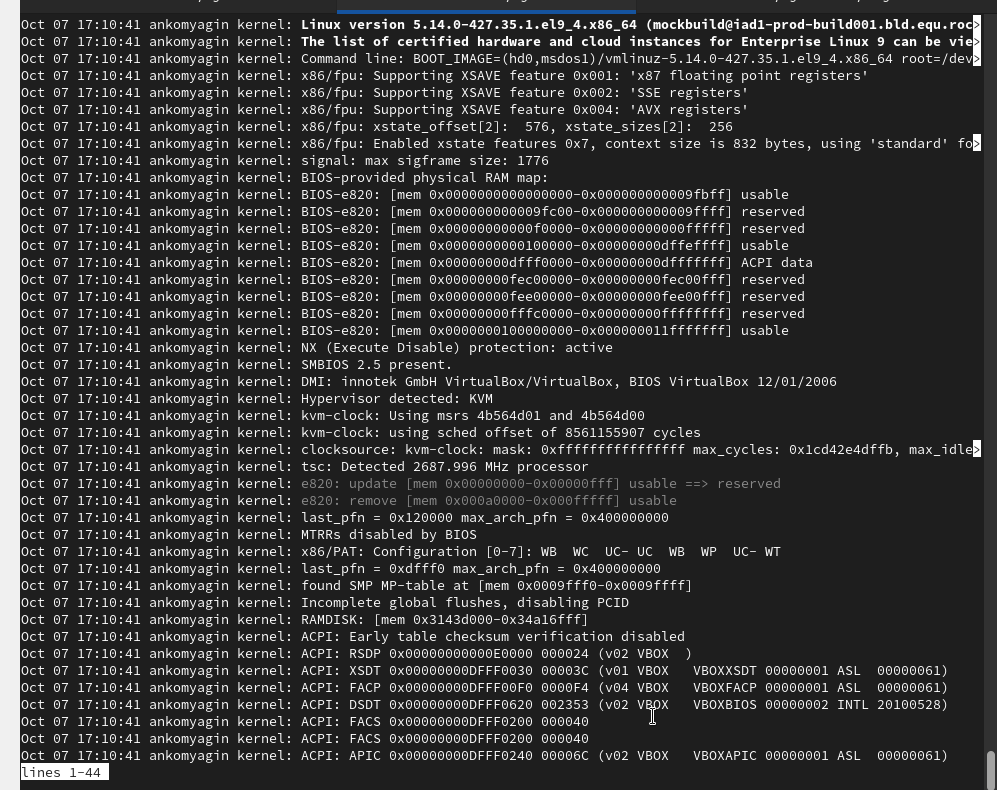{#fig:012 width=70%}

Режим просмотра журнала в реальном времени(рис. [-@fig:013])

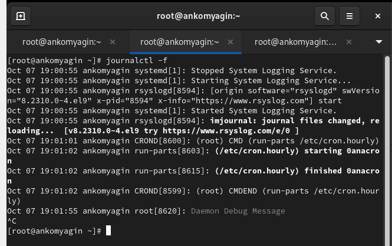{#fig:013 width=70%}

Отобрахим последние 20 строк журнала(рис. [-@fig:014])

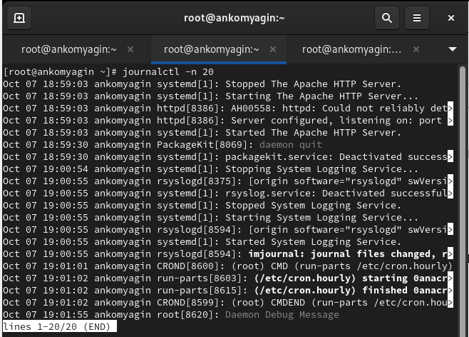{#fig:014 width=70%}

Просмотрим только сообщения об ошибках(рис. [-@fig:015])

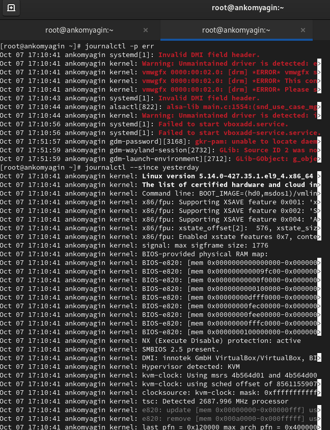{#fig:015 width=70%}

Для просмотра всех сообщений со вчерашнего дня введём **journalctl --since yesterday**(рис. [-@fig:016]).

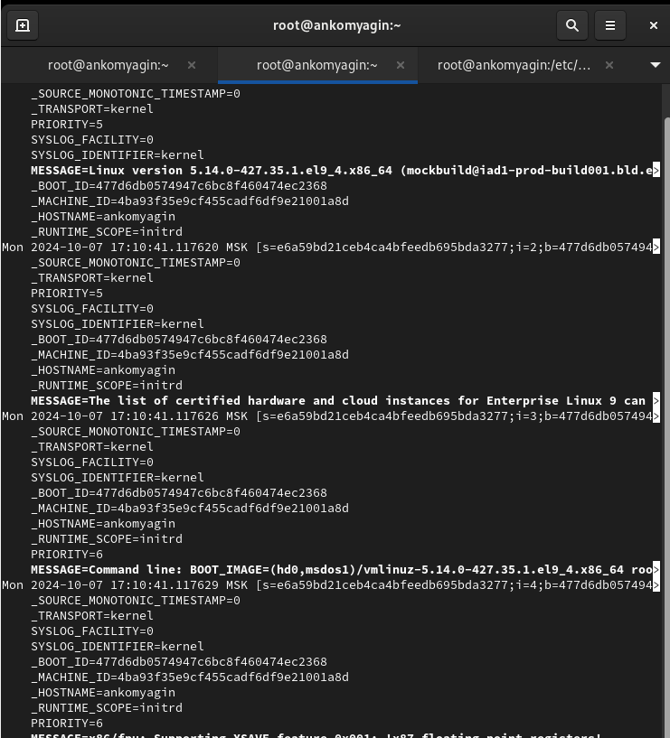{#fig:016 width=70%}

Просмотрим дополнительную информацию о модуле sshd(рис. [-@fig:017]).

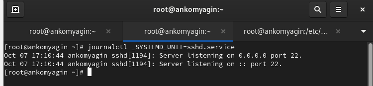{#fig:017 width=70%}

## Постоянный журнал journald

Создадим каталог для хранения записей журнала. Скорректируем права доступа для каталога /var/log/journal, чтобы journald смог записывать в него информацию. Журнал systemd теперь постоянный (рис. [-@fig:018]).

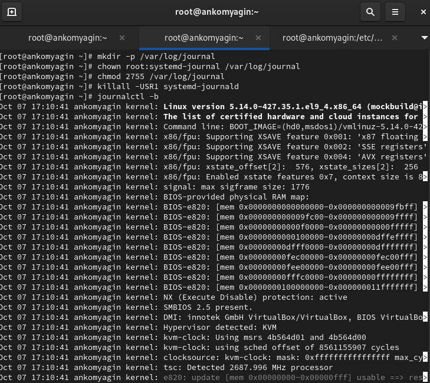{#fig:018 width=70%}

# Контрольные вопросы

1. Какой файл используется для настройки rsyslogd?

   - Основной файл конфигурации для rsyslogd — это /etc/rsyslog.conf.

2. В каком файле журнала rsyslogd содержатся сообщения, связанные с аутентификацией?

   - Сообщения, связанные с аутентификацией, обычно записываются в файл /var/log/auth.log (или /var/log/secure в некоторых дистрибутивах).

3. Если вы ничего не настроите, то сколько времени потребуется для ротации файлов журналов?

   - По умолчанию ротация файлов журналов происходит раз в неделю (это может варьироваться в зависимости от конфигурации системы и используемого инструмента ротации, например, logrotate).

4. Какую строку следует добавить в конфигурацию для записи всех сообщений с приоритетом info в файл /var/log/messages.info?

   - Добавим строку: *.info /var/log/messages.info.

5. Какая команда позволяет вам видеть сообщения журнала в режиме реального времени?

   - Команда tail -f /var/log/syslog (или другой соответствующий файл журнала).

6. Какая команда позволяет вам видеть все сообщения журнала, которые были написаны для PID 1 между 9:00 и 15:00?

   - Используем команду: journalctl _PID=1 --since "YYYY-MM-DD 09:00" --until "YYYY-MM-DD 15:00" (замените YYYY-MM-DD на нужную дату).

7. Какая команда позволяет вам видеть сообщения journald после последней перезагрузки системы?

   - Команда: journalctl -b.

8. Какая процедура позволяет сделать журнал journald постоянным?

   - Чтобы сделать журнал journald постоянным, нужно отредактировать файл конфигурации /etc/systemd/journald.conf и установить параметр Storage=persistent. Затем перезапустите службу journald с помощью команды systemctl restart systemd-journald.

# Вывод

В ходе выполнения лабораторной работы я получил навыки работы с журналами мониторинга различных событий в системе.

# Список литературы{.unnumbered}

[Туис, курс Администрирование операционных систем](https://esystem.rudn.ru/course/view.php?id=5946)
