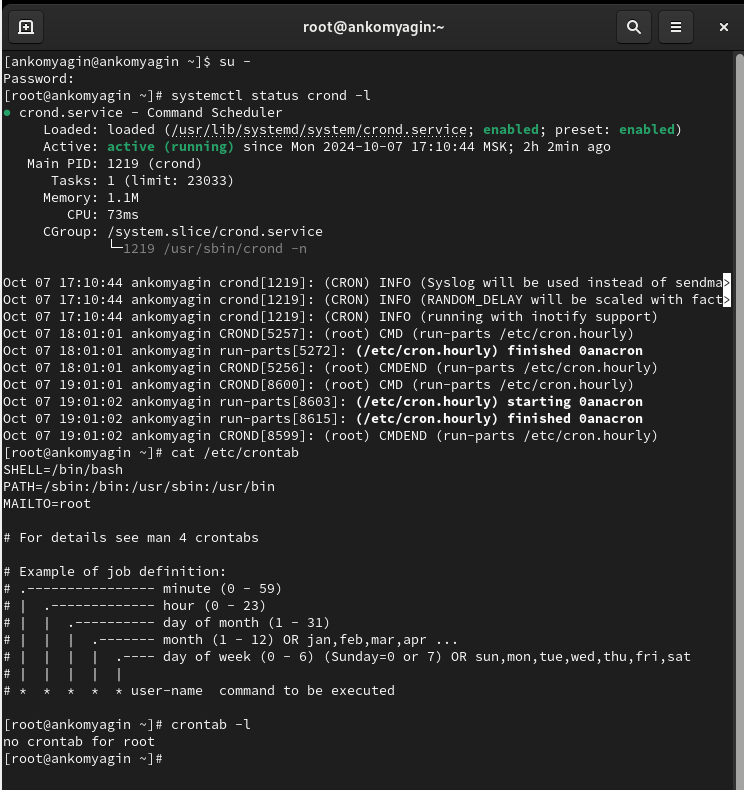
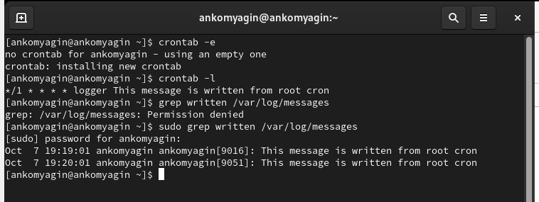
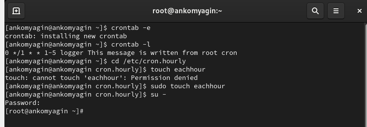
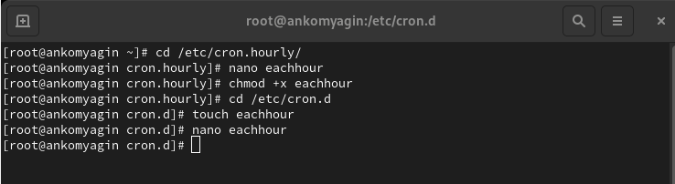
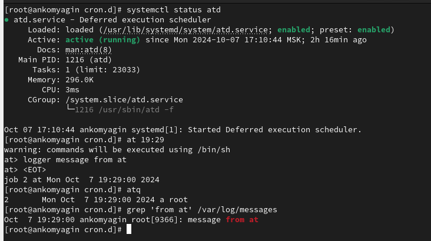

---
## Front matter
lang: ru-RU
title: Лабораторная работа №8
subtitle: Планировщики событий
author:
  - Комягин А. Н.
institute:
  - Российский университет дружбы народов, Москва, Россия
date: 09 октября 2024

## i18n babel
babel-lang: russian
babel-otherlangs: english

## Formatting pdf
toc: false
toc-title: Содержание
slide_level: 2
aspectratio: 169
section-titles: true
theme: metropolis
header-includes:
 - \metroset{progressbar=frametitle,sectionpage=progressbar,numbering=fraction}
 - '\makeatletter'
 - '\beamer@ignorenonframefalse'
 - '\makeatother'

##Fonts
mainfont: PT Serif
romanfont: PT Serif
sansfont: PT Sans
monofont: PT Mono
mainfontoptions: Ligatures=TeX
romanfontoptions: Ligatures=TeX
sansfontoptions: Ligatures=TeX,Scale=MatchLowercase
monofontoptions: Scale=MatchLowercase,Scale=0.9
---

## Цель

Получение навыков работы с планировщиками событий cron и at.

# Выполнение лабораторной работы

# Планирование задач с помощью cron

## статус crond задания в расписании

{width=100%}

## файл расписания, журнал событий

"*/1 * * * * logger This message is written from root cron"

{width=100%}

## crontab

**0 */1 * * 1-5 logger This message is written from root cron**

{width=100%}

## eachhour

**11 * * * * root logger This message is written from /etc/cron.d**

{width=100%}

# Планирование заданий с помощью at

## служба atd

{width=100%}

# Контрольные вопросы

## 1. Настройка задания cron для выполнения раз в 2 недели

Чтобы задать выполнение задания раз в 2 недели, можно использовать следующие записи:

**0 0 * * 0,14 command**

Эта запись будет выполнять команду в полночь (00:00) каждое воскресенье и 14-го числа каждого месяца. Однако, если вам нужно строгое выполнение каждые 14 дней, это потребует более сложной логики, так как cron не поддерживает это напрямую.

## 2. Настройка задания cron для выполнения 1-го и 15-го числа каждого месяца в 2 часа ночи

**0 2 1,15 * * command**

Эта запись будет выполнять команду в 2:00 ночи 1-го и 15-го числа каждого месяца.

## 3. Настройка задания cron для выполнения каждые 2 минуты каждый день

**\*/2 * * * * command**

Эта запись будет выполнять команду каждые 2 минуты каждый день.

## 4. Настройка задания cron для выполнения 19 сентября ежегодно

**0 0 19 9 * command**

Эта запись будет выполнять команду в полночь (00:00) 19 сентября каждого года.

## 5. Настройка задания cron для выполнения каждый четверг сентября ежегодно

**0 0 * 9 4 command**

Эта запись будет выполнять команду в полночь (00:00) каждую пятницу (4 - четверг) в сентябре.

## 6. Команда для назначения задания cron для пользователя alice
Вы можете использовать команду crontab с параметром -u:

**sudo crontab -u alice -e**

Это откроет crontab для пользователя alice, где вы можете добавить свои задания.

## 7. Запрет назначения заданий через cron для пользователя bob

Для этого можно отредактировать файл /etc/cron.d/cron.allow и /etc/cron.d/cron.deny. Если вы добавите пользователя bob в файл cron.deny, он не сможет назначать задания через cron.

**echo "bob" >> /etc/cron.d/cron.deny**

## 8. Убедиться, что задание выполняется каждый день, даже если сервер временно недоступен

Вы можете использовать systemd или другой менеджер задач, который поддерживает повторные попытки выполнения. Кроме того, можно добавить логику в сам скрипт, чтобы проверять, был ли он выполнен в предыдущие дни, например, записывать дату последнего выполнения в файл и проверять его наличие.

## 9. Команда для проверки запланированных заданий на выполнение с помощью atd

**atq**

Эта команда покажет список всех заданий, запланированных с помощью at.

# Вывод

## Вывод

В ходе выполнения лабораторной работы я получил навыки работы с планировщиками событий cron и at.

