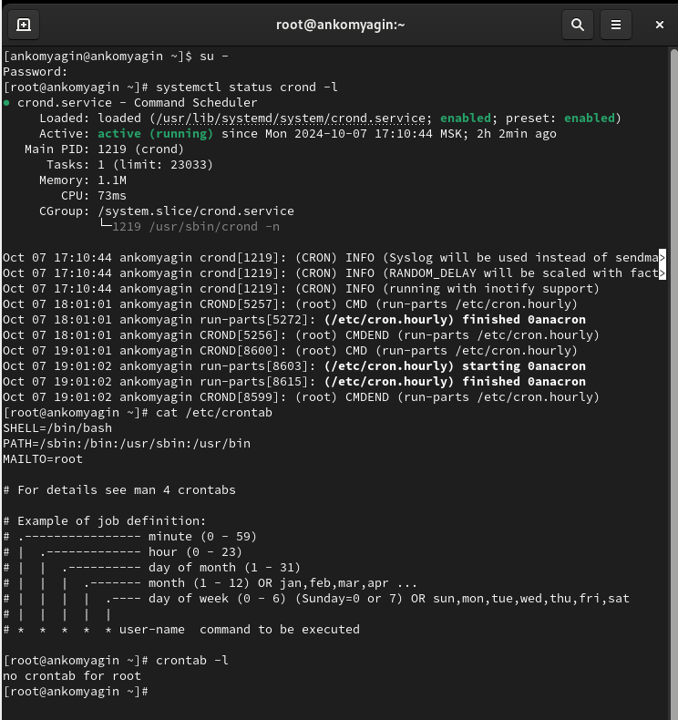
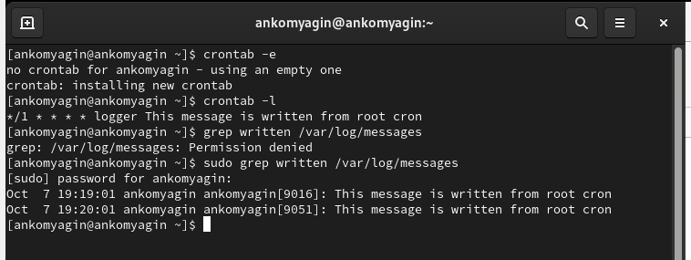
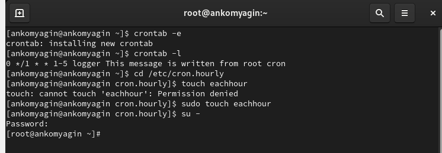
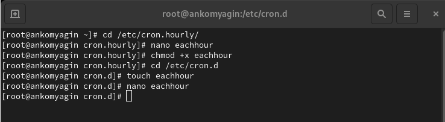
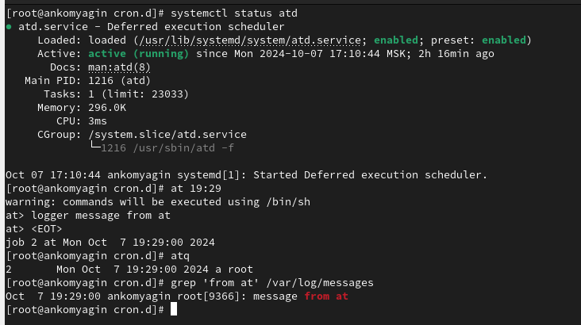

---
## Front matter
title: "Лабораторная работа №8"
subtitle: "Планировщики событий"
author: "Комягин Андрей Николаевич"

## Generic otions
lang: ru-RU
toc-title: "Содержание"

## Bibliography
bibliography: bib/cite.bib
csl: pandoc/csl/gost-r-7-0-5-2008-numeric.csl

## Pdf output format
toc: true # Table of contents
toc-depth: 2
lof: true # List of figures
lot: true # List of tables
fontsize: 12pt
linestretch: 1.5
papersize: a4
documentclass: scrreprt
## I18n polyglossia
polyglossia-lang:
  name: russian
  options:
	- spelling=modern
	- babelshorthands=true
polyglossia-otherlangs:
  name: english
## I18n babel
babel-lang: russian
babel-otherlangs: english
## Fonts
mainfont: PT Serif
romanfont: PT Serif
sansfont: PT Sans
monofont: PT Mono
mainfontoptions: Ligatures=TeX
romanfontoptions: Ligatures=TeX
sansfontoptions: Ligatures=TeX,Scale=MatchLowercase
monofontoptions: Scale=MatchLowercase,Scale=0.9
## Biblatex
biblatex: true
biblio-style: "gost-numeric"
biblatexoptions:
  - parentracker=true
  - backend=biber
  - hyperref=auto
  - language=auto
  - autolang=other*
  - citestyle=gost-numeric
## Pandoc-crossref LaTeX customization
figureTitle: "Рис."
tableTitle: "Таблица"
listingTitle: "Листинг"
lofTitle: "Список иллюстраций"
lotTitle: "Список таблиц"
lolTitle: "Листинги"
## Misc options
indent: true
header-includes:
  - \usepackage{indentfirst}
  - \usepackage{float} # keep figures where there are in the text
  - \floatplacement{figure}{H} # keep figures where there are in the text
---

# Цель работы

Получение навыков работы с планировщиками событий cron и at.

# Выполнение лабораторной работы

## Планирование задач с помощью cron

Посмотриv статус демона crond, посмотрим содержимое файла конфигурации /etc/crontab, осмотрим список заданий в расписании (рис. [-@fig:001]).

{#fig:001 width=70%}

Добавим строку в файл расписания. Посмотрим список заданий в расписании. Просмотрим журнал системных событий(рис. [-@fig:002]).

{#fig:002 width=70%}

"*/1 * * * * logger This message is written from root cron"

Синтаксис: (по порядку звездочек)

- */1 — это поле минут. Оно означает "каждую минуту". Знак * означает "каждое значение", а /1 указывает, что это происходит каждые 1 минуту.

- * — поле часов. Здесь также указано "каждый час".

- * — поле дней месяца. "Каждый день месяца".

- * — поле месяцев. "Каждый месяц".

- * — поле дней недели. "Каждый день недели".

Эта запись означает, что команда **logger This message is written from root cron** будет выполняться каждую минуту.

Изменим запись в расписании crontab на следующую:

**0 */1 * * 1-5 logger This message is written from root cron** (рис. [-@fig:003]).

{#fig:003 width=70%}

Перейдём в каталог /etc/cron.hourly и создадим в нём файл сценария с именем **eachhour**. Откроем файл eachhour и пропишем в нём  скрипт. Сделаем файл сценария **eachhour** исполняемым. Перейдём в каталог /etc/crond.d и создадим в нём файл с расписанием **eachhour** (рис. [-@fig:004]).

Синтаксис:

- 0 — это поле минут. Команда будет выполняться в начале часа (0 минут).

- */1 — поле часов. Это означает "каждый час".

- * — поле дней месяца. "Каждый день месяца".

- * — поле месяцев. "Каждый месяц".

- 1-5 — поле дней недели. Это означает, что команда будет выполняться только с понедельника по пятницу.

Эта запись означает, что команда будет выполняться каждый час в начале часа (0 минут) только с понедельника по пятницу.

{#fig:004 width=70%}

Откройем этот файл для редактирования и поместим в него следующее содержимое:

**11 * * * * root logger This message is written from /etc/cron.d**

Синтаксис:

- 11 — это поле минут. Команда будет выполняться в 11-й минуте каждого часа.

- * — поле часов. "Каждый час".

- * — поле дней месяца. "Каждый день месяца".

- * — поле месяцев. "Каждый месяц".

- * — поле дней недели. "Каждый день недели".

- root — это поле пользователя, указывающее, что команда будет выполняться от имени пользователя root.

Эта запись означает, что команда **logger This message is written from /etc/cron.d** будет выполняться каждый час в 11-й минуте от имени пользователя root. 

## Планирование заданий с помощью at

Проверим, что служба atd загружена и включена. Зададим выполнение команды logger message from at в 19:29. Убедимся, что задание действительно запланировано(рис. [-@fig:005]).

{#fig:005 width=70%}

# Контрольные вопросы

1. Настройка задания cron для выполнения раз в 2 недели

Чтобы задать выполнение задания раз в 2 недели, можно использовать следующие записи:

**0 0 * * 0,14 command**

Эта запись будет выполнять команду в полночь (00:00) каждое воскресенье и 14-го числа каждого месяца. Однако, если вам нужно строгое выполнение каждые 14 дней, это потребует более сложной логики, так как cron не поддерживает это напрямую.

2. Настройка задания cron для выполнения 1-го и 15-го числа каждого месяца в 2 часа ночи

**0 2 1,15 * * command**

Эта запись будет выполнять команду в 2:00 ночи 1-го и 15-го числа каждого месяца.

3. Настройка задания cron для выполнения каждые 2 минуты каждый день

**\*/2 * * * * command**

Эта запись будет выполнять команду каждые 2 минуты каждый день.

4. Настройка задания cron для выполнения 19 сентября ежегодно

**0 0 19 9 * command**

Эта запись будет выполнять команду в полночь (00:00) 19 сентября каждого года.

5. Настройка задания cron для выполнения каждый четверг сентября ежегодно

**0 0 * 9 4 command**

Эта запись будет выполнять команду в полночь (00:00) каждую пятницу (4 - четверг) в сентябре.

6. Команда для назначения задания cron для пользователя alice
Вы можете использовать команду crontab с параметром -u:

**sudo crontab -u alice -e**

Это откроет crontab для пользователя alice, где вы можете добавить свои задания.

7. Запрет назначения заданий через cron для пользователя bob

Для этого можно отредактировать файл /etc/cron.d/cron.allow и /etc/cron.d/cron.deny. Если вы добавите пользователя bob в файл cron.deny, он не сможет назначать задания через cron.

**echo "bob" >> /etc/cron.d/cron.deny**

8. Убедиться, что задание выполняется каждый день, даже если сервер временно недоступен

Вы можете использовать systemd или другой менеджер задач, который поддерживает повторные попытки выполнения. Кроме того, можно добавить логику в сам скрипт, чтобы проверять, был ли он выполнен в предыдущие дни, например, записывать дату последнего выполнения в файл и проверять его наличие.

9. Команда для проверки запланированных заданий на выполнение с помощью atd

**atq**

Эта команда покажет список всех заданий, запланированных с помощью at.

# Вывод

В ходе выполнения лабораторной работы я получил навыки работы с планировщиками событий cron и at.

# Список литературы{.unnumbered}

[Туис, курс Администрирование операционных систем](https://esystem.rudn.ru/course/view.php?id=5946)
