---
## Front matter
lang: ru-RU
title: Лабораторная работа №9
subtitle: Управление SELinux
author:
  - Комягин А. Н.
institute:
  - Российский университет дружбы народов, Москва, Россия
date: 23 октября 2024

## i18n babel
babel-lang: russian
babel-otherlangs: english

## Formatting pdf
toc: false
toc-title: Содержание
slide_level: 2
aspectratio: 169
section-titles: true
theme: metropolis
header-includes:
 - \metroset{progressbar=frametitle,sectionpage=progressbar,numbering=fraction}
 - '\makeatletter'
 - '\beamer@ignorenonframefalse'
 - '\makeatother'

##Fonts
mainfont: PT Serif
romanfont: PT Serif
sansfont: PT Sans
monofont: PT Mono
mainfontoptions: Ligatures=TeX
romanfontoptions: Ligatures=TeX
sansfontoptions: Ligatures=TeX,Scale=MatchLowercase
monofontoptions: Scale=MatchLowercase,Scale=0.9
---

## Цель

Получить навыки работы с контекстом безопасности и политиками SELinux.

# Выполнение лабораторной работы

# Управление режимами SELinux

## Состояние и режим работы SELinux

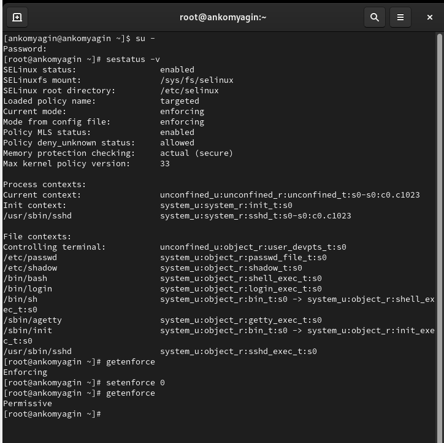{width=100%}

## SELINUX=disabled

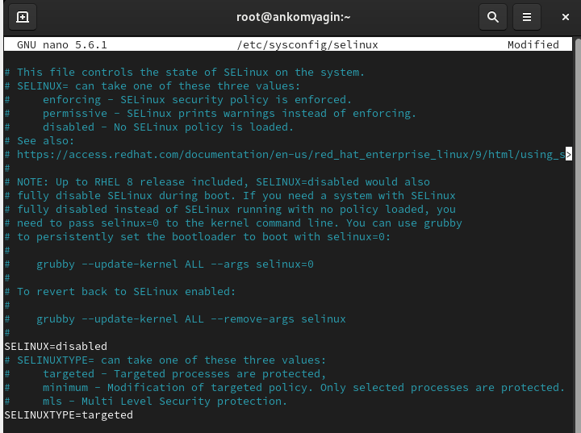{width=100%}

## Переключение режимов

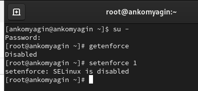{width=100%}

## SELINUX=enforcing

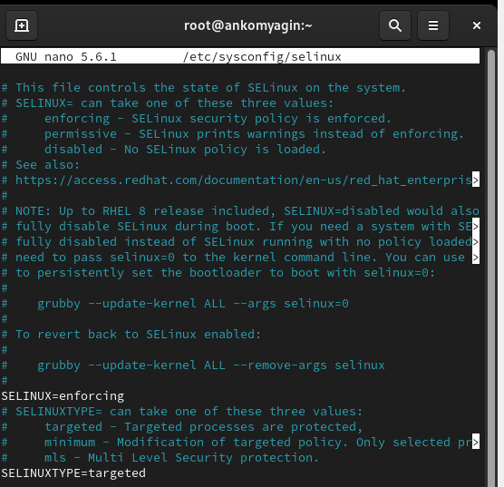{width=100%}

## информация о состоянии

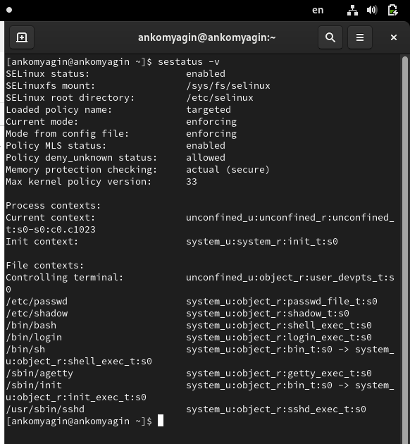{width=100%}

# Использование restorecon для восстановления контекста безопасности

## контекст безопасности

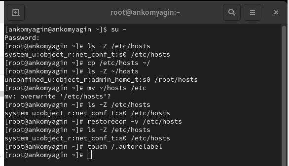{width=100%}

## перемаркировка

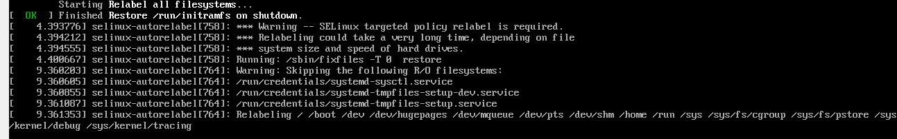{width=100%}

## установка по

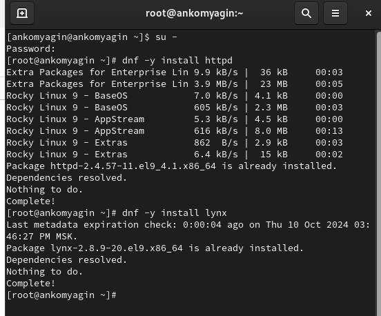{width=100%}

## web-сервер

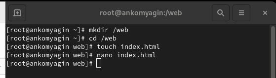{width=100%}

## редактирование /etc/httpd/conf/httpd.conf

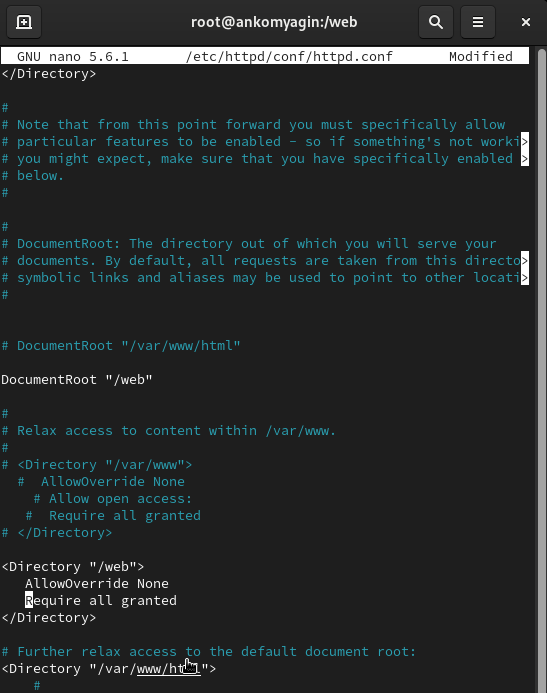{width=100%}

## запуск сервера и службы

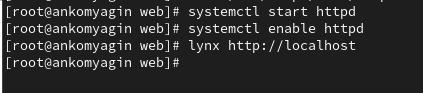{width=100%}

## новая метка контекста к веб

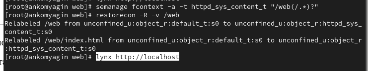{width=100%}

## веб-сервер

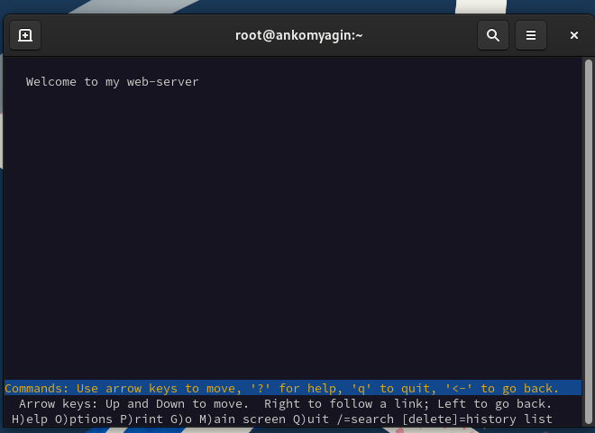{width=100%}

# Работа с переключателями SELinux

## режимы системы

{width=100%}

# Контрольные вопросы

## 1. Команда для временного перевода SELinux в разрешающий режим:
   
**setenforce 0**
   
(для временного перехода в разрешающий режим используется setenforce 1).

## 2. Команда для получения списка всех доступных переключателей SELinux:
   
**getsebool -a**

## 3. Имя пакета для получения легко читаемых сообщений журнала SELinux:

Пакет называется setroubleshoot.

## 4. Команды для применения типа контекста httpdsyscontent_t к каталогу /web:
   
**semanage fcontext -a -t httpd_sys_content_t "/web(/.*)?"**
**restorecon -R /web**

## 5. Файл, который нужно изменить для полного отключения SELinux:

Файл конфигурации SELinux находится по пути /etc/selinux/config. В нем нужно изменить строку:
   
**SELINUX=disabled**
   
## 6. Место, где SELinux регистрирует свои сообщения:

SELinux регистрирует свои сообщения в журнале аудита, обычно это файл /var/log/audit/audit.log, а также может использоваться системный журнал (journalctl).

## 7. Команда для получения информации о доступных типах контекстов для службы ftp:
   
   **seinfo -t | grep ftp**
   
   или
   
   **sesearch --allow -s ftp_t**

## 8. Самый простой способ узнать, связано ли поведение сервиса с SELinux:
   Использовать команду audit2why для анализа сообщений журнала аудита:
   
   **ausearch -m avc -ts recent | audit2why**
  
Это покажет, были ли какие-либо отказанные доступы, связанные с SELinux.

# Вывод

## Вывод

В ходе выполнения лабораторной работы я получил навыки управления системными службами операционной системы посредством systemd.

