---
## Front matter
title: "Лабораторная работа №9"
subtitle: "Управление SELinux"
author: "Комягин Андрей Николаевич"

## Generic otions
lang: ru-RU
toc-title: "Содержание"

## Bibliography
bibliography: bib/cite.bib
csl: pandoc/csl/gost-r-7-0-5-2008-numeric.csl

## Pdf output format
toc: true # Table of contents
toc-depth: 2
lof: true # List of figures
lot: true # List of tables
fontsize: 12pt
linestretch: 1.5
papersize: a4
documentclass: scrreprt
## I18n polyglossia
polyglossia-lang:
  name: russian
  options:
	- spelling=modern
	- babelshorthands=true
polyglossia-otherlangs:
  name: english
## I18n babel
babel-lang: russian
babel-otherlangs: english
## Fonts
mainfont: PT Serif
romanfont: PT Serif
sansfont: PT Sans
monofont: PT Mono
mainfontoptions: Ligatures=TeX
romanfontoptions: Ligatures=TeX
sansfontoptions: Ligatures=TeX,Scale=MatchLowercase
monofontoptions: Scale=MatchLowercase,Scale=0.9
## Biblatex
biblatex: true
biblio-style: "gost-numeric"
biblatexoptions:
  - parentracker=true
  - backend=biber
  - hyperref=auto
  - language=auto
  - autolang=other*
  - citestyle=gost-numeric
## Pandoc-crossref LaTeX customization
figureTitle: "Рис."
tableTitle: "Таблица"
listingTitle: "Листинг"
lofTitle: "Список иллюстраций"
lotTitle: "Список таблиц"
lolTitle: "Листинги"
## Misc options
indent: true
header-includes:
  - \usepackage{indentfirst}
  - \usepackage{float} # keep figures where there are in the text
  - \floatplacement{figure}{H} # keep figures where there are in the text
---

# Цель работы

Получить навыки работы с контекстом безопасности и политиками SELinux.

# Выполнение лабораторной работы

## Управление режимами SELinux

Просмотрим текущую информацию о состоянии SELinux. Посмотрим, в каком режиме работает SELinux, изменим режим работы SELinux на разрешающий.  (рис. [-@fig:001]).

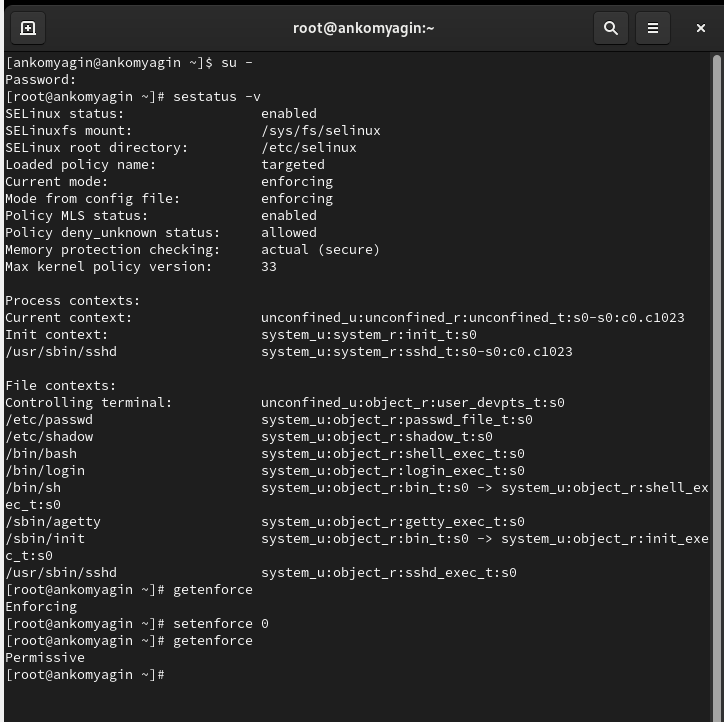{#fig:001 width=70%}

1. **SELinux status**: 

   * enabled: SELinux включен и работает.

2. **SELinuxfs mount**: 

   * Указывает, где в файловой системе смонтирована файловая система SELinux (/sys/fs/selinux).

3. **SELinux root directory**: 

   * Путь к директории, где хранятся конфигурационные файлы SELinux (/etc/selinux).

4. **Loaded policy name**: 

   * targeted: Загружена политика "targeted", которая фокусируется на защите определённых процессов.

5. **Current mode**: 

   * enforcing: SELinux работает в режиме принудительного контроля, что означает, что он будет блокировать действия, которые нарушают политику безопасности.

6. **Mode from config file**: 

   * Показывает, что режим, указанный в конфигурационном файле, также "enforcing".

7. **Policy MLS status**: 

   * enabled: Указывает на то, что поддержка многоуровневой безопасности (MLS) включена.

8. **Policy deny_unknown status**: 

   * Указывает, разрешено ли блокирование неизвестных объектов.

9. **Memory protection checking**: 

   * Указывает на проверку защиты памяти.

10. **Max kernel policy version**: 

   * Указывает максимальную версию политики ядра.

11. **Process contexts**: 

   * Отображает контексты процессов, показывая текущие контексты безопасности для различных процессов.
   
12. **File contexts**: 

   * Показаны контексты безопасности для различных файлов.

В файле /etc/sysconfig/selinux с помощью редактора установим **SELINUX=disabled** (рис. [-@fig:002]).

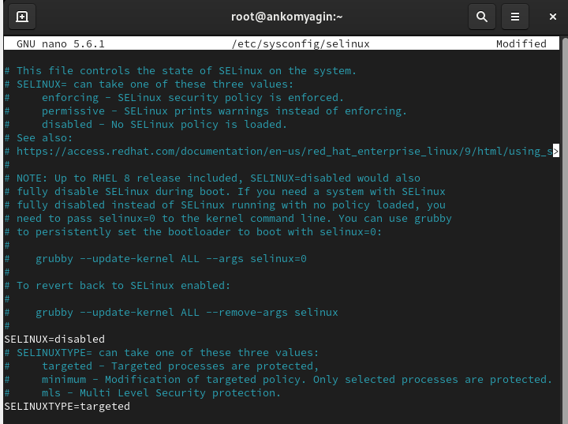{#fig:002 width=70%}

Посмотрим статус SELinux. Попробуем переключить режим работы SELinux. Мы не можем переключаться между отключённым и принудительным режимом без перезагрузки системы. (рис. [-@fig:003]).

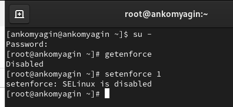{#fig:003 width=70%}

Откроем файл /etc/sysconfig/selinux с помощью редактора и установим: **SELINUX=enforcing** (рис. [-@fig:004]).

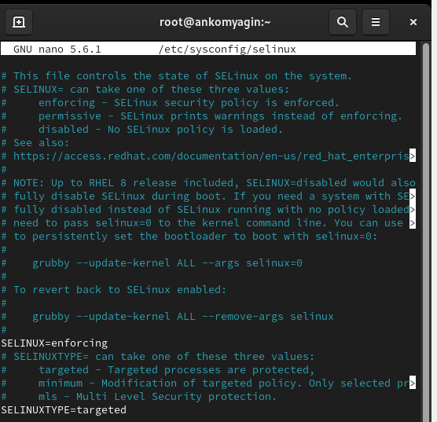{#fig:004 width=70%}

После перезагрузки просмотрим текущую информацию о состоянии SELinux (рис. [-@fig:005]).

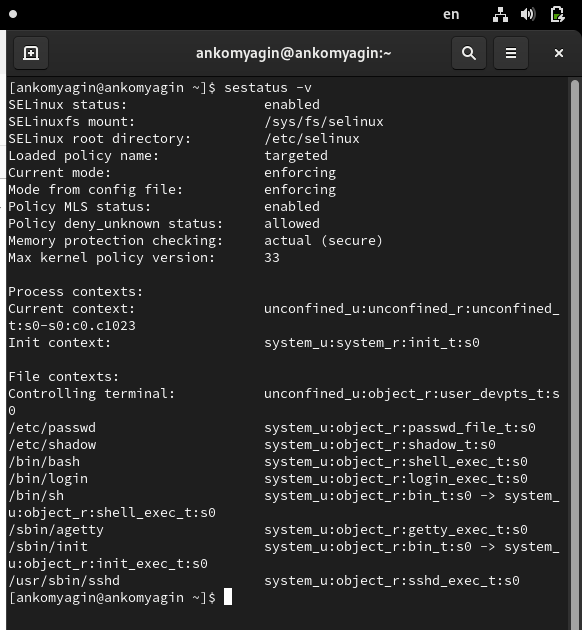{#fig:005 width=70%}

## Использование restorecon для восстановления контекста безопасности

Посмотрим контекст безопасности файла /etc/hosts. Мы увидим, что у файла есть метка контекста net_conf_t.

Скопируем файл /etc/hosts в домашний каталог. Проверим контекст файла ~/hosts: Поскольку копирование считается созданием нового файла, то параметр контекста в файле ~/hosts, расположенном в домашнем каталоге, станет admin_home_t.

Попытаемся перезаписать существующий файл hosts из домашнего каталога в каталог /etc:
mv ~/hosts /etc

Убедиимя, что тип контекста по-прежнему установлен на admin_home_t:

Исправим контекст безопасности и убедимся, что тип контекста изменился:

Для массового исправления контекста безопасности на файловой системе введём **touch /.autorelabel**(рис. [-@fig:006]) 

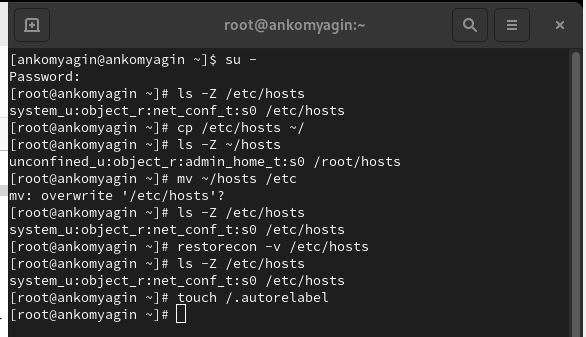{#fig:006 width=70%}

Перезагрузим систему. Файловая система автоматически перемаркирована(рис. [-@fig:007])

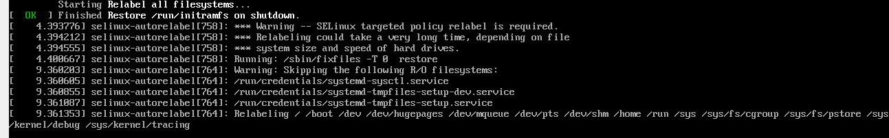{#fig:007 width=70%}

## Настройка контекста безопасности для нестандартного расположения файлов веб-сервера

Установим необходимое программное обеспечение (рис. [-@fig:008]).

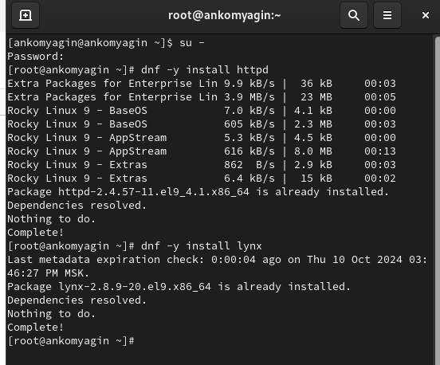{#fig:008 width=70%}

Создадим новое хранилище для файлов web-сервера. Создадим файл index.html в каталоге с контентом веб-сервера и поместим в файл **Welcome to my web-server**(рис. [-@fig:009])

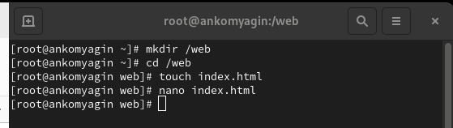{#fig:009 width=70%}

Отредактируем файл **/etc/httpd/conf/httpd.conf**(рис. [-@fig:010])

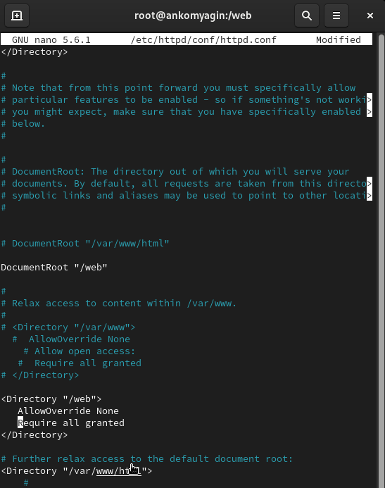{#fig:010 width=70%}

Запустим веб-сервер и службу httpd(рис. [-@fig:011])

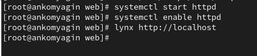{#fig:011 width=70%}

Применим новую метку контекста к /web. Восстановим контекст безопасности. (рис. [-@fig:012])

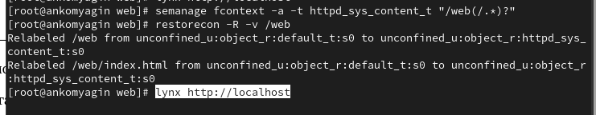{#fig:012 width=70%}

Обратимся к веб-серверу(рис. [-@fig:013])

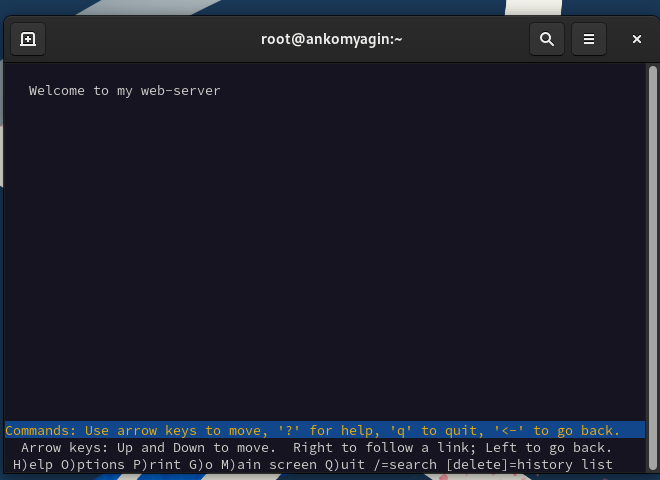{#fig:013 width=70%}

## Работа с переключателями SELinux

Перегрузим систему командой reboot. Вновь перегрузим систему командой reboot. Убедимся, что система загрузилась в графическом режиме(рис. [-@fig:014])

{#fig:014 width=70%}

# Контрольные вопросы

1. Команда для временного перевода SELinux в разрешающий режим:
   
**setenforce 0**
   
(для временного перехода в разрешающий режим используется setenforce 1).

2. Команда для получения списка всех доступных переключателей SELinux:
   
**getsebool -a**

3. Имя пакета для получения легко читаемых сообщений журнала SELinux:

Пакет называется setroubleshoot.

4. Команды для применения типа контекста httpdsyscontent_t к каталогу /web:
   
**semanage fcontext -a -t httpd_sys_content_t "/web(/.*)?"**
**restorecon -R /web**

5. Файл, который нужно изменить для полного отключения SELinux:

Файл конфигурации SELinux находится по пути /etc/selinux/config. В нем нужно изменить строку:
   
**SELINUX=disabled**
   
6. Место, где SELinux регистрирует свои сообщения:

SELinux регистрирует свои сообщения в журнале аудита, обычно это файл /var/log/audit/audit.log, а также может использоваться системный журнал (journalctl).

7. Команда для получения информации о доступных типах контекстов для службы ftp:
   
   **seinfo -t | grep ftp**
   
   или
   
   **sesearch --allow -s ftp_t**

8. Самый простой способ узнать, связано ли поведение сервиса с SELinux:
   Использовать команду audit2why для анализа сообщений журнала аудита:
   
   **ausearch -m avc -ts recent | audit2why**
  
Это покажет, были ли какие-либо отказанные доступы, связанные с SELinux.

# Вывод

В ходе выполнения лабораторной работы я получил навыки управления системными службами операционной системы посредством systemd.

# Список литературы{.unnumbered}

[Туис, курс Администрирование операционных систем](https://esystem.rudn.ru/course/view.php?id=5946)
