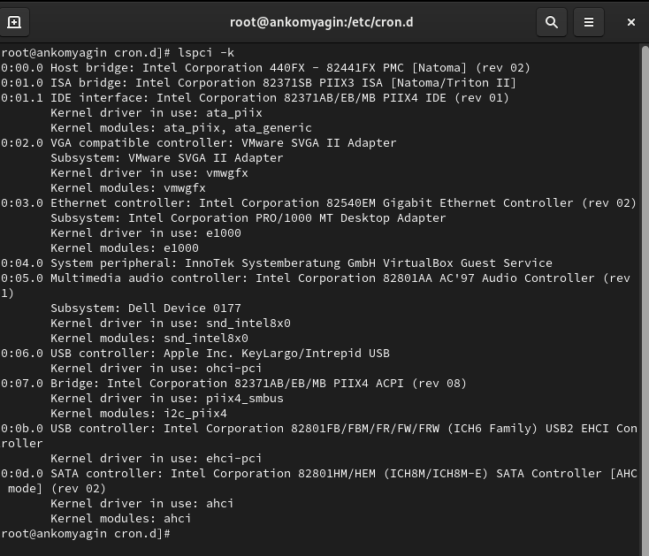
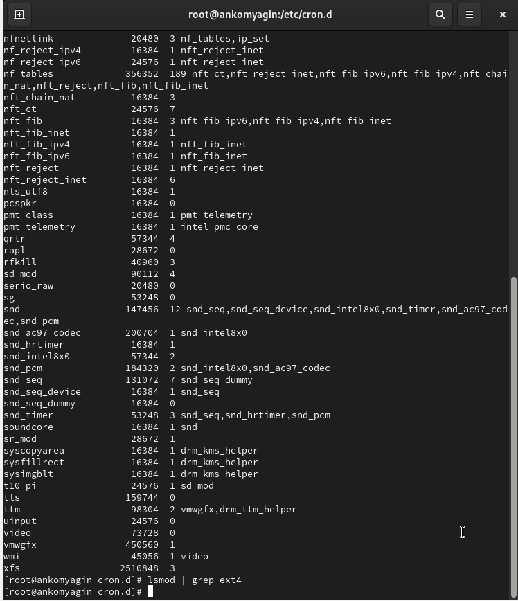
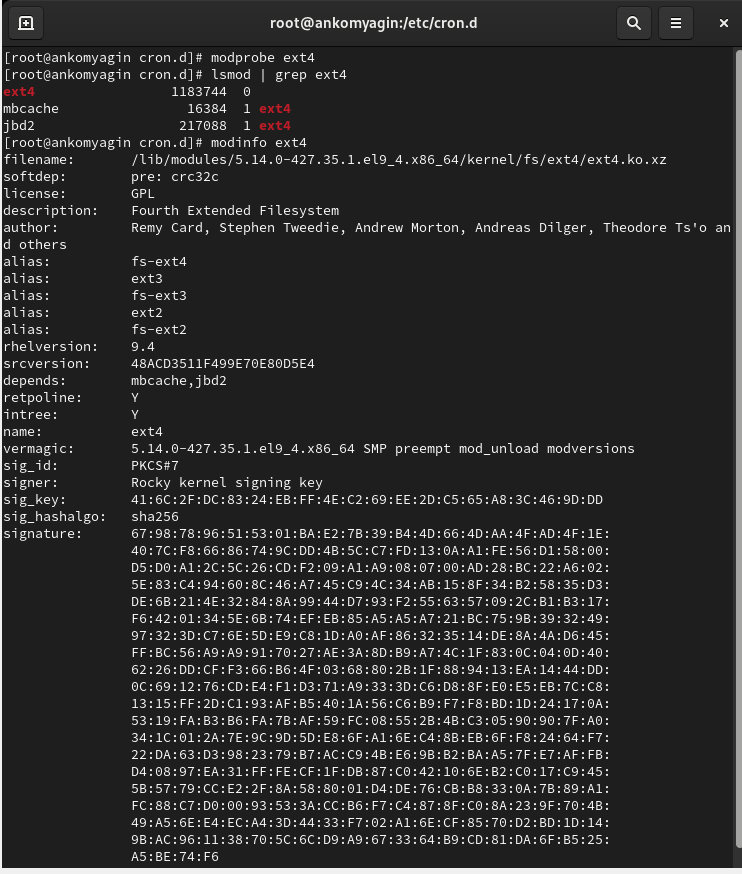
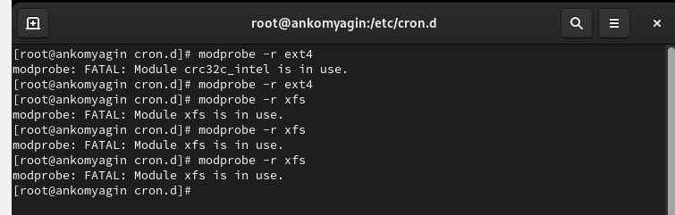
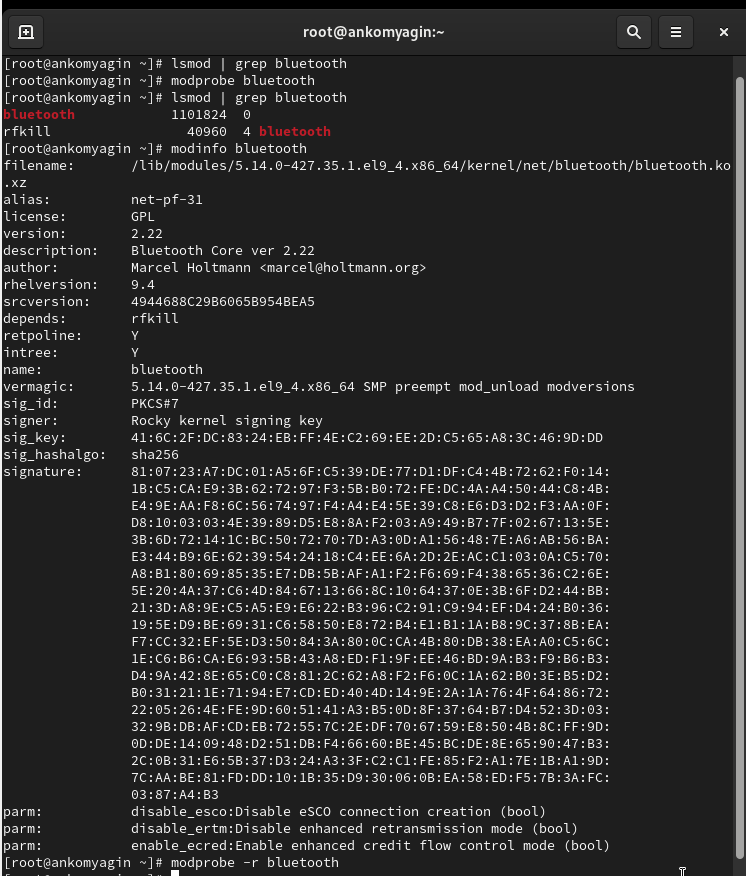
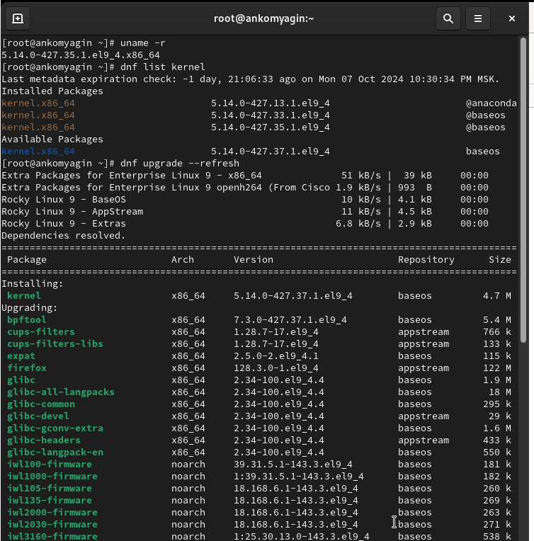
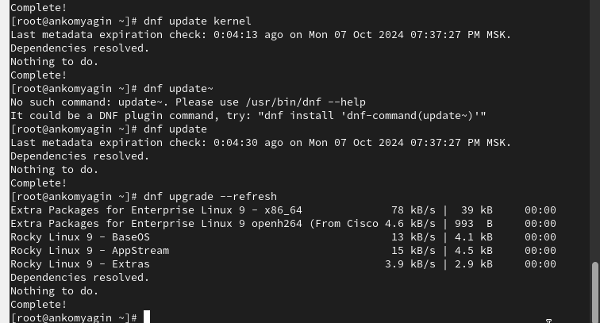
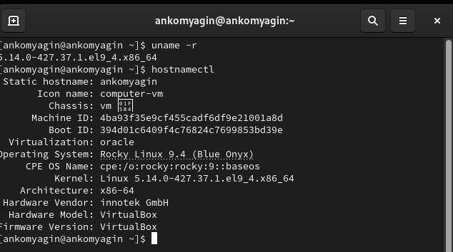

---
## Front matter
lang: ru-RU
title: Лабораторная работа №10
subtitle: Основы работы с модулями ядра операционной системы
author:
  - Комягин А. Н.
institute:
  - Российский университет дружбы народов, Москва, Россия
date: 09 октября 2024

## i18n babel
babel-lang: russian
babel-otherlangs: english

## Formatting pdf
toc: false
toc-title: Содержание
slide_level: 2
aspectratio: 169
section-titles: true
theme: metropolis
header-includes:
 - \metroset{progressbar=frametitle,sectionpage=progressbar,numbering=fraction}
 - '\makeatletter'
 - '\beamer@ignorenonframefalse'
 - '\makeatother'

##Fonts
mainfont: PT Serif
romanfont: PT Serif
sansfont: PT Sans
monofont: PT Mono
mainfontoptions: Ligatures=TeX
romanfontoptions: Ligatures=TeX
sansfontoptions: Ligatures=TeX,Scale=MatchLowercase
monofontoptions: Scale=MatchLowercase,Scale=0.9
---

## Цель

Получить навыки работы с утилитами управления модулями ядра операционной системы.

# Выполнение лабораторной работы

# Управление модулями ядра из командной строки

## lspci -k

{width=100%}

## загруженные модули

{width=100%}

## загрузка ядра ext4 и информация

{width=100%}

## выгрузка модулей

{width=100%}

# Загрузка модулей ядра с параметрами

## модуль bluetooth

{width=100%}

## версия ядра

{width=100%}

## обновим ядро и систему

{width=80%}

## версия ОС

{width=80%}

# Контрольные вопросы

## 1. Какой командой показать текущую версию ядра?
   
   **uname -r**
   

## 2. Как посмотреть более подробную информацию о текущей версии ядра?
   

   **uname -a**
   

   Эта команда покажет полную информацию о системе, включая версию ядра.

## 3. Какая команда показывает список загруженных модулей ядра?
   
   **lsmod**
   

## 4. Как определить параметры модуля ядра?
   

   **modinfo <имя_модуля>**

   Замените <имя_модуля> на имя интересующего вас модуля.

## 5. Как выгрузить модуль ядра?
   
   **rmmod <имя_модуля>**
 
   Или можно использовать:
   
  **modprobe -r <имя_модуля>**
   

## 6. Что делать, если вы получили сообщение об ошибке при попытке выгрузить модуль ядра?

   - Убедитесь, что модуль не используется другими процессами. Используйте команду lsof или fuser, чтобы найти процессы, использующие модуль.
   
   - Если модуль является зависимостью для других модулей, сначала нужно выгрузить их.
   
   - Попробуйте использовать modprobe -r вместо rmmod, так как он автоматически обработает зависимости.

## 7. Как определить, какие параметры модуля ядра поддерживаются?
   

   **modinfo -p <имя_модуля>**
   

## 8. Как установить новую версию ядра?

   - Сначала загрузите новую версию ядра (например, из официальных репозиториев вашей дистрибуции):
     
     **sudo dnf install kernel-<версия>**           # для Fedora
     

   - После установки перезагрузите систему:
     
     **reboot**
     

   - Выберите новую версию ядра в меню загрузчика (GRUB), если это необходимо.

# Вывод

## Вывод

В ходе выполнения лабораторной работы я получил навыки работы с утилитами управления модулями ядра операционной системы.

