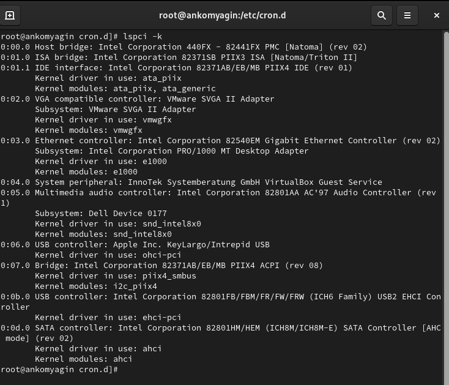
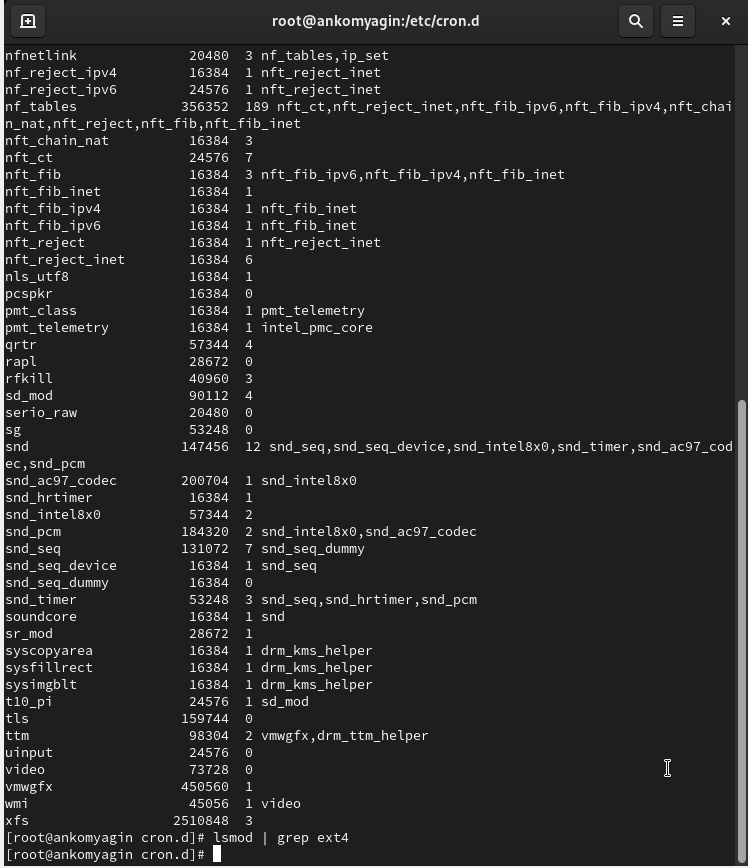
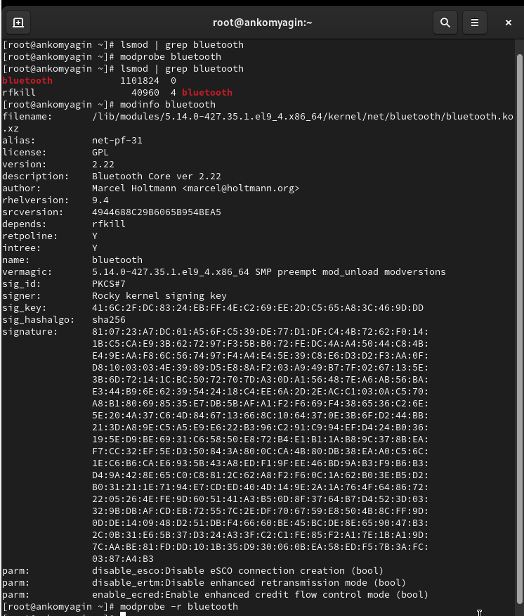
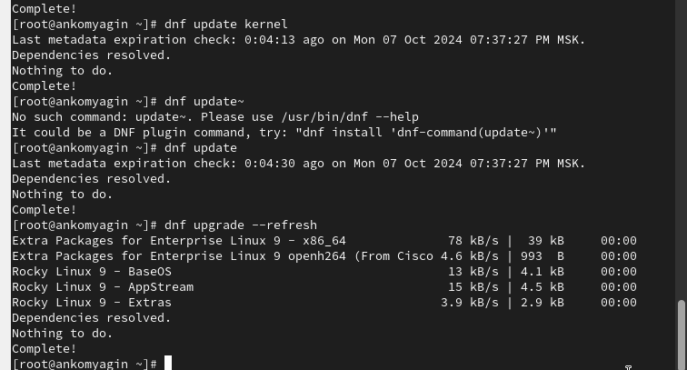

---
## Front matter
title: "Лабораторная работа №10"
subtitle: "Основы работы с модулями ядра операционной системы"
author: "Комягин Андрей Николаевич"

## Generic otions
lang: ru-RU
toc-title: "Содержание"

## Bibliography
bibliography: bib/cite.bib
csl: pandoc/csl/gost-r-7-0-5-2008-numeric.csl

## Pdf output format
toc: true # Table of contents
toc-depth: 2
lof: true # List of figures
lot: true # List of tables
fontsize: 12pt
linestretch: 1.5
papersize: a4
documentclass: scrreprt
## I18n polyglossia
polyglossia-lang:
  name: russian
  options:
	- spelling=modern
	- babelshorthands=true
polyglossia-otherlangs:
  name: english
## I18n babel
babel-lang: russian
babel-otherlangs: english
## Fonts
mainfont: PT Serif
romanfont: PT Serif
sansfont: PT Sans
monofont: PT Mono
mainfontoptions: Ligatures=TeX
romanfontoptions: Ligatures=TeX
sansfontoptions: Ligatures=TeX,Scale=MatchLowercase
monofontoptions: Scale=MatchLowercase,Scale=0.9
## Biblatex
biblatex: true
biblio-style: "gost-numeric"
biblatexoptions:
  - parentracker=true
  - backend=biber
  - hyperref=auto
  - language=auto
  - autolang=other*
  - citestyle=gost-numeric
## Pandoc-crossref LaTeX customization
figureTitle: "Рис."
tableTitle: "Таблица"
listingTitle: "Листинг"
lofTitle: "Список иллюстраций"
lotTitle: "Список таблиц"
lolTitle: "Листинги"
## Misc options
indent: true
header-includes:
  - \usepackage{indentfirst}
  - \usepackage{float} # keep figures where there are in the text
  - \floatplacement{figure}{H} # keep figures where there are in the text
---

# Цель работы

Получить навыки работы с утилитами управления модулями ядра операционной системы.

# Выполнение лабораторной работы

## Управление модулями ядра из командной строки

Посмотрим, какие устройства имеются в системе и какие модули ядра с ними связаны (рис. [-@fig:001]).

{#fig:001 width=70%}

Каждая строка в выводе содержит следующую информацию:

1. Идентификатор устройства (например, 0:00.0): Уникальный адрес устройства на шине PCI.

2. Тип устройства (например, Host bridge, VGA compatible controller): Описание типа устройства.

3. Производитель и модель (например, Intel Corporation 440FX - 82441FX PMC [Natoma]): Информация о производителе и модели устройства.

4. Версия (например, (rev 02)): Версия устройства.

5. Драйвер ядра (например, Kernel driver in use: ata_piix): Драйвер, который в данный момент используется для управления устройством.

6. Модули ядра (например, Kernel modules: ata_piix, ata_generic): Модули ядра, которые могут быть загружены для работы с данным устройством.

**Примеры устройств**

1. Host bridge: Устройство, которое соединяет процессор с другими компонентами системы.

2. IDE interface: Устройство для управления IDE-накопителями. Использует драйвер ata_piix.

3. VGA compatible controller: Видеоконтроллер, который управляет графикой. Использует драйвер vmwgfx.

4. Ethernet controller: Сетевой контроллер для подключения к сети. Использует драйвер e1000.

5. Multimedia audio controller: Звуковой контроллер для обработки аудиосигналов. Использует драйвер snd_intel8x0.

6. USB controller: Контроллер для управления USB-устройствами. Использует драйвер ohci-pci и ehci-pci для разных USB-портов.

7. SATA controller: Контроллер для управления SATA-накопителями. Использует драйвер ahci.

Посмотрим, какие модули ядра загружены. Посмотрим, загружен ли модуль ext4 (нет). (рис. [-@fig:002]).

{#fig:002 width=70%}

Загрузим модуль ядра ext4. Убедимся, что модуль загружен. Посмотрим информацию о модуле ядра ext4(рис. [-@fig:003]).

{#fig:003 width=70%}

1. filename: 

   - /lib/modules/5.14.0-427.35.1.el9_4.x86_64/kernel/fs/ext4/ext4.ko.xz 
   
   - Указывает путь к файлу модуля ядра (в данном случае, сжатый файл ext4.ko).

2. description: 

   - Fourth Extended Filesystem
   
   - Краткое описание модуля.

3. author: 

   - Указывает авторов разработки модуля (например, Remy Card, Stephen Tweedie и др.).

4. license: 

   - GPL
   
   - Указывает лицензию, под которой распространяется модуль (в данном случае, GNU General Public License).

5. depends: 

   - mbcache, jbd2
   
   - Указывает зависимости модуля от других модулей ядра. Этот модуль зависит от mbcache и jbd2.

6. alias: 

   - fs-ext4, ext3, fs-ext3, ext2, fs-ext2
   
   - Указывает альтернативные имена для данного модуля, что позволяет системе загружать модуль по другим именам.

7. rhelversion: 

   - 9.4
   
   - Указывает на версию Red Hat Enterprise Linux, с которой этот модуль совместим.

8. srcversion: 

   - 48ACD3511F499E70E80D5E4
   
   - Уникальный идентификатор версии исходного кода модуля.

9. vermagic: 

   - 5.14.0-427.35.1.el9_4.x86_64 SMP preempt mod_unload modversions
   
   - Указывает на версию ядра, для которой был скомпилирован модуль, а также на параметры конфигурации (например, поддержка SMP, прерываемости и т.д.).

10. signature: 

    - Содержит информацию о цифровой подписи модуля, включая алгоритм хеширования (sha256) и саму подпись.
    
    - Это обеспечивает безопасность и целостность модуля.

Попробуем выгрузить модуль ядра ext4 (рис. [-@fig:004]).

Система сообщает, что модуль нельзя выгрузить так как он используется.

{#fig:004 width=70%}

## Загрузка модулей ядра с параметрами

Посмотрим, загружен ли модуль bluetooth. hагрузим модуль ядра bluetooth. Посмотрим список модулей ядра, отвечающих за работу с Bluetooth. посмотрим информацию о модуле bluetooth. Выгрузим модуль ядра bluetooth (рис. [-@fig:005]).

{#fig:005 width=70%}

**параметры модуля Bluetooth**

1. disable_esco: 

   - Описание: Отключает создание соединений eSCO (Extended Synchronous Connection-Oriented).
   
   - Тип: bool (логический, true/false)

2. disable_ertm: 

   - Описание: Отключает режим улучшенной повторной передачи (Enhanced Retransmission Mode).
   
   - Тип: bool (логический, true/false)

3. enable_ecred: 

   - Описание: Включает режим улучшенного управления потоком (Enhanced Credit Flow Control).
   
   - Тип: bool (логический, true/false)

## Обновление ядра системы

Посмотрим версию ядра, используемую в операционной системе. Выведем на экран список пакетов, относящихся к ядру операционной системы. Обновим систему, чтобы убедиться, что все существующие пакеты обновлены(рис. [-@fig:006]) 

{#fig:006 width=70%}

Обновим ядро операционной системы, а затем саму операционную систему (рис. [-@fig:007])

{#fig:007 width=70%}

Посмотрим версию ядра, используемую в операционной системе (выбрана последняя версия) (рис. [-@fig:008]).

{#fig:008 width=70%}

# Контрольные вопросы

1. Какой командой показать текущую версию ядра?
   
   **uname -r**
   

2. Как посмотреть более подробную информацию о текущей версии ядра?
   

   **uname -a**
   

   Эта команда покажет полную информацию о системе, включая версию ядра.

3. Какая команда показывает список загруженных модулей ядра?
   
   **lsmod**
   

4. Как определить параметры модуля ядра?
   

   **modinfo <имя_модуля>**

   Замените <имя_модуля> на имя интересующего вас модуля.

5. Как выгрузить модуль ядра?
   
   **rmmod <имя_модуля>**
 
   Или можно использовать:
   
  **modprobe -r <имя_модуля>**
   

6. Что делать, если вы получили сообщение об ошибке при попытке выгрузить модуль ядра?

   - Убедитесь, что модуль не используется другими процессами. Используйте команду lsof или fuser, чтобы найти процессы, использующие модуль.
   
   - Если модуль является зависимостью для других модулей, сначала нужно выгрузить их.
   
   - Попробуйте использовать modprobe -r вместо rmmod, так как он автоматически обработает зависимости.

7. Как определить, какие параметры модуля ядра поддерживаются?
   

   **modinfo -p <имя_модуля>**
   

8. Как установить новую версию ядра?

   - Сначала загрузите новую версию ядра (например, из официальных репозиториев вашей дистрибуции):
     
     **sudo dnf install kernel-<версия>**           # для Fedora
     

   - После установки перезагрузите систему:
     
     **reboot**
     

   - Выберите новую версию ядра в меню загрузчика (GRUB), если это необходимо.

# Вывод

В ходе выполнения лабораторной работы я получил навыки работы с утилитами управления модулями ядра операционной системы.

# Список литературы{.unnumbered}

[Туис, курс Администрирование операционных систем](https://esystem.rudn.ru/course/view.php?id=5946)
