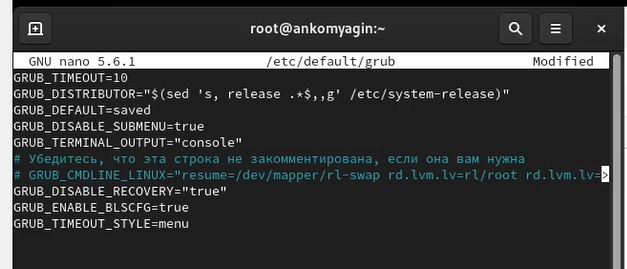
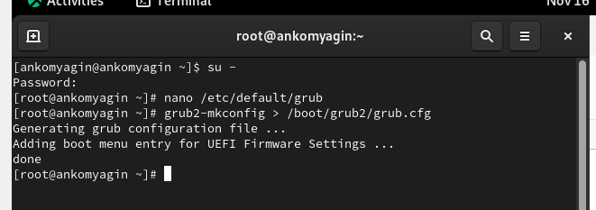
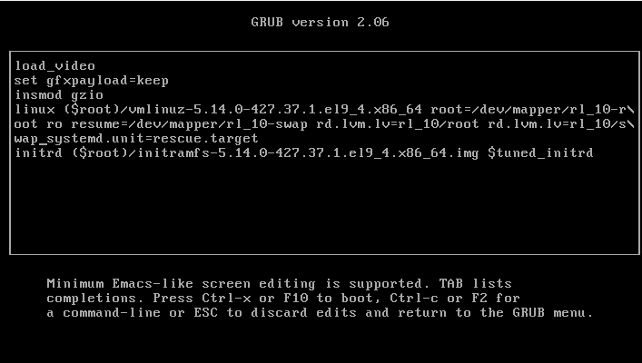
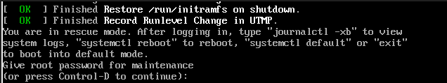
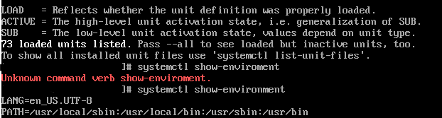
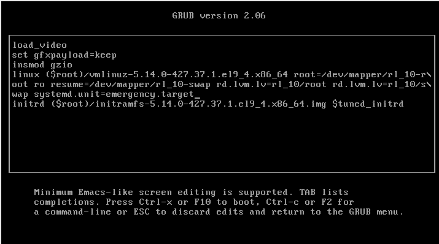
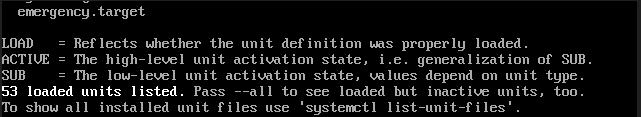
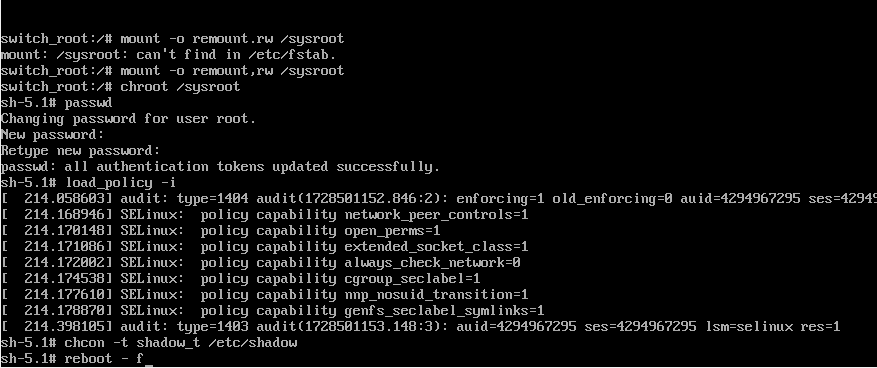

---
## Front matter
lang: ru-RU
title: Лабораторная работа №11
subtitle: Управление загрузкой системы
author:
  - Колонтырский И.Р.
institute:
  - Российский университет дружбы народов, Москва, Россия

## i18n babel
babel-lang: russian
babel-otherlangs: english

## Formatting pdf
toc: false
toc-title: Содержание
slide_level: 2
aspectratio: 169
section-titles: true
theme: metropolis
header-includes:
 - \metroset{progressbar=frametitle,sectionpage=progressbar,numbering=fraction}
 - '\makeatletter'
 - '\beamer@ignorenonframefalse'
 - '\makeatother'
 
## Fonts
mainfont: PT Serif
romanfont: PT Serif
sansfont: PT Sans
monofont: PT Mono
mainfontoptions: Ligatures=TeX
romanfontoptions: Ligatures=TeX
sansfontoptions: Ligatures=TeX,Scale=MatchLowercase
monofontoptions: Scale=MatchLowercase,Scale=0.9
---

# Цель работы

## Цель работы

 - Продолжение изучения ОС Linux. Получение навыков работы с загрузчиком системы GRUB2.

# Выполнение работы

## 11.4.1. Модификация параметров GRUB2
:::::::::::::: {.columns align=center}
::: {.column width="45%"}

:::
::: {.column width="50%"}

:::
::::::::::::::

## 11.4.2. Устранения неполадок
:::::::::::::: {.columns align=center}
::: {.column width="40%"}
Перезапускаем систему, как только появится меню GRUB, выбираем строку с текущей версией ядра в меню и нажимаем e для редактирования. В конце строки ($root)/vmlinuz-  введем systemd.unit=rescue.target
и удалим опции rhgb
:::
::: {.column width="50%"}

:::
::::::::::::::

## 11.4.2
:::::::::::::: {.columns align=center}
::: {.column width="50%"}

:::
::: {.column width="45%"}

:::
::::::::::::::

## 11.4.2

:::::::::::::: {.columns align=center}
::: {.column width="50%"}

:::
::: {.column width="60%"}

:::
::::::::::::::

## 11.4.3. Сброс пароля root
:::::::::::::: {.columns align=center}
::: {.column width="50%"}

:::
::::::::::::::

## 11.4.3
:::::::::::::: {.columns align=center}
::: {.column width="50%"}

Чтобы получить доступ к системному образу для чтения и записи, наберем mount -o remount,rw /sysroot
Сделаем содержимое каталога /sysimage новым корневым каталогом, введем команду задания пароляи установим новый пароль для пользователя root. Загрузим также политику SELinux с помощью команды
load_policy -i и  вручную установим правильный тип контекста для /etc/shadow.
:::
::: {.column width="50%"}

:::
::::::::::::::

# Вывод

## Вывод

- В ходе работы были получены навыки работы с загрузчиком системы, проделаны различные действия в GRUB2.

