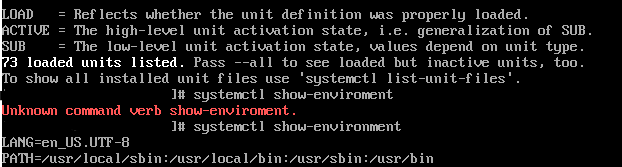

---
## Front matter
title: "Лабораторная работа №11"
subtitle: "Управление загрузкой системы"
author: "Комягин Андрей Николаевич"

## Generic otions
lang: ru-RU
toc-title: "Содержание"

## Bibliography
bibliography: bib/cite.bib
csl: pandoc/csl/gost-r-7-0-5-2008-numeric.csl

## Pdf output format
toc: true # Table of contents
toc-depth: 2
lof: true # List of figures
lot: true # List of tables
fontsize: 12pt
linestretch: 1.5
papersize: a4
documentclass: scrreprt
## I18n polyglossia
polyglossia-lang:
  name: russian
  options:
	- spelling=modern
	- babelshorthands=true
polyglossia-otherlangs:
  name: english
## I18n babel
babel-lang: russian
babel-otherlangs: english
## Fonts
mainfont: PT Serif
romanfont: PT Serif
sansfont: PT Sans
monofont: PT Mono
mainfontoptions: Ligatures=TeX
romanfontoptions: Ligatures=TeX
sansfontoptions: Ligatures=TeX,Scale=MatchLowercase
monofontoptions: Scale=MatchLowercase,Scale=0.9
## Biblatex
biblatex: true
biblio-style: "gost-numeric"
biblatexoptions:
  - parentracker=true
  - backend=biber
  - hyperref=auto
  - language=auto
  - autolang=other*
  - citestyle=gost-numeric
## Pandoc-crossref LaTeX customization
figureTitle: "Рис."
tableTitle: "Таблица"
listingTitle: "Листинг"
lofTitle: "Список иллюстраций"
lotTitle: "Список таблиц"
lolTitle: "Листинги"
## Misc options
indent: true
header-includes:
  - \usepackage{indentfirst}
  - \usepackage{float} # keep figures where there are in the text
  - \floatplacement{figure}{H} # keep figures where there are in the text
---

# Цель работы

Продолжение изучения ОС Linux. Получение навыков работы с загрузчиком системы GRUB2.

# Выполнение лабораторной работы

Запустим терминал и получим полномочия администратора. В файле /etc/default/grub установим параметр отображения меню загрузки в течение 10 секунд. Запишем изменения в GRUB2. Перезагрузим систему, чтобы убедиться, что мы видим отображение сообщений(рис. [-@fig:001]) и (рис. [-@fig:002]).

{#fig:001 width=70%}

{#fig:002 width=70%}

Перейдем к устранению неполадок.
Перезапускаем систему, как только появится меню GRUB, выбираем строку с текущей версией ядра в меню и нажимаем e для редактирования. В конце строки ($root)/vmlinuz-  введем systemd.unit=rescue.target
и удалим опции rhgb(рис. [-@fig:003]).

{#fig:003 width=70%}

Продолжаем процесс загрузки, вводим пароль и смотрим список всех файлов модулей, которые загружены в настоящее время. Видим, что загружена базовая системная среда(рис. [-@fig:004]).

{#fig:004 width=70%}

Просмотрим также переменные среды оболочки и перегрзуим системы(рис. [-@fig:005]).

{#fig:005 width=55%}

Еще раз откроем GRUB2 на редактирование, в конце той же строки введем systemd.unit=emergency.target, также удалив ненужные опции(рис. [-@fig:006]).

{#fig:006 width=70%}

Посмотрим список всех загруженных файлов модулей - 
systemctl list-units

Обратим внимание, что количество загружаемых файлов модулей уменьшилось до минимума. Перезапустим систему(рис. [-@fig:007]).

{#fig:007 width=70%}

Перейдем к сбросу пароля root.
Перезапустим систему, откроем меню GRUB2, выберем в меню
строку с текущей версией ядра системы и нажмем e , чтобы войти в режим редактора. В конце строки, загружающей ядро, введем rd.break и удалим опции rhgb (рис. [-@fig:008]).

{#fig:008 width=70%}

Продолжим загрузку. 
Чтобы получить доступ к системному образу для чтения и записи, наберем mount -o remount,rw /sysroot
Сделаем содержимое каталога /sysimage новым корневым каталогом, набрав
chroot /sysroot.

Теперь введем команду задания пароля:
passwd
и установим новый пароль для пользователя root. Загрузим также политику SELinux с помощью команды
load_policy -i и  вручную установим правильный тип контекста для /etc/shadow.
Перезагрузим систему с помощью команды reboot -f (рис. [-@fig:009]).

{#fig:009 width=70%}

Поcле запуска войдем в систему и введем пароль root, для проверки корректности работы.(рис. [-@fig:010]).

{#fig:010 width=70%}

# Контрольные вопросы

1. Для применения общих изменений в GRUB2 следует изменить файл конфигурации /etc/default/grub.

2. Конфигурационный файл GRUB2 называется /boot/grub/grub.cfg. 

3. После внесения изменений в конфигурацию GRUB2, чтобы изменения сохранились и воспринялись при загрузке системы, необходимо выполнить команду: systemctl reboot.

# Выводы

В ходе работы я получил навыки работы с загрузчиком системы, проделал различные действия в GRUB2.

# Список литературы{.unnumbered}

[ТУИС](https://esystem.rudn.ru/pluginfile.php/2400735/mod_resource/content/4/012-boot.pdf)
:::
