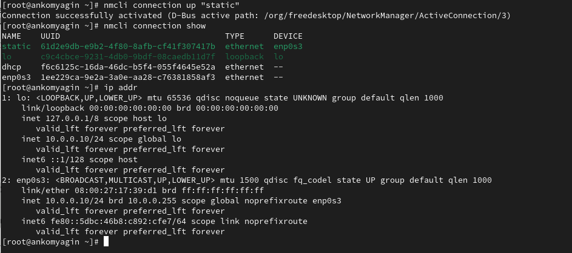

---
## Front matter
lang: ru-RU
title: Лабораторная работа №5
subtitle: Управление системными службами
author:
  - Комягин А. Н.
institute:
  - Российский университет дружбы народов, Москва, Россия
date: 05 октября 2024

## i18n babel
babel-lang: russian
babel-otherlangs: english

## Formatting pdf
toc: false
toc-title: Содержание
slide_level: 2
aspectratio: 169
section-titles: true
theme: metropolis
header-includes:
 - \metroset{progressbar=frametitle,sectionpage=progressbar,numbering=fraction}
 - '\makeatletter'
 - '\beamer@ignorenonframefalse'
 - '\makeatother'

##Fonts
mainfont: PT Serif
romanfont: PT Serif
sansfont: PT Sans
monofont: PT Mono
mainfontoptions: Ligatures=TeX
romanfontoptions: Ligatures=TeX
sansfontoptions: Ligatures=TeX,Scale=MatchLowercase
monofontoptions: Scale=MatchLowercase,Scale=0.9
---

## Цель

Получить навыки управления системными службами операционной системы посредством systemd.

# Выполнение лабораторной работы

# Управление сервисами

## Установка службы Very Secure FTP

{width=100%}

## Статус Very Secure FTP

{width=100%}

## автозапуск

{width=100%}

## символические ссылки

{width=100%}

## Список зависимостей

{width=100%}

## Список юнитов, зависящих от юнита

{width=100%}

# Конфликты юнитов

## установка iptables

{width=80%}

## запуск конфликтующих юнитов

{width=80%}

##  Конфликты юнитов

{width=80%}

## блокировка iptables

{width=80%}

## Изолируемые цели

{width=80%}

## режим восстановления

{width=80%}

## цель по умолчанию

{width=80%}

## режимы системы

{width=80%}

# Контрольные вопросы

## 1. Что такое юнит (unit)? Приведите примеры.

   Юнит в контексте systemd — это абстракция, представляющая собой объект, который управляется системой и может быть запущен или остановлен. Существует несколько типов юнитов, включая:

   - Сервисные юниты (service): представляют собой службы, которые выполняют определенные задачи (например, httpd.service для Apache).
   
   - Целевые юниты (target): группы других юнитов, которые могут быть активированы вместе (например, multi-user.target).
   
   - Монтажные юниты (mount): представляют собой точки монтирования файловых систем.
   
   - Сокетные юниты (socket): управляют сокетами для межпроцессного взаимодействия.

## 2. Какая команда позволяет вам убедиться, что цель больше не входит в список автоматического запуска при загрузке системы?

   Для этого используется команда:
   
      **sudo systemctl disable <имя_цели>**
   

## 3. Какую команду вы должны использовать для отображения всех сервисных юнитов, которые в настоящее время загружены?

   Для отображения всех загруженных сервисных юнитов используйте команду:
   
      **systemctl list-units --type=service**
   

## 4. Как создать потребность (wants) в сервисе?

   Для создания зависимости типа "wants" можно использовать команду:
   
      **sudo systemctl add-wants <имя_юнита> <имя_сервиса>**
   

## 5. Как переключить текущее состояние на цель восстановления (rescue target)?

   Для переключения на цель восстановления используйте команду:
   
      **sudo systemctl isolate rescue.target**
   

## 6. Поясните причину получения сообщения о том, что цель не может быть изолирована.

   Сообщение о том, что цель не может быть изолирована, может возникнуть, если цель имеет активные зависимости или другие юниты, которые не могут быть остановлены без нарушения работы системы. Это может происходить из-за активных служб или процессов, которые требуют других юнитов.

## 7. Вы хотите отключить службу systemd, но, прежде чем сделать это, вы хотите узнать, какие другие юниты зависят от этой службы. Какую команду вы бы использовали?

   Для отображения зависимостей используйте команду:
   
      **systemctl list-dependencies <имя_службы>**

# Вывод

## Вывод

В ходе выполнения лабораторной работы я получил навыки управления системными службами операционной системы посредством systemd.

