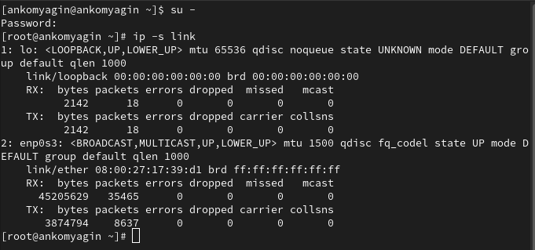
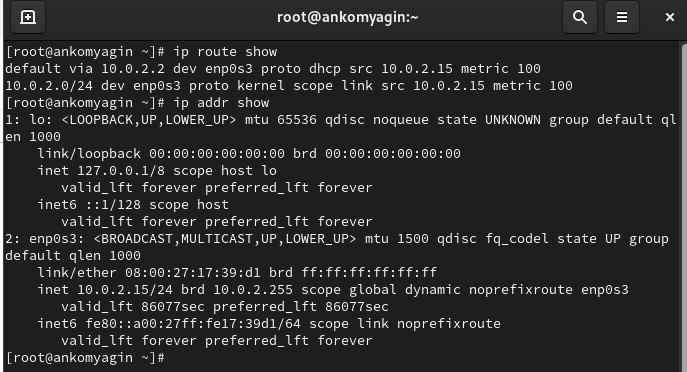
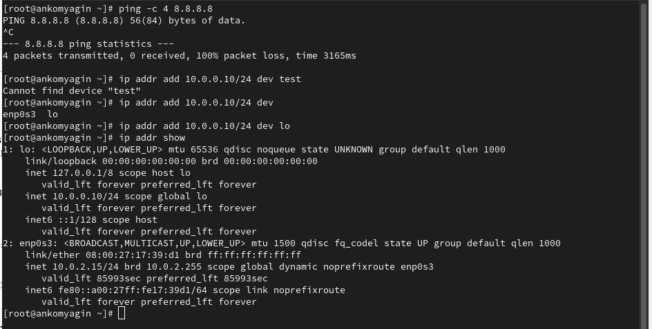
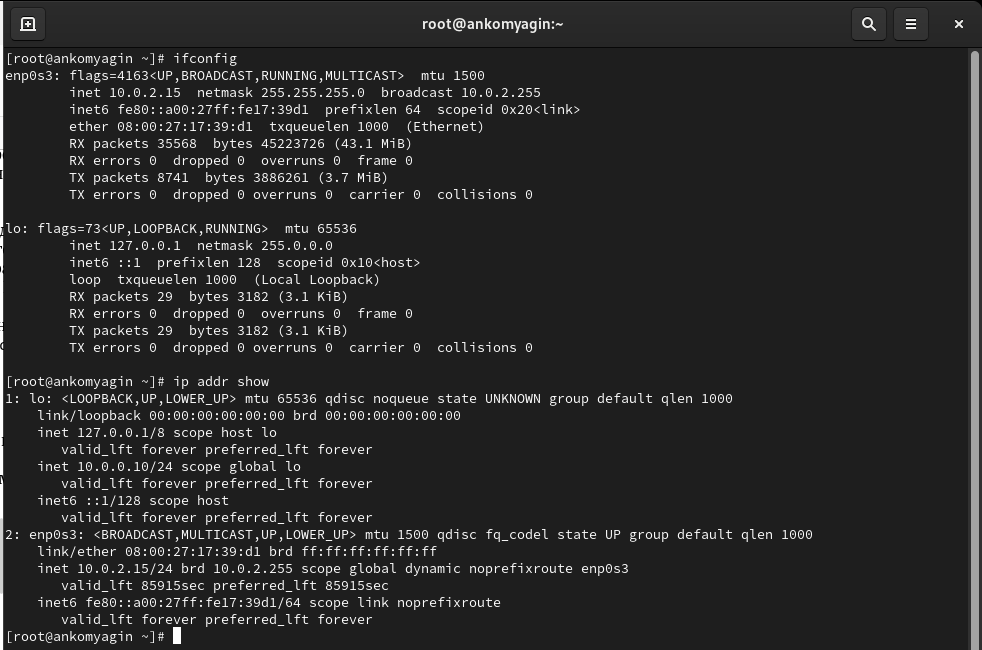
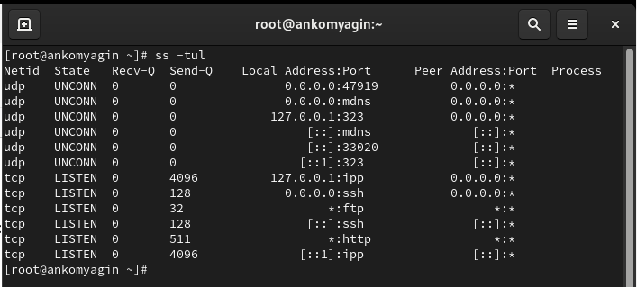
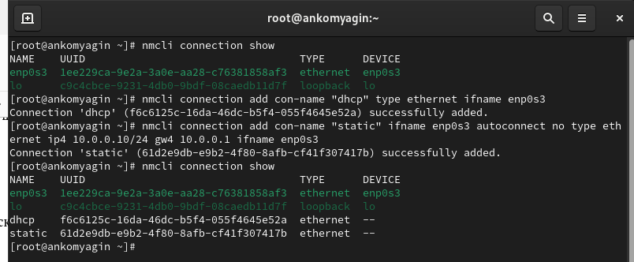
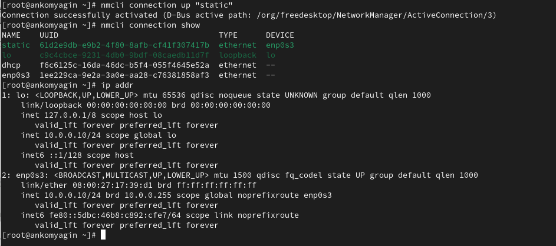
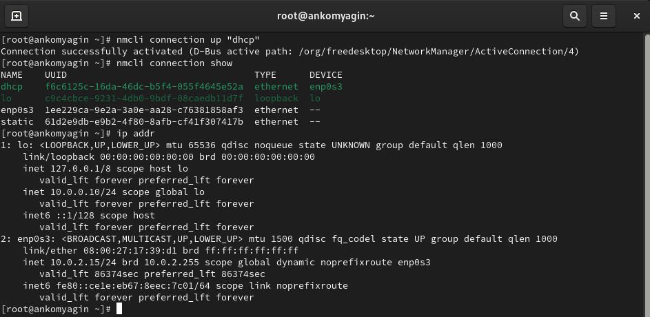
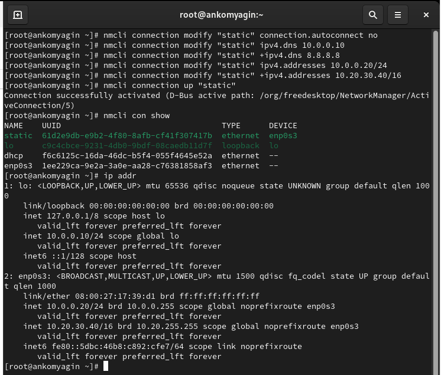
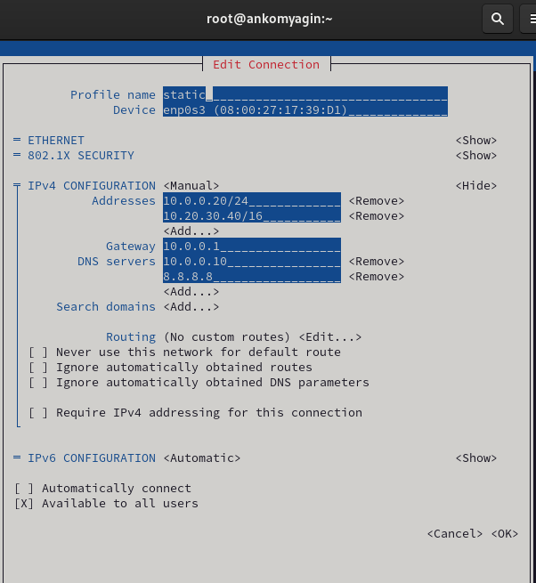

---
## Front matter
title: "Лабораторная работа №12"
subtitle: "Настройки сети в Linux"
author: "Комягин Андрей Николаевич"

## Generic otions
lang: ru-RU
toc-title: "Содержание"

## Bibliography
bibliography: bib/cite.bib
csl: pandoc/csl/gost-r-7-0-5-2008-numeric.csl

## Pdf output format
toc: true # Table of contents
toc-depth: 2
lof: true # List of figures
lot: true # List of tables
fontsize: 12pt
linestretch: 1.5
papersize: a4
documentclass: scrreprt
## I18n polyglossia
polyglossia-lang:
  name: russian
  options:
	- spelling=modern
	- babelshorthands=true
polyglossia-otherlangs:
  name: english
## I18n babel
babel-lang: russian
babel-otherlangs: english
## Fonts
mainfont: PT Serif
romanfont: PT Serif
sansfont: PT Sans
monofont: PT Mono
mainfontoptions: Ligatures=TeX
romanfontoptions: Ligatures=TeX
sansfontoptions: Ligatures=TeX,Scale=MatchLowercase
monofontoptions: Scale=MatchLowercase,Scale=0.9
## Biblatex
biblatex: true
biblio-style: "gost-numeric"
biblatexoptions:
  - parentracker=true
  - backend=biber
  - hyperref=auto
  - language=auto
  - autolang=other*
  - citestyle=gost-numeric
## Pandoc-crossref LaTeX customization
figureTitle: "Рис."
tableTitle: "Таблица"
listingTitle: "Листинг"
lofTitle: "Список иллюстраций"
lotTitle: "Список таблиц"
lolTitle: "Листинги"
## Misc options
indent: true
header-includes:
  - \usepackage{indentfirst}
  - \usepackage{float} # keep figures where there are in the text
  - \floatplacement{figure}{H} # keep figures where there are in the text
---

# Цель работы

Получить навыки настройки сетевых параметров системы.

# Выполнение лабораторной работы

## Проверка конфигурации сети

Выведем на экран информацию о существующих сетевых подключениях, а также статистику о количестве отправленных пакетов и связанных с ними сообщениях об ошибках (рис. [-@fig:001]).

{#fig:001 width=70%}

- Существует 2 сетевых подключения **lo** и **enp0s3**

- Для каждого описаны переданные пакеты (вес и количество), а также ошибок.

- Ошибок на скриншоте нет.

Выведем на экран информацию о текущих маршрутах, выведем на экран информацию о текущих назначениях адресов для сетевых интерфейсов на устройстве (рис. [-@fig:002]).

{#fig:002 width=70%}

Описаны маршруты двух подключений.

Добавим дополнительный адрес к интерфейсу (рис. [-@fig:003]).

{#fig:003 width=70%}

Сравним вывод информации от утилиты **ip** и от команды **ifconfig** (рис. [-@fig:004]).

{#fig:004 width=70%}

Выведем на экран список всех прослушиваемых системой портов UDP и TCP (рис. [-@fig:005]).

{#fig:005 width=70%}

## Управление сетевыми подключениями с помощью nmcli

Выведем на экран информацию о текущих
соединениях
Добавим Ethernet-соединение с именем dhcp к интерфейсу
Добавим к этому же интерфейсу Ethernet-соединение с именем static, статическим
IPv4-адресом адаптера и статическим адресом шлюза(рис. [-@fig:006]) 

{#fig:006 width=70%}

Переключимся на статическое соединение, проверим успешность переключения(рис. [-@fig:007])

{#fig:007 width=70%}

Вернёмся к соединению dhcp (рис. [-@fig:008]).

{#fig:008 width=70%}

## Изменение параметров соединения с помощью nmcl

Совершим иземнения со статическим соединением, проверим успешность переключения(рис. [-@fig:009])

{#fig:009 width=70%}

Используя nmtui, посмотрим настройки static соединения на устройстве. Как мы видим, все изменения приняты(рис. [-@fig:010])

{#fig:010 width=70%}

# Контрольные вопросы

1. Какая команда отображает только статус соединения, но не IP-адрес?
   
   **nmcli connection show --active**

2. Какая служба управляет сетью в ОС типа RHEL?
   
   Служба, управляющая сетью в ОС типа RHEL, — это **NetworkManager**.

3. Какой файл содержит имя узла (устройства) в ОС типа RHEL?
   Имя узла (hostname) хранится в файле:
   
   **/etc/hostname**

4. Какая команда позволяет вам задать имя узла (устройства)?
   Для задания имени узла можно использовать команду:
   
  **hostnamectl set-hostname <новое_имя_узла>** 

5. Какой конфигурационный файл можно изменить для включения разрешения имён для конкретного IP-адреса?
   Для включения разрешения имён для конкретного IP-адреса можно изменить файл:
  
   **/etc/hosts**

6. Какая команда показывает текущую конфигурацию маршрутизации?
   Для отображения текущей конфигурации маршрутизации используйте команду:
   
   **ip route show**

7. Как проверить текущий статус службы NetworkManager?
   Для проверки статуса службы NetworkManager используйте команду:
   

   **systemctl status NetworkManager**
   

8. Какая команда позволяет вам изменить текущий IP-адрес и шлюз по умолчанию для вашего сетевого соединения?
   Чтобы изменить текущий IP-адрес и шлюз по умолчанию, используйте команду:
   

   **nmcli connection modify "<имя_соединения>" ipv4.addresses <новый_IP_адрес>/<маска> ipv4.gateway <новый_шлюз>**

   Затем активировать соединение:
   

   **nmcli connection up "<имя_соединения>"**
   

# Вывод

В ходе выполнения лабораторной работы я получил навыки настройки сетевых параметров системы.

# Список литературы{.unnumbered}

[Туис, курс Администрирование операционных систем](https://esystem.rudn.ru/course/view.php?id=5946)
