---
## Front matter
title: "Лабораторная работа №13"
subtitle: "Фильтр пакетов"
author: "Комягин Андрей Николаевич"

## Generic otions
lang: ru-RU
toc-title: "Содержание"

## Pdf output format
toc: true # Table of contents
toc-depth: 2
lof: true # List of figures
lot: true # List of tables
fontsize: 12pt
linestretch: 1.5
papersize: a4
documentclass: scrreprt
## I18n polyglossia
polyglossia-lang:
  name: russian
  options:
	- spelling=modern
	- babelshorthands=true
polyglossia-otherlangs:
  name: english
## I18n babel
babel-lang: russian
babel-otherlangs: english
## Fonts
mainfont: PT Serif
romanfont: PT Serif
sansfont: PT Sans
monofont: PT Mono
mainfontoptions: Ligatures=TeX
romanfontoptions: Ligatures=TeX
sansfontoptions: Ligatures=TeX,Scale=MatchLowercase
monofontoptions: Scale=MatchLowercase,Scale=0.9
## Biblatex
biblatex: true
biblio-style: "gost-numeric"
biblatexoptions:
  - parentracker=true
  - backend=biber
  - hyperref=auto
  - language=auto
  - autolang=other*
  - citestyle=gost-numeric
## Pandoc-crossref LaTeX customization
figureTitle: "Рис."
tableTitle: "Таблица"
listingTitle: "Листинг"
lofTitle: "Список иллюстраций"
lolTitle: "Листинги"
## Misc options
indent: true
header-includes:
  - \usepackage{indentfirst}
  - \usepackage{float} # keep figures where there are in the text
  - \floatplacement{figure}{H} # keep figures where there are in the text
---

# Цель работы

Получение навыков настройки пакетного фильтра в Linux.

# Выполнение лабораторной работы

Получим полномочия администратора. Определим текущую зону по умолчанию. Определим доступные зоны. (рис. [-@fig:001]).

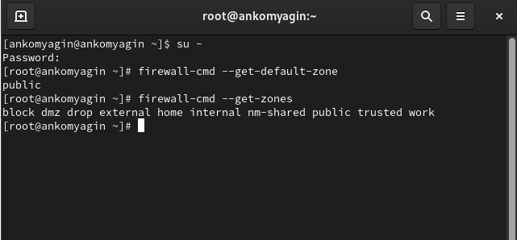{#fig:001 width=70%}

Посмотрим службы, доступные на компьютере.
 (рис. [-@fig:002]).

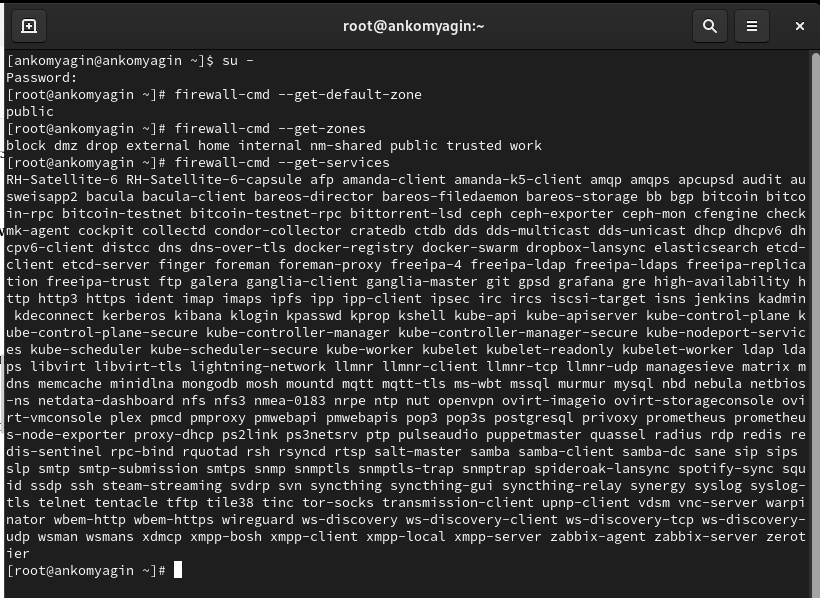{#fig:002 width=70%}

Определим доступные службы в текущей зоне. (рис. [-@fig:003]).

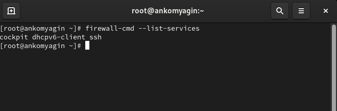{#fig:003 width=70%}

Сравним результаты вывода информации при использовании команд. (рис. [-@fig:004]). Вывод одинаков

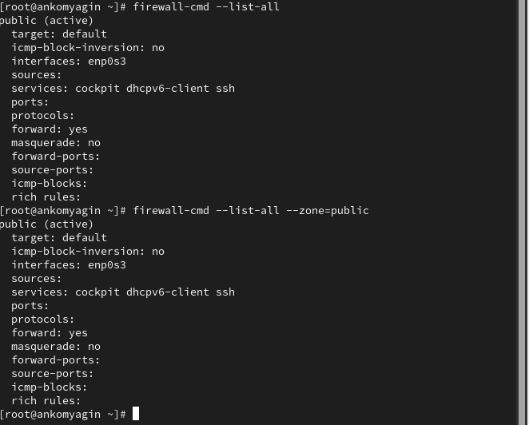{#fig:004 width=70%}

Добавим сервер VNC в конфигурацию брандмауэра. Проверим, добавился ли vnc-server в конфигурацию. (добавился) (рис. [-@fig:005]).

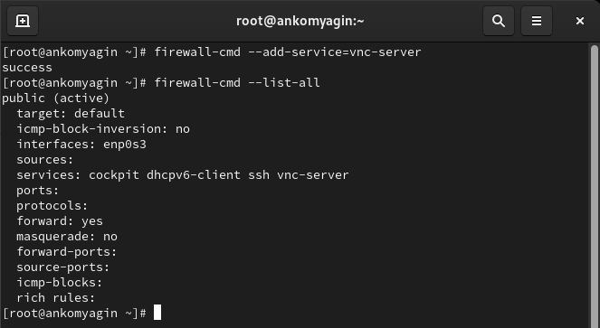{#fig:005 width=70%}

Перезапустим службу firewalld. (рис. [-@fig:006]).

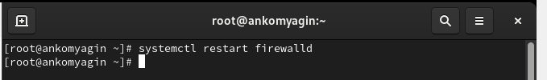{#fig:006 width=70%}

Проверим, есть ли vnc-server в конфигурации.
 (нет)(рис. [-@fig:007]).

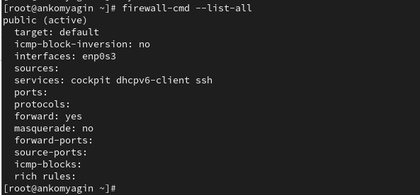{#fig:007 width=70%}

Добавим службу vnc-server ещё раз, но на этот раз сделайте её постоянной. Проверим наличие vnc-server в конфигурации.
 (рис. [-@fig:008]).

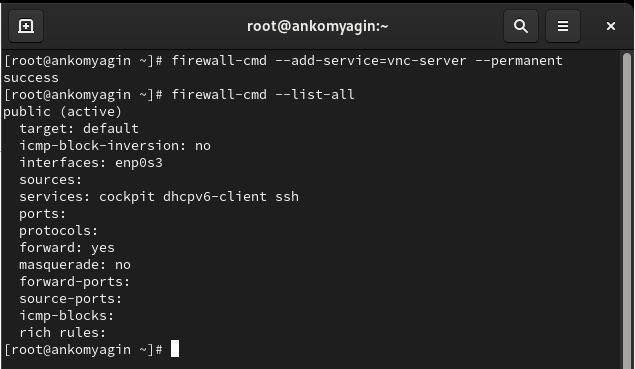{#fig:008 width=70%}

Служба не появилась сразу, при использовании опции --permanent нужно перезагрузить конфигурацию firewalld.

Перезагрузим конфигурацию firewalld и просмотрим конфигурацию времени выполнения (рис. [-@fig:009]).

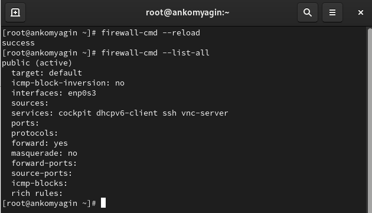{#fig:009 width=70%}

Сервер vnc отображается в конфигурации.

Добавим в конфигурацию межсетевого экрана порт 2022 протокола TCP. Затем перезагрузим конфигурацию firewalld. Проверим, что порт добавлен в конфигурацию.
(рис. [-@fig:010]).

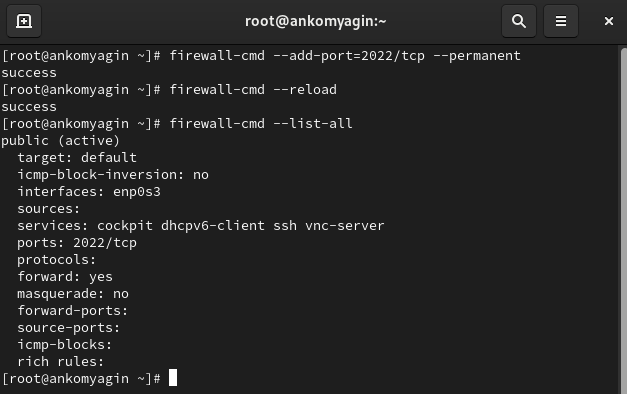{#fig:010 width=70%}

Откроем терминал и под учётной записью пользователя запустим интерфейс **GUI firewall-config**.
(рис. [-@fig:011]).

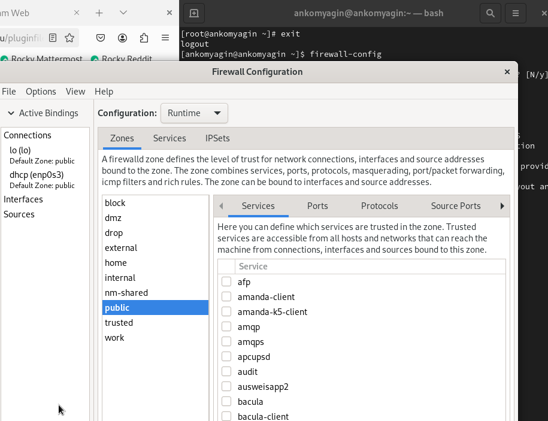{#fig:011 width=70%}

Нажмём выпадающее меню рядом с параметром **Configuration**. Откроем раскрывающийся список и выберем **Permanent** Это позволит сделать постоянными все изменения (рис. [-@fig:012]).

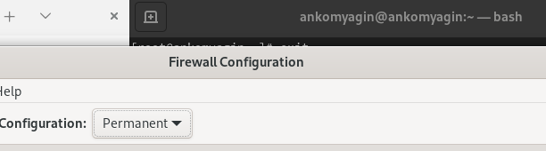{#fig:012 width=70%}

Выберем зону public и отметим службы **http, https и ftp**, чтобы включить их. (рис. [-@fig:013]).

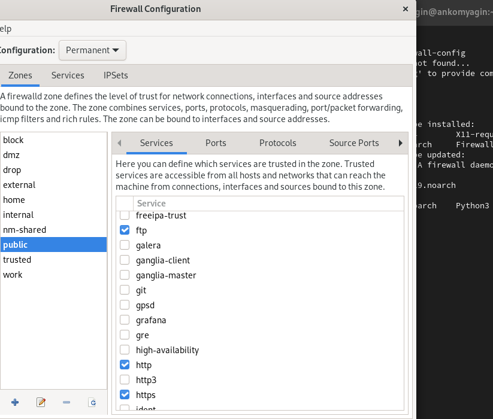{#fig:013 width=70%}

Выберем вкладку **Ports** и на этой вкладке нажмём **Add**. Введём порт 2022 и протокол **udp**, нажмём ОК , чтобы добавить их в список.(рис. [-@fig:014]).

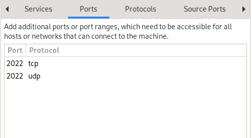{#fig:014 width=70%}

Закроем утилиту **firewall-config**. В окне терминала введём **firewall-cmd --list-all** (рис. [-@fig:015]).

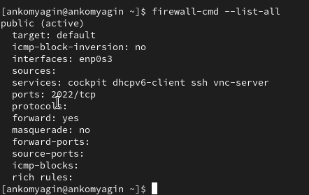{#fig:015 width=70%}

Изменения ещё не вступили в силу, так как конфигурация выбрана постоянная.

Перегрузим конфигурацию **firewall-cmd**. Вызовем список доступных сервисов.(рис. [-@fig:016]).

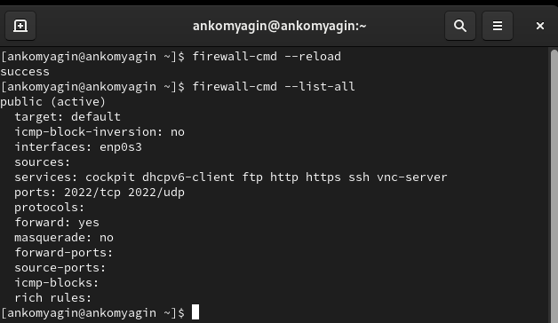{#fig:016 width=70%}

Создадим конфигурацию межсетевого экрана, которая позволяет получить доступ к следующим службам:
- telnet;
- imap;
- pop3;
- smtp.

Сделаем это как в командной строке (для службы telnet), так и в графическом интерфейсе (для служб imap, pop3, smtp). 
 (рис. [-@fig:017]).

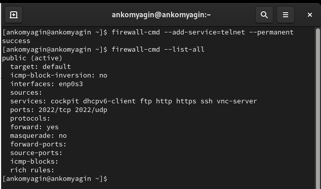{#fig:017 width=70%}

Затем добавим оставшиеся службы через графический интерфейс (рис. [-@fig:018]).

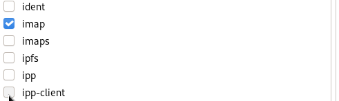{#fig:018 width=70%}

# Ответы на контрольные вопросы

1. Какая служба должна быть запущена перед началом работы с менеджером конфигурации брандмауэра firewall-config?

Нужно запустить службу firewalld, это можно сделать командой systemctl start firewalld.

2. Какая команда позволяет добавить UDP-порт 2355 в конфигурацию брандмауэра в зоне по умолчанию?

Команда firewall-cmd --add-port=2355/udp --permanent.

3. Какая команда позволяет показать всю конфигурацию брандмауэра во всех зонах?

Команда firewall-cmd --list-all-zones.

4. Какая команда позволяет удалить службу vnc-server из текущей конфигурации брандмауэра?

Команда firewall-cmd --remove-service=vnc-server --permanent.

5. Какая команда firewall-cmd позволяет активировать новую конфигурацию, добавленную опцией --permanent?

Команда firewall-cmd --reload.

6. Какой параметр firewall-cmd позволяет проверить, что новая конфигурация была добавлена в текущую зону и теперь активна?

Команда firewall-cmd --list-all.

7. Какая команда позволяет добавить интерфейс eno1 в зону public?

Команда firewall-cmd --zone=public --add-interface=eno1 --permanent.

8. Если добавить новый интерфейс в конфигурацию брандмауэра, пока не указана зона, в какую зону он будет добавлен?

Он будет добавлен в зону по умолчанию.

# Выводы

В ходе выполнения лабораторной работы я получил навыки настройки пакетного фильтра в Linux.
