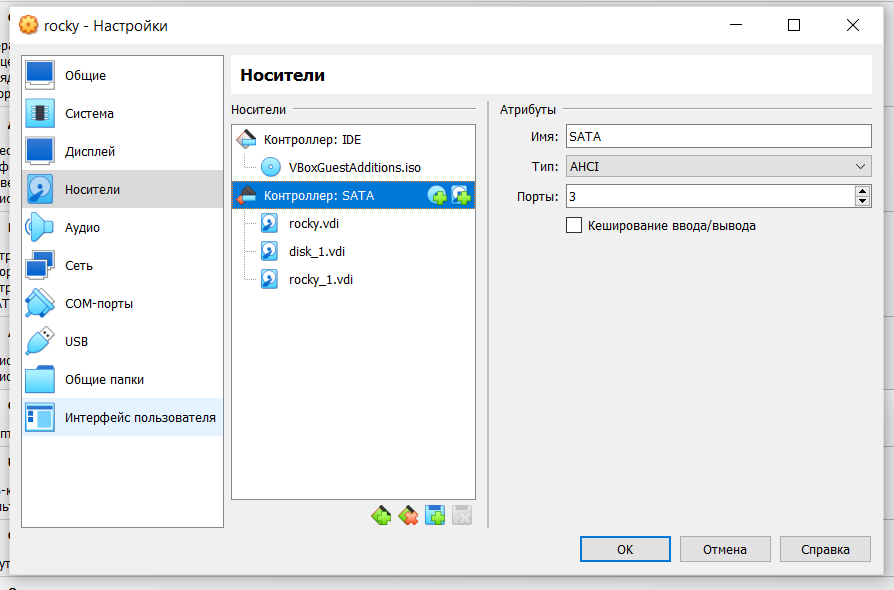
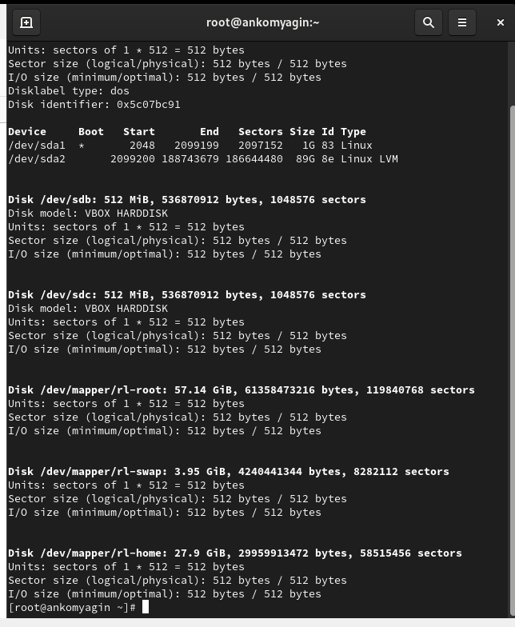
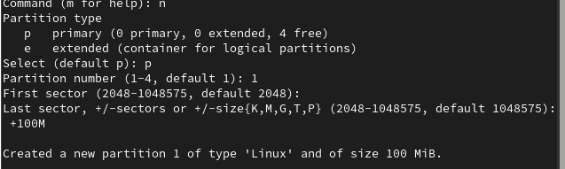

---
## Front matter
lang: ru-RU
title: Лабораторная работа №14
subtitle: "Партиции, файловые системы, монтирование"
author:
  - Комягин А.Н.
institute:
  - Российский университет дружбы народов, Москва, Россия
  
date: 7 декабря 2024

## i18n babel
babel-lang: russian
babel-otherlangs: english

## Formatting pdf
toc: false
toc-title: Содержание
slide_level: 2
aspectratio: 169
section-titles: true
theme: metropolis
header-includes:
 - \metroset{progressbar=frametitle,sectionpage=progressbar,numbering=fraction}
---

# Цель

## Цель

Получить навыки создания разделов на диске и файловых систем. Получить навыки монтирования файловых систем.

# Выполнение лабораторной работы

##  Добавим к виртуальной машине два диска размером 512 МБ 

##  Посмотрим перечень разделов на всех имеющихся в системе устройствах жёстких дисков

## Добавим новый раздел, создадим основной раздел. Укажем первый сектор, последний сектор

# Ответы на контрольные вопросы

## 1. Какой инструмент используется для создания разделов GUID?

Инструментом для создания разделов GUID (GPT) является gdisk или parted.

## 2. Какой инструмент применяется для создания разделов MBR?

Для создания разделов MBR (Master Boot Record) обычно используются такие инструменты, как fdisk или parted.

## 3. Какой файл используется для автоматического монтирования разделов во время загрузки?

Файл, используемый для автоматического монтирования разделов во время загрузки, — это /etcfstab.

## 4. Какой вариант монтирования целесообразно выбрать, если необходимо, чтобы файловая система не была автоматически примонтирована во время загрузки?

Для того чтобы файловая система не монтировалась автоматически во время загрузки, можно использовать параметр noauto в строке монтирования в файле /etc/fstab.

## 5. Какая команда позволяет форматировать раздел с типом 82 с соответствующей файловой системой?

Раздел с типом 82 — это раздел подкачки (swap). Для его форматирования используется команда:
     
sudo mkswap /dev/sdXn
     
(где /dev/sdXn — это ваш раздел).

## 6. Вы только что добавили несколько разделов для автоматического монтирования при загрузке. Как можно безопасно проверить, будет ли это работать без реальной перезагрузки?

 Для проверки конфигурации файла /etc/fstab можно использовать команду:
     
**sudo mount -a**
     
Эта команда попытается смонтировать все файловые системы, указанные в fstab, без перезагрузки.

## 7. Какая файловая система создаётся, если вы используете команду mkfs без какой-либо спецификации файловой системы?

Если вы используете команду mkfs без указания конкретной файловой системы, по умолчанию создаётся файловая система ext2.

## 8. Как форматировать раздел EXT4?

Для форматирования раздела в файловую систему EXT4 используется команда:
     
sudo mkfs.ext4 /dev/sdXn
     
(где /dev/sdXn — это ваш раздел).

## 9. Как найти UUID для всех устройств на компьютере?

Чтобы найти UUID для всех устройств на компьютере, можно использовать команду:
     
Можно использовать команду:
   
blkid

# Вывод

## Вывод 

Я получил навыки создания разделов на диске и файловых систем. Также получил навыки монтирования файловых систем.
	
