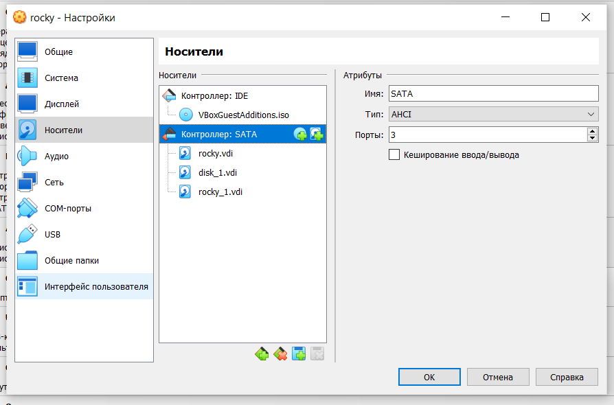

---
## Front matter
title: "Лабораторная работа №14"
subtitle: "Партиции, файловые системы, монтирование"
author: "Комягин Андрей Николаевич"

## Generic otions
lang: ru-RU
toc-title: "Содержание"

## Pdf output format
toc: true # Table of contents
toc-depth: 2
lof: true # List of figures
lot: true # List of tables
fontsize: 12pt
linestretch: 1.5
papersize: a4
documentclass: scrreprt
## I18n polyglossia
polyglossia-lang:
  name: russian
  options:
	- spelling=modern
	- babelshorthands=true
polyglossia-otherlangs:
  name: english
## I18n babel
babel-lang: russian
babel-otherlangs: english
## Fonts
mainfont: PT Serif
romanfont: PT Serif
sansfont: PT Sans
monofont: PT Mono
mainfontoptions: Ligatures=TeX
romanfontoptions: Ligatures=TeX
sansfontoptions: Ligatures=TeX,Scale=MatchLowercase
monofontoptions: Scale=MatchLowercase,Scale=0.9
## Biblatex
biblatex: true
biblio-style: "gost-numeric"
biblatexoptions:
  - parentracker=true
  - backend=biber
  - hyperref=auto
  - language=auto
  - autolang=other*
  - citestyle=gost-numeric
## Pandoc-crossref LaTeX customization
figureTitle: "Рис."
tableTitle: "Таблица"
listingTitle: "Листинг"
lofTitle: "Список иллюстраций"
lolTitle: "Листинги"
## Misc options
indent: true
header-includes:
  - \usepackage{indentfirst}
  - \usepackage{float} # keep figures where there are in the text
  - \floatplacement{figure}{H} # keep figures where there are in the text
---

# Цель работы

Получить навыки создания разделов на диске и файловых систем. Получить навыки монтирования файловых систем.

# Выполнение лабораторной работы

## Создание виртуальных носителей

Добавим к виртуальной машине два диска размером 512 МБ (рис. [-@fig:001]).

{#fig:001 width=70%}

Посмотрим перечень разделов на всех имеющихся в системе устройствах жёстких дисков
 (рис. [-@fig:002]).

{#fig:002 width=70%}

Предположим, что необходимо сделать разметку диска /dev/sdb с помощью ути-
литы fdisk. Получим справку по командам. (рис. [-@fig:003]).

{#fig:003 width=70%}

Проверим, сколько дискового пространства у нас есть

{#fig:004 width=70%}

Добавим новый раздел, создадим основной раздел. Укажем первый сектор, последний сектор (рис. [-@fig:005]).

{#fig:005 width=70%}

Определим тип раздела (рис. [-@fig:006]).

{#fig:006 width=70%}

Сравним вывод(рис. [-@fig:007]).

{#fig:007 width=70%}

fdisk предоставляет более детальную информацию о конкретном диске и его разделах, тогда как /proc/partitions дает обзор всех доступных устройств.

cat /proc/partitions

1. Общая информация о всех разделах: Эта команда показывает информацию о всех разделах и устройствах хранения, доступных в системе, а не только о конкретном диске.

2. Формат вывода: Вывод включает столбцы для мажорного и минорного номеров устройства, количества блоков (в 1 блоке 512 байт) и имени устройства.

fdisk -l /dev/sdb

1. Информация о диске: Команда fdisk предназначена для работы с разделами на дисках. В данном случае она показывает информацию только о конкретном диске (/dev/sdb).

2. Структура разделов: Вывод включает информацию о типе разделов (в данном случае "dos"), идентификаторе диска и структуре разделов на этом диске. Здесь мы видим, что на диске /dev/sdb есть один раздел (/dev/sdb1), который занимает 100 МБ.

3. Размеры и адресация: Указаны начальный и конечный сектор, а также общий размер раздела в секторах и мегабайтах.

## Создание логических разделов

Добавим новый раздел, создадим расширенный раздел (рис. [-@fig:008]).

{#fig:008 width=70%}

Теперь, когда расширенный раздел создан, создадим  в нём логический раздел. (рис. [-@fig:009]).

{#fig:009 width=70%}

Просмотрим информацию о добавленных разделах (рис. [-@fig:010]).

{#fig:010 width=70%}

## Создание раздела подкачки

добавим новый раздел с номером
раздела 6 изменим тип раздела, запишем изменения на диск
и выйдем (рис. [-@fig:011]).

{#fig:011 width=70%}

Просмотрим информацию о добавленных разделах (рис. [-@fig:012]).

{#fig:012 width=70%}

Отформатируем раздел подкачки, просмотрим размер пространства подкачки, которое в настоящее время выделено (рис. [-@fig:013]).

{#fig:013 width=70%}

## Создание разделов GPT с помощью gdisk

посмотрим таблицы
разделов и разделы на втором добавленном ранее диске(рис. [-@fig:014]).

{#fig:014 width=70%}

добавим новый раздел(рис. [-@fig:015]).

{#fig:015 width=70%}

Просмотрим информацию о добавленных разделах(рис. [-@fig:016]).

{#fig:016 width=70%}

## Форматирование файловой системы XFS

Создадим файловую систему XFS, установим параметры монтирования по умолчанию (рис. [-@fig:017]).

{#fig:017 width=70%}

## Форматирование файловой системы EXT4

Создадим файловую систему EXT4(рис. [-@fig:018]).

{#fig:018 width=70%}

## Ручное монтирование файловых систем

Создадим точку монтирования для раздела, смонтируем файловую систему(рис. [-@fig:019]).

{#fig:019 width=70%}

Отмонтируем раздел и проверим, что раздел отмонтирован(рис. [-@fig:020]).

{#fig:020 width=70%}

## Монтирование разделов с помощью /etc/fstab

Создадим точку монтирования для раздела XFS. Скопируем значение идентификатора UUID (рис. [-@fig:021]).

{#fig:021 width=70%}

Откроем файл /etc/fstab на редактирование и добавим строку(рис. [-@fig:022]).

{#fig:022 width=70%}

Проверим, что раздел примонтирован правильно(рис. [-@fig:023]).

{#fig:023 width=70%}

# Ответы на контрольные вопросы

1. Какой инструмент используется для создания разделов GUID?

Инструментом для создания разделов GUID (GPT) является gdisk или parted.

2. Какой инструмент применяется для создания разделов MBR?

Для создания разделов MBR (Master Boot Record) обычно используются такие инструменты, как fdisk или parted.

3. Какой файл используется для автоматического монтирования разделов во время загрузки?

Файл, используемый для автоматического монтирования разделов во время загрузки, — это /etcfstab.

4. Какой вариант монтирования целесообразно выбрать, если необходимо, чтобы файловая система не была автоматически примонтирована во время загрузки?

Для того чтобы файловая система не монтировалась автоматически во время загрузки, можно использовать параметр noauto в строке монтирования в файле /etc/fstab.

5. Какая команда позволяет форматировать раздел с типом 82 с соответствующей файловой системой?

Раздел с типом 82 — это раздел подкачки (swap). Для его форматирования используется команда:
     
sudo mkswap /dev/sdXn
     
(где /dev/sdXn — это ваш раздел).

6. Вы только что добавили несколько разделов для автоматического монтирования при загрузке. Как можно безопасно проверить, будет ли это работать без реальной перезагрузки?

 Для проверки конфигурации файла /etc/fstab можно использовать команду:
     
**sudo mount -a**
     
Эта команда попытается смонтировать все файловые системы, указанные в fstab, без перезагрузки.

7. Какая файловая система создаётся, если вы используете команду mkfs без какой-либо спецификации файловой системы?

Если вы используете команду mkfs без указания конкретной файловой системы, по умолчанию создаётся файловая система ext2.

8. Как форматировать раздел EXT4?

Для форматирования раздела в файловую систему EXT4 используется команда:
     
sudo mkfs.ext4 /dev/sdXn
     
(где /dev/sdXn — это ваш раздел).

9. Как найти UUID для всех устройств на компьютере?

Чтобы найти UUID для всех устройств на компьютере, можно использовать команду:
     
Можно использовать команду:
   
blkid
   
# Выводы

В ходе выполнения лабораторной работы я получил навыки создания разделов на диске и файловых систем. Получить навыки монтирования файловых систем.
