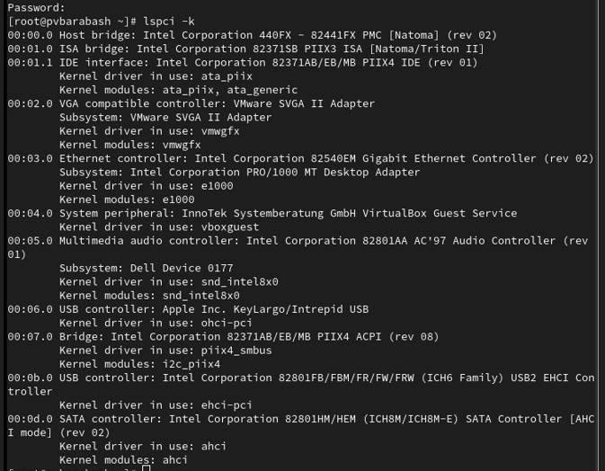
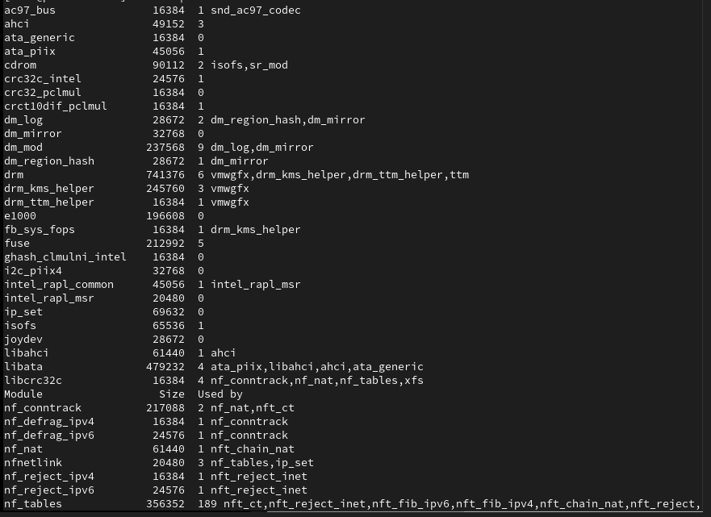
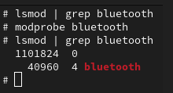
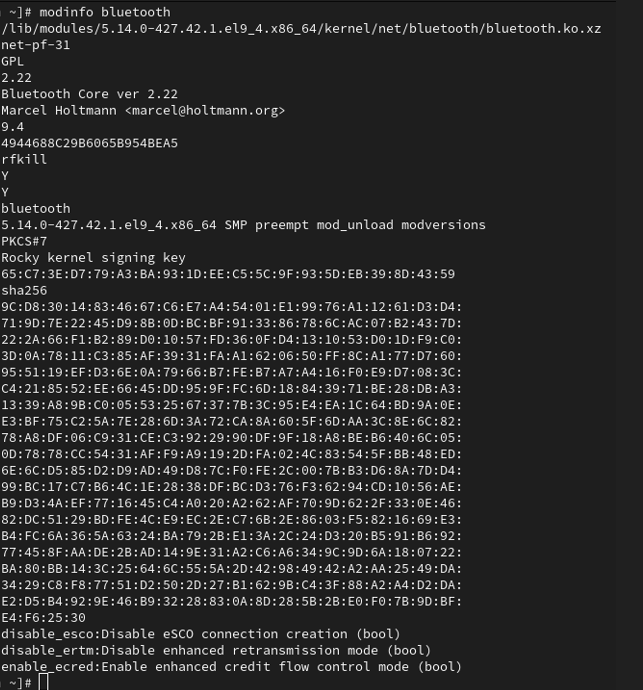
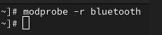
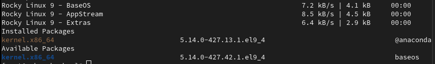

---
## Front matter
lang: ru-RU
title: Презентация по выполнению лабораторной работы 
subtitle: Лабораторная работа №10
author:
  - Колонтырский И. Р.
institute:
  - Российский университет дружбы народов, Москва, Россия
  
date: 8 ноября 2024

## i18n babel
babel-lang: russian
babel-otherlangs: english

## Formatting pdf
toc: false
toc-title: Содержание
slide_level: 2
aspectratio: 169
section-titles: true
theme: metropolis
header-includes:
 - \metroset{progressbar=frametitle,sectionpage=progressbar,numbering=fraction}
---

# Информация

## Цели и задачи

- Получить навыки работы с утилитами управления модулями ядра операционной системы.

##  Просмотр устройств и модулей ядра, с ними связанных

##  Информация по команде lspci -k

Вывод команды включает следующие данные:

1. Идентификатор устройства: Уникальный код, который идентифицирует устройство.

2. Имя устройства: Человекочитаемое название устройства.

3. Драйвер: Информация о том, какой драйвер используется для управления устройством. Если драйвер не загружен, это также будет указано.

##  Просмотр загруженных модулей ядра

## Проверка загруженности и загрузка модуля ядра

## Просмотр информации о модуле ядра

## Выгрузка модуля ядра

# Обновление ядра системы

## Просмотр версии ядра

## Вывод на экран списка пакетов, относящихся к ядру

## Действия для установки/обновления ядра

dnf upgrade --refresh -- обновление системы

dnf update kernel -- обновление ядра

dnf update и dnf upgrade --refresh -- повторное обновление системы

# Выводы

Я получил навыки работы с утилитами управления модулями ядра операционной системы.
