---
## Front matter
title: "Отчет по выполнению лабораторной работы"
subtitle: "Лабораторная работа №10"
author: "Колонтырский Илья Русланович"

## Generic otions
lang: ru-RU
toc-title: "Содержание"

## Pdf output format
toc: true # Table of contents
toc-depth: 2
lof: true # List of figures
lot: true # List of tables
fontsize: 12pt
linestretch: 1.5
papersize: a4
documentclass: scrreprt
## I18n polyglossia
polyglossia-lang:
  name: russian
  options:
	- spelling=modern
	- babelshorthands=true
polyglossia-otherlangs:
  name: english
## I18n babel
babel-lang: russian
babel-otherlangs: english
## Fonts
mainfont: PT Serif
romanfont: PT Serif
sansfont: PT Sans
monofont: PT Mono
mainfontoptions: Ligatures=TeX
romanfontoptions: Ligatures=TeX
sansfontoptions: Ligatures=TeX,Scale=MatchLowercase
monofontoptions: Scale=MatchLowercase,Scale=0.9
## Biblatex
biblatex: true
biblio-style: "gost-numeric"
biblatexoptions:
  - parentracker=true
  - backend=biber
  - hyperref=auto
  - language=auto
  - autolang=other*
  - citestyle=gost-numeric
## Pandoc-crossref LaTeX customization
figureTitle: "Рис."
tableTitle: "Таблица"
listingTitle: "Листинг"
lofTitle: "Список иллюстраций"
lolTitle: "Листинги"
## Misc options
indent: true
header-includes:
  - \usepackage{indentfirst}
  - \usepackage{float} # keep figures where there are in the text
  - \floatplacement{figure}{H} # keep figures where there are in the text
---

# Цель работы

Получить навыки работы с утилитами управления модулями ядра операционной системы.

# Выполнение лабораторной работы

**Задание 1.** Получите полномочия администратора. Посмотрите, какие устройства имеются в вашей системе и какие модули ядра с ними связаны.

Я перешел в режим работы суперпользователя, использовав команду su -. А затем использовала команду lspci -k (рис. [-@fig:001]).

{#fig:001 width=70%}

Вывод команды включает следующие данные:

1. Идентификатор устройства: Уникальный код, который идентифицирует устройство.

2. Имя устройства: Человекочитаемое название устройства.

3. Драйвер: Информация о том, какой драйвер используется для управления устройством. Если драйвер не загружен, это также будет указано.

**Задание 2.** Посмотрите, какие модули ядра загружены.

Я ввел команду lsmod | sort (рис. [-@fig:002]) и (рис. [-@fig:003]).

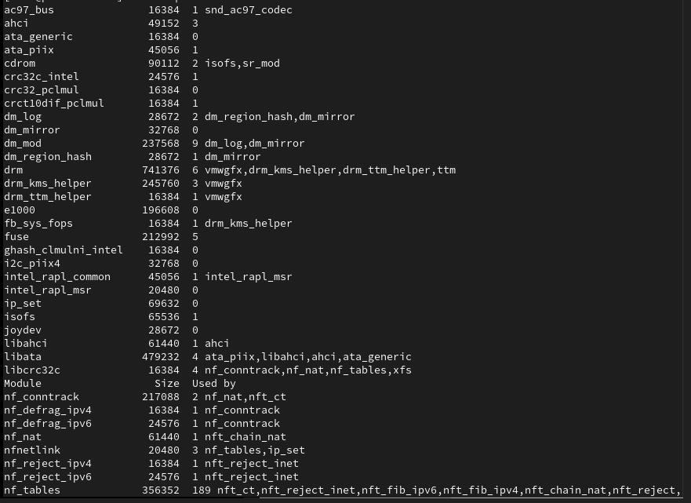{#fig:002 width=70%}

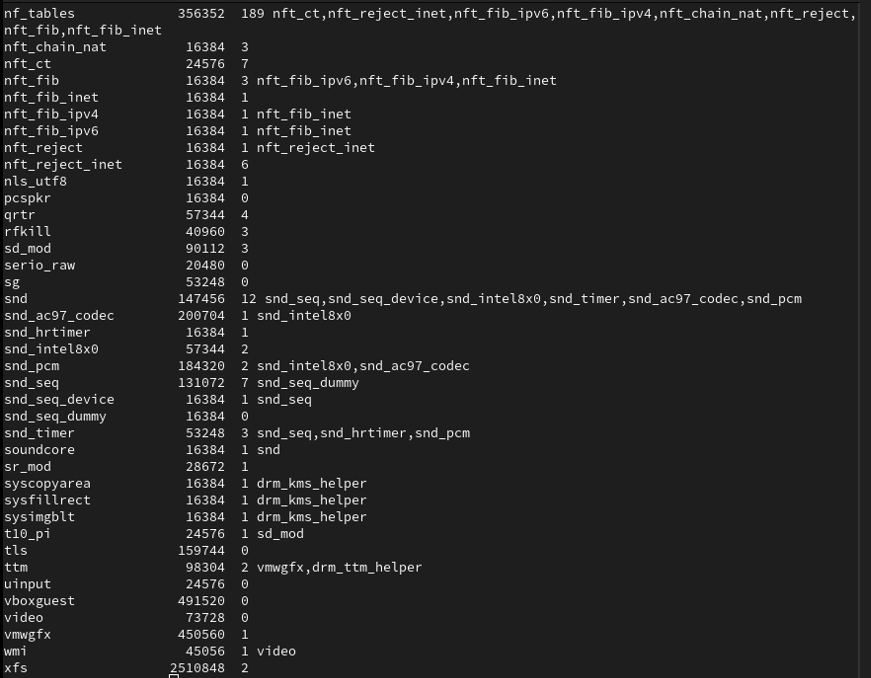{#fig:003 width=70%}

**Задание 3.** Посмотрите, загружен ли модуль ext4. Загрузите модуль ядра ext4. Убедитесь, что модуль загружен, посмотрев список загруженных модулей.

Сначала я проверил, загружен ли модуль ext4 с помощью команды lsmod | grep ext4. Он не был загружен, поэтому я его загрузил с помощью команды modprobe ext4. Затем я снова использовал команду lsmod | grep ext4, чтобы убедиться, что модулю загружен (рис. [-@fig:004]).

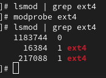{#fig:004 width=70%}

**Задание 4.** Посмотрите информацию о модуле ядра ext4.

Я использовал команду modinfo ext4 (рис. [-@fig:005]).

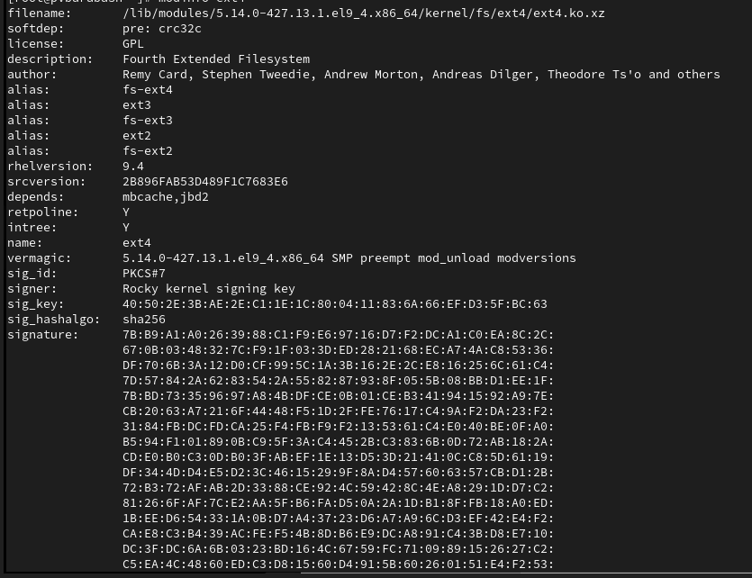{#fig:005 width=70%}

Команда modinfo выдает следующую информацию:

1. filename: Путь к файлу модуля.

2. version: Версия модуля.

3. description: Краткое описание модуля.

4. author: Имя автора модуля.

5. license: Лицензия, под которой распространяется модуль.

6. srcversion: Исходная версия модуля, если доступна.

7. depends: Список зависимостей модуля (другие модули, которые должны быть загружены для работы данного модуля).

8. parm: Параметры, которые могут быть переданы модулю при его загрузке.

**Задание 5.** Попробуйте выгрузить модуль ядра ext4.

Чтобы выгрузить модуль ядра ext4, мне потребовалось дважды использовать команду modprobe -r ext4 (рис. [-@fig:006]).

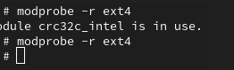{#fig:006 width=70%}

В первый раз выдалась ошибка "modprobe: FATAL: Module crc32c_intel is in use.".

**Задание 6.** Попробуйте выгрузить модуль ядра xfs.

Я использовал команду modprobe -r xfs несколько раз, но каждый раз получал сообщение, что этот модуль сейчас используется (рис. [-@fig:007]).

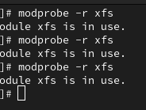{#fig:007 width=70%}

**Задание 7.** Посмотрите, загружен ли модуль bluetooth. Загрузите модуль ядра bluetooth. Посмотрите список модулей ядра, отвечающих за работу с Bluetooth.

Я использовал команду lsmod | grep bluetooth, он был не загружен. Я загрузил его с помощью команды modprobe bluetooth, а затем снова использовал команду lsmod | grep bluetooth (рис. [-@fig:008]).

{#fig:008 width=70%}

**Задание 8.** Посмотрите информацию о модуле bluetooth.

Я использовал команду modinfo bluetooth (рис. [-@fig:009]).

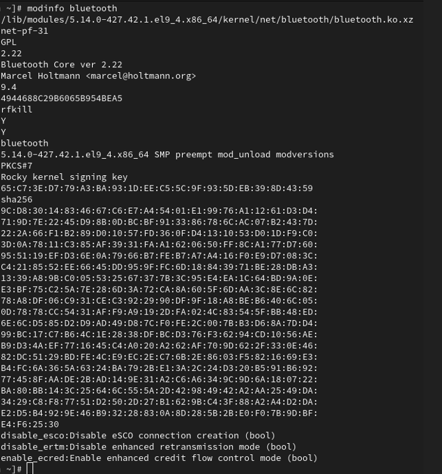{#fig:009 width=70%}

Этот модуль имеет следующие параметры: disable_esco, disable_ertm, enable_ecred.

**Задание 9.** Выгрузите модуль ядра bluetooth

Я использовал команду modprobe -r bluetooth и не столкнулся ни с какими ошибками (рис. [-@fig:010]).

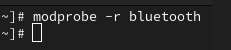{#fig:010 width=70%}

**Задание 10.** Посмотрите версию ядра, используемую в операционной системе.

Я использовал команду uname -r (рис. [-@fig:011]).

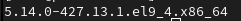{#fig:011 width=70%}

**Задание 11.** Выведите на экран список пакетов, относящихся к ядру операционной системы.

Я использовал команду dnf list kernel (рис. [-@fig:012]).

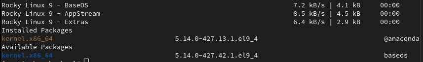{#fig:012 width=70%}

**Задание 12.** Обновите систему, чтобы убедиться, что все существующие пакеты обновлены.

Я использовал команду dnf upgrade --refresh и дождалась, когда все пакеты обновились (рис. [-@fig:013]).

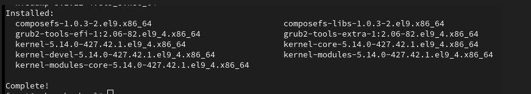{#fig:013 width=70%}

**Задание 13.** Обновите ядро операционной системы, а затем саму операционную систему.

Я выполнил команду dnf update kernel и dnf update (рис. [-@fig:014]).

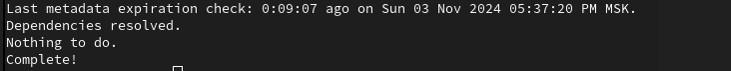{#fig:014 width=70%}

Затем я обновил систему с помощью команды dnf upgrade --refresh (рис. [-@fig:015]).

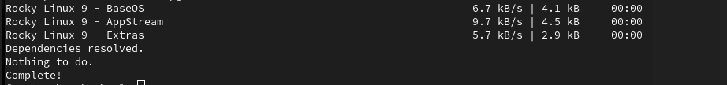{#fig:015 width=70%}

**Задание 14.** Перезагрузите систему.

Я перезагрузил систему с помощью команды reboot.

**Задание 15.** Посмотрите версию ядра, используемую в операционной системы.

Я посмотрел версию ядра с помощью команды uname -r (рис. [-@fig:016]).

{#fig:016 width=70%}

Как можно видеть, версия изменилась.

Затем я ввел команду hostnamectl (рис. [-@fig:017]).

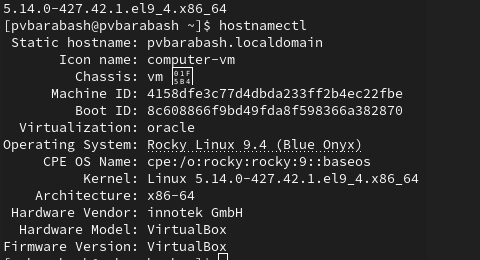{#fig:017 width=70%}

# Ответы на контрольные вопросы

1. Какая команда показывает текущую версию ядра, которая используется на вашей системе?
Команда: uname -r.
2. Как можно посмотреть более подробную информацию о текущей версии ядра операционной системы?
Команда: uname -a.
3. Какая команда показывает список загруженных модулей ядра?
Команда: lsmod.
4. Какая команда позволяет вам определять параметры модуля ядра?
Команда: modinfo <module_name>.
5. Как выгрузить модуль ядра?
modprobe -r <module_name>.
6. Что вы можете сделать, если получите сообщение об ошибке при попытке выгрузить модуль ядра?
Убедиться, что модуль не используется другими процессами или модулями. Для этого можно использовать команду lsmod, чтобы проверить зависимости. Если модуль занят, попробовать завершить процессы, которые его используют, или перезагрузить систему. 
7. Как определить, какие параметры модуля ядра поддерживаются?
Команда: modinfo <module_name>.
8. Как установить новую версию ядра?
sudo dnf install kernel-<version>

# Выводы

Я получил навыки работы с утилитами управления модулями ядра операционной системы.
