---
## Front matter
lang: ru-RU
title: Доклад по теме
subtitle: Планировщик заданий в Windows
author:
  - Комягин А.Н.
institute:
  - Российский университет дружбы народов, Москва, Россия
date: 19 октября 2024

## i18n babel
babel-lang: russian
babel-otherlangs: english

## Formatting pdf
toc: false
toc-title: Содержание
slide_level: 2
aspectratio: 169
section-titles: true
theme: metropolis
header-includes:
 - \metroset{progressbar=frametitle,sectionpage=progressbar,numbering=fraction}
 - '\makeatletter'
 - '\beamer@ignorenonframefalse'
 - '\makeatother'

##Fonts
mainfont: PT Serif
romanfont: PT Serif
sansfont: PT Sans
monofont: PT Mono
mainfontoptions: Ligatures=TeX
romanfontoptions: Ligatures=TeX
sansfontoptions: Ligatures=TeX,Scale=MatchLowercase
monofontoptions: Scale=MatchLowercase,Scale=0.9
---

# Введение

##  Введение

**«Планировщик заданий»** в Windows — это встроенный инструмент, который позволяет автоматизировать выполнение различных задач на компьютере. Он предоставляет пользователям возможность запускать программы, скрипты или выполнять действия в заданное время или при определенных условиях. Это значительно упрощает управление задачами и повышает производительность.

**«Планировщик задач»** в Windows представляет собой менеджер задач, позволяющий настроить и отложить использование некоторых команд на определённый срок. В отличие от «PowerShell», планировщик предоставляет пользователю более удобный интерфейс для глубокой настройки запланированных задач.

# Работа с планировщиком задач

# Запуск утилиты планировщика заданий

## Запуск с помощью командной строки

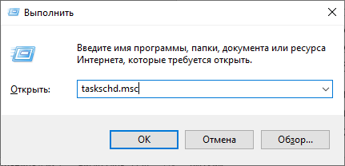{width=80%}

## Запуск через строку поиска

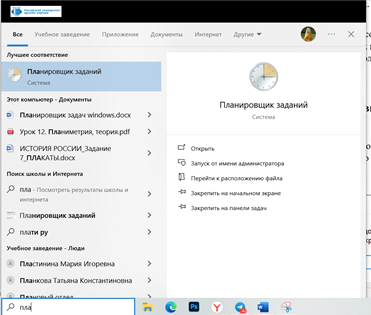{width=80%}

## Запуск через панель управления

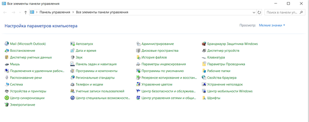{width=80%}

# Интерфейс программы

## Интерфейс программы

В левой части древовидная структура папок, по центру — информация о выбранном элементе, справа — основные действия над задачами.

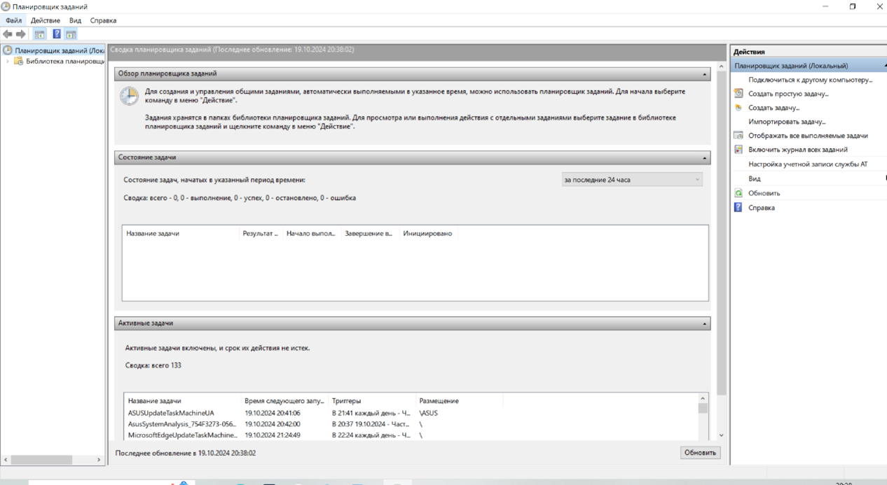{width=80%}

# Основные действия в планировщике заданий

## Основные действия в планировщике заданий

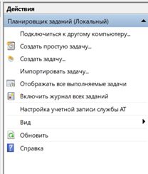{width=85%}

# Создание простой задачи

## Выбор пункта «Создать простую задачу»

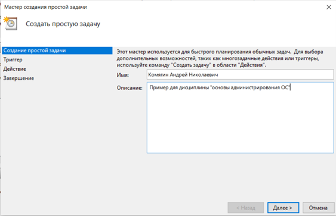{width=80%}

## Настройка триггера

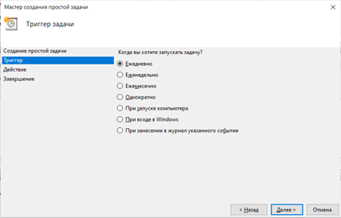{width=80%}

## Настройка действия

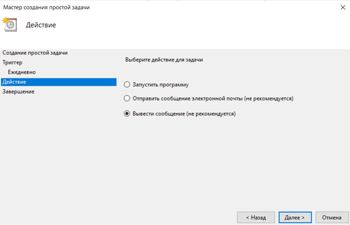{width=80%}

## Завершение

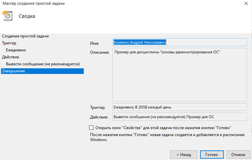{width=80%}

# Создание задачи 

## Общие настройки

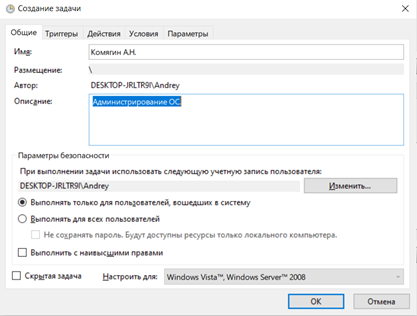{width=80%}

## Расширенная настройка триггеров

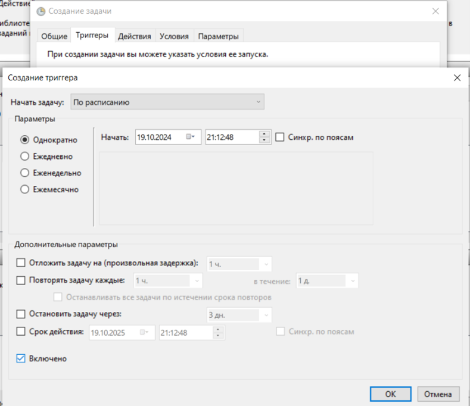{width=80%}

## Расширенные условия

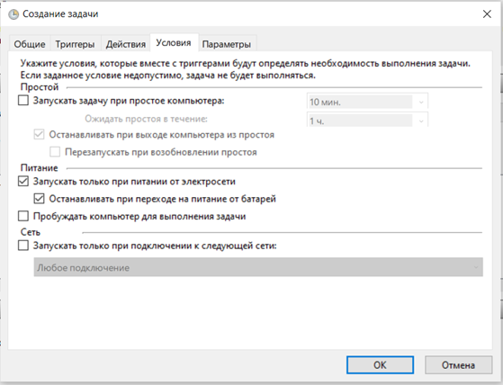{width=80%}

# Работа с уже созданными задачами

## Работа с уже созданными задачами

Процесс просмотра и изменения уже существующих задач довольно прост и не требует особых знаний

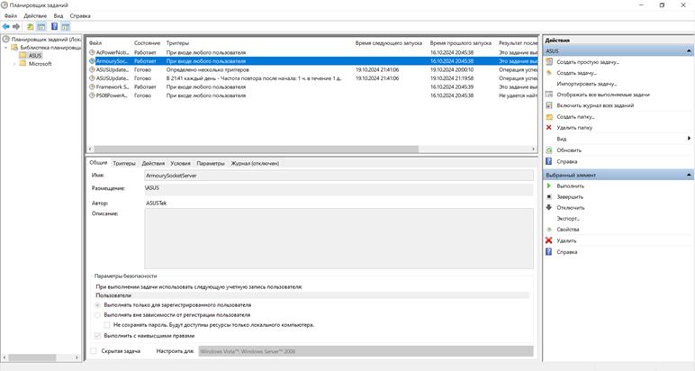{width=80%}

# Удаление задач

## Удаление задач

Крайне полезная опция, особенно в случаях работы с задачами от сторонних разработчиков. Например, нам надоело получать постоянные требования об обновлении какой-нибудь программы, ведь мы редко её используем.

Чтобы удалить уже созданную задачу, сделаем следующее:

1.  Переходим в нужное нам расположение. Если мы работаем со сторонним ПО, достаточно найти имя компании-разработчика или самой программы в свойствах задач. Если нашей целью является встроенное ПО, то ориентируемся по названиям вложенных папок.

2.  Находим нужный нам элемент – допустим, автоматический поиск обновлений для какой-то утилиты. Выделяем его щелчком мыши и выбираем пункт «Удалить» на правой панели. Подтверждаем внесённые изменения.

# Вывод

## Вывод

Планировщик заданий в Windows — это мощный инструмент для автоматизации и управления задачами. Его возможности позволяют значительно упростить рабочие процессы и повысить эффективность работы пользователей. Несмотря на некоторые сложности в настройке, преимущества использования планировщика делают его незаменимым элементом в арсенале инструментов Windows.

