---
## Front matter
title: "Реферат по теме"
subtitle: "Планировщик заданий в Windows"
author: "Комягин Андрей Николаевич"

## Generic otions
lang: ru-RU
toc-title: "Содержание"

## Bibliography
bibliography: bib/cite.bib
csl: pandoc/csl/gost-r-7-0-5-2008-numeric.csl

## Pdf output format
toc: true # Table of contents
toc-depth: 2
lof: true # List of figures

fontsize: 12pt
linestretch: 1.5
papersize: a4
documentclass: scrreprt
## I18n polyglossia
polyglossia-lang:
  name: russian
  options:
	- spelling=modern
	- babelshorthands=true
polyglossia-otherlangs:
  name: english
## I18n babel
babel-lang: russian
babel-otherlangs: english
## Fonts
mainfont: PT Serif
romanfont: PT Serif
sansfont: PT Sans
monofont: PT Mono
mainfontoptions: Ligatures=TeX
romanfontoptions: Ligatures=TeX
sansfontoptions: Ligatures=TeX,Scale=MatchLowercase
monofontoptions: Scale=MatchLowercase,Scale=0.9
## Biblatex
biblatex: true
biblio-style: "gost-numeric"
biblatexoptions:
  - parentracker=true
  - backend=biber
  - hyperref=auto
  - language=auto
  - autolang=other*
  - citestyle=gost-numeric
## Pandoc-crossref LaTeX customization
figureTitle: "Рис."
listingTitle: "Листинг"
lofTitle: "Список иллюстраций"
lolTitle: "Листинги"
## Misc options
indent: true
header-includes:
  - \usepackage{indentfirst}
  - \usepackage{float} # keep figures where there are in the text
  - \floatplacement{figure}{H} # keep figures where there are in the text
---

# Введение

«Планировщик заданий» в Windows — это встроенный инструмент, который позволяет автоматизировать выполнение различных задач на компьютере. Он предоставляет пользователям возможность запускать программы, скрипты или выполнять действия в заданное время или при определенных условиях. Это значительно упрощает управление задачами и повышает производительность.

«Планировщик задач» в Windows представляет собой менеджер задач, позволяющий настроить и отложить использование некоторых команд на определённый срок. В отличие от «PowerShell», планировщик предоставляет пользователю более удобный интерфейс для глубокой настройки запланированных задач.

# Работа с планировщиком задач

## Запуск утилиты планировщика заданий

Программа является штатным средством Microsoft и не требует дополнительных настроек перед запуском. Открыть её в windows 10 можно различными способами:

1.  C помощью командной строки (рис. [-@fig:001])

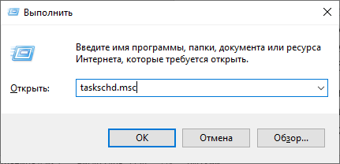{#fig:001 width=70%}

Открываем любое подобие консоли (Windows PowerShell, Командная строка, Выполнить (win+R)) и вводим в нем команду taskschd.msc

2.  Через «поиск»(рис. [-@fig:002])

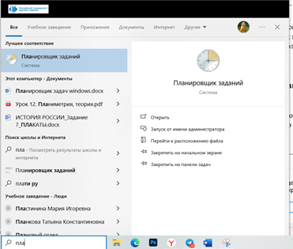{#fig:002 width=70%}

Ввести в поиске «планировщик заданий» или «taskschd.msc»

3. Через панель управления(рис. [-@fig:003])

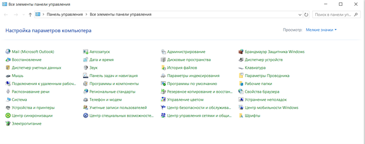{#fig:003 width=70%}

Заходим в панель управления, переключаем просмотр на мелкие значки и переходим в пункт администрирование. Там выбираем утилиту «Планировщик заданий»

## Интерфейс программы

Основное окно состоит из трёх-четырёх (в зависимости от открытой вкладки) независимых панелей и дополнительной панели с опциями в верхней части экрана. В левом меню мы видим список вкладок планировщика, позволяющий легче ориентироваться в уже созданных задачах, справа – основные действия для работы с ними. В центральной части экрана располагаются, собственно, сами задачи и их свойства. Приблизительно так выглядит окно «Планировщика» на системе с небольшим количеством ПО. 

Планировщик заданий имеет примерно тот же интерфейс, что и другие инструменты администрирования — в левой части древовидная структура папок, по центру — информация о выбранном элементе, справа — основные действия над задачами. Доступ к этим же действиям можно получить из соответствующего пункта главного меню (При выборе конкретной задачи или папки пункты меню меняются на относящиеся к выбранному элементу).(рис. [-@fig:004])

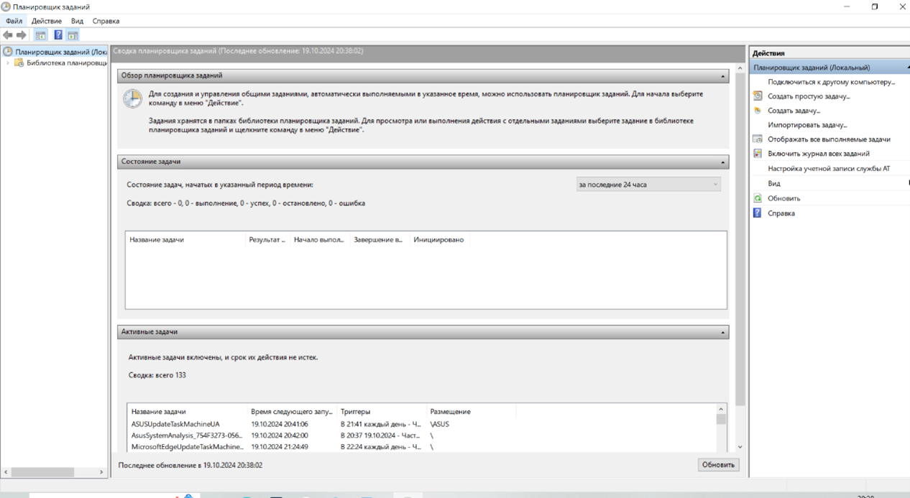{#fig:004 width=70%}

## Основные действия в планировщике заданий

В данном инструменте вам доступны следующие действия над задачами(рис. [-@fig:005])

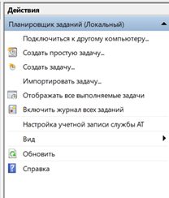{#fig:005 width=70%}

*  **Создать простую задачу** — создание задания с помощью встроенного мастера.

*  **Создать задачу** — то же, что и в предыдущем пункте, но с ручной настройкой всех параметров.

* **Импортировать задачу** — импорт ранее созданной задачи, которую вы экспортировали. Может пригодиться, если вам нужно настроить выполнение определенного действия на нескольких компьютерах (например, запуск проверки антивирусом, блокировка сайтов и прочее).

*  **Отображать все выполняемые задачи** — позволяет посмотреть список всех задач, которые запущены в настоящий момент времени.

*  **Включить журнал всех заданий** — позволяет включить и отключить ведение журнала планировщика заданий (записывает все действия, запускаемые планировщиком).

*  **Создать папку** — служит для создания собственных папок в левой панели. Можно использовать для собственного удобства, чтобы было понятно, что и где вы создали.

*  **Удалить папку** — удаление папки, созданной в предыдущем пункте.

*  **Экспорт** — позволяет экспортировать выбранную задачу для последующего использования на других компьютерах или на этом же, например, после переустановки ОС.

Кроме этого, вы можете вызвать список действий, кликнув правой кнопкой мыши по папке или задаче.
Кстати, если у вас есть подозрения на наличие вредоносного ПО, рекомендую заглянуть в список всех выполняемых задач, это может оказаться полезным. Также будет полезным включить журнал заданий (по умолчанию отключен), и заглянуть в него после пары перезагрузок, чтобы посмотреть, какие задания выполнялись (для просмотра журнала используйте вкладку «Журнал», выбрав папку «Библиотека планировщика заданий»).

## Создание простой задачи

1.  Выбираем пункт «Создать простую задачу».(рис. [-@fig:006])

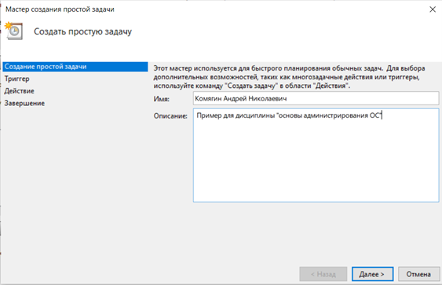{#fig:006 width=70%}

На первом экране вам потребуется ввести имя задачи и, при желании, ее описание. Затем нажимаем кнопку «Далее»

2. Настройка триггера(рис. [-@fig:007])

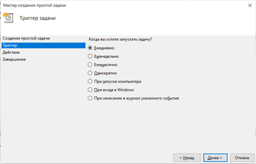{#fig:007 width=70%}

Следующий пункт — выбрать, когда будет выполняться задание: можно выполнять ее по времени, при входе в Windows или включении компьютера, или же по возникновению какого-либо события в системе. При выборе одного из пунктов, вам также предложат задать время выполнения и другие детали.

3. Настройка действия(рис. [-@fig:008])

{#fig:008 width=70%}

И последний этап, выбрать, какое именно действие будет выполняться — запуск программы (к ней можно добавить аргументы), вывод сообщения или отправка сообщения электронной почты.

4. Завершение(рис. [-@fig:009])

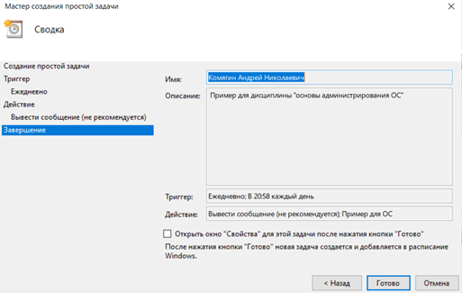{#fig:009 width=70%}

## Создание задачи 

Приведем общие настройки для создания задачи с более точной настройкой

1. Общие(рис. [-@fig:010])

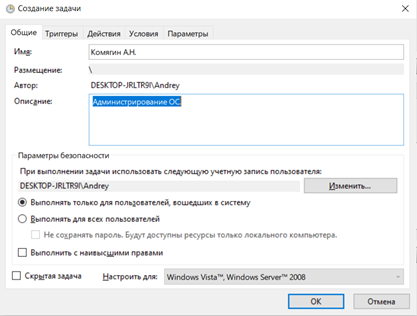{#fig:010 width=70%}

Если вам требуется более точная настройка задач в планировщике заданий Windows, нажмите «Создать задачу» и вас ждет множество параметров и опций.

2. Триггеры(рис. [-@fig:011])

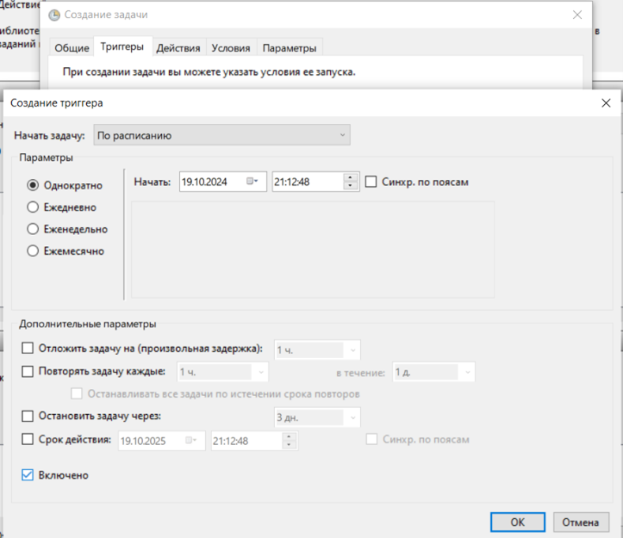{#fig:011 width=70%}

На вкладке «Триггеры» вы можете задать сразу несколько параметров для ее запуска — например, при простое и при блокировке компьютера. Также, при выборе пункта «По графику», вы можете настроить выполнение в определенные числа месяца или дни недели. 

3. Действие
На вкладке «Действие» вы можете определить запуск сразу нескольких программ или выполнения других действий на компьютере. 

4. Условия(рис. [-@fig:012])

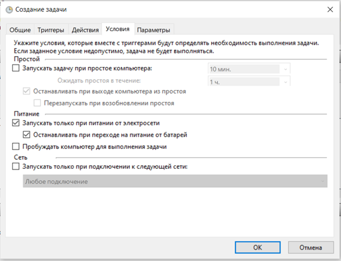{#fig:012 width=70%}

Также вы можете настроить выполнение задачи при простое компьютера, только при питании от розетки и другие параметры. 

## Работа с уже созданными задачами

Процесс просмотра и изменения уже существующих задач довольно прост и не требует особых знаний (только в том случае, если мы соберёмся менять какие-либо системные команды). Чтобы просмотреть запланированное действие, сделаем следующее(рис. [-@fig:013])

1.  Ориентируясь по левой панели, найдём нужную нам директорию и выберем запланированную задачу – например, работа Armory.

2.  В центральной нижней панели отразятся основные свойства плана, разделённые по вкладкам – «Общие», «Триггеры», «Действия», «Условия», «Параметры» и «Журнал».

3.  Просматриваем и меняем нужные нам параметры, подтверждаем изменения и закрываем «Планировщик».

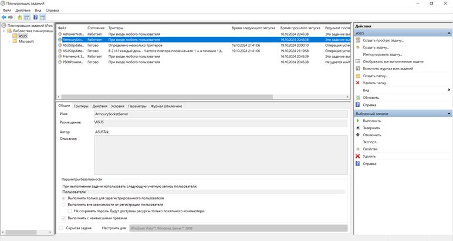{#fig:013 width=70%}

## Удаление задач

Крайне полезная опция, особенно в случаях работы с задачами от сторонних разработчиков. Например, нам надоело получать постоянные требования об обновлении какой-нибудь программы, ведь мы редко её используем. Чтобы удалить уже созданную задачу, сделаем следующее:

1.  Переходим в нужное нам расположение. Если мы работаем со сторонним ПО, достаточно найти имя компании-разработчика или самой программы в свойствах задач. Если нашей целью является встроенное ПО, то ориентируемся по названиям вложенных папок.

2.  Находим нужный нам элемент – допустим, автоматический поиск обновлений для какой-то утилиты. Выделяем его щелчком мыши и выбираем пункт «Удалить» на правой панели. Подтверждаем внесённые изменения.

Часть из блокируемых задач может потребовать использование прав администратора, а некоторые, как в случае задач утилит Microsoft, самостоятельно вернуть запуск на прежнее место. Обычно удаление задач не составляет никакого труда и дает мгновенные результаты.

# Вывод

Планировщик заданий в Windows — это мощный инструмент для автоматизации и управления задачами. Его возможности позволяют значительно упростить рабочие процессы и повысить эффективность работы пользователей. Несмотря на некоторые сложности в настройке, преимущества использования планировщика делают его незаменимым элементом в арсенале инструментов Windows.

# Список литературы{.unnumbered}

1. Remontka.pro [Планировщик заданий в Windows](https://remontka.pro/windows-task-scheduler/)(дата обращения: 19 октября 2024).
2. Дзен [Что такое планировщик заданий и как им пользоваться](https://dzen.ru/a/X-ScWPx0yE3tJ0br)(дата обращения: 19 октября 2024).
3. Comss.ru [Планировщик заданий в Windows: что это и как им пользоваться](https://www.comss.ru/page.php?id=4840) (дата обращения: 19 октября 2024).
4. Microsoft [What's new in Task Scheduler](https://learn.microsoft.com/ru-ru/windows/win32/taskschd/what-s-new-in-task-scheduler) (дата обращения: 19 октября 2024).
